# 네트워크

---

# 네트워크 개요

---

## 네트워크의 정의와 필요성

**네트워크**

- **정의**: 통신 및 데이터 교환을 용이하게 하기 위해 함께 연결된 컴퓨터, 서버, 라우터, 스위치 및 기타 네트워킹 장비와 같은 상호 연결된 장치의 모음
- **네트워크의 필요성**
    - 프린터 등의 공유 자원을 사용하기 위함
    - 이메일, 채팅, 화상 회의 등의 정보 교환을 위함
    - 서버의 데이터에 접근하기 위함

---

## 데이터 통신의 기본 구성 요소

### 송신자(Sender), 수신자(Receiver), 메시지(Message), 전송 매체(Medium), 프로토콜(Protocol)

**송신자(Sender)**

- **정의**: 데이터 메시지를 전송하는 장치
- **특징**: 데이터를 전송하기 위해 적절한 포맷으로 변환함
- **예시**: 이메일 작성자, 서버에서 데이터를 전송하는 애플리케이션

**수신자(Receiver)**

- **정의**: 송신자가 보낸 메시지를 받는 장치
- **특징**: 데이터를 수신하고 이를 적절히 표현하거나 저장함
- **예시**: 이메일 수신자, 서버에서 데이터를 처리하는 애플리케이션

**메시지(Message)**

- **정의**: 송신자가 보내는 실제 데이터
- **특징**: 텍스트, 이미지, 비디오 등 다양한 형태임
- **예시**: 이메일 본문, 데이터 패킷

**전송 매체(Medium)**

- **정의**: 송신자에서 수신자로 이동하는 물리적인 경로
- **특징**: 유선, 무선 또는 혼합 형태로 구현 가능함
- **예시**: LAN 케이블, Wi-Fi

**프로토콜(Protocol)**

- **정의**: 컴퓨터나 원거리 통신 장비 사이에서 메시지를 주고 받는 양식과 규칙의 체계
- **특징**: 데이터의 형식, 순서, 오류 처리 등을 정의함
- **예시**: HTTP/HTTPS, TCP, DHCP

## 네트워크 모델 (Network Models)

### OSI 7계층 모델

- **정의**: 국제표준화기구(ISO)에서 개발한 모델로, 컴퓨터 네트워크 프로토콜 디자인과 통신을 계층으로 7단계로 나누어 설명한 것임
    
    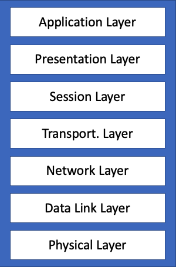
    

**물리 계층 (Physical Layer)**

- **정의**: 장치 간 전기적 신호를 전달하는 계층으로, 데이터 프레임 내부의 각 bit를 한 노드에서 다음 노드로 실제로 이동시키는 계층임
- **특징**:
    - 통신 데이터의 단위는 Bit
    - 디지털 신호를 전기적인 신호로 변환하여 주고받는 기능 수행함
    - 주요 프로토콜은 RS-232, X.25/X.21
    - 관련 장비로는 케이블(Cable), 리피터(Repeater), 더미허브(Dummy Hub)

**데이터 링크 계층 (Data Link Layer)**

- **정의**: 물리 계층을 통해 송수신되는 정보의 오류와 흐름을 관리하여 안전한 정보의 전달을 수행할 수 있도록 도와주는 역할을 하는 계층임
- **특징**:
    - 통신 데이터의 단위는 Frame
    - MAC 주소를 이용하여, hop-to-hop 방식으로 물리계층에서 받은 정보를 전달함
    - 주요 프로토콜은 Ethernet, HDLC(High-Level Data-Link Control), PPP(Point-to-Point Protocol)
    - 관련 장비로는 L2 스위치(Switch), 브릿지(Bridge)

**네트워크 계층 (Network Layer)**

- **정의**: 경로를 선택하고 주소를 정하고 경로에 따라 패킷을 전달해주는 역할을 하는 계층임
- **특징**:
    - 통신 데이터의 단위는 Packet
    - 라우팅, 트래픽 제어, 패킷 정보 전송 등을 수행함
    - 주요 프로토콜은 IP(Internet Protocol), ICMP, RIP
    - 관련 장비로는 라우터(Router), L3 스위치

**전송 계층 (Transport Layer)**

- **정의**: 데이터 전송의 오류 검출, 수정 및 흐름 제어를 수행하는 계층임
- **특징**:
    - 통신 데이터의 단위는 Segment
    - 오류검출 및 복구, 흐름제어와 중복검사 등을 수행함
    - 주요 프로토콜은 TCP(Transmission Control Protocol), UDP(User Datagram Protocol)
    - 관련 장비로는 게이트웨이(Gateway), L4 스위치

**세션 계층 (Session Layer)**

- **정의**: 응용 프로그램 간의 대화를 유지하기 위한 구조를 제공하고, 이를 처리하기 위해 프로세스들의 논리적인 연결을 담당하는 계층임
- **특징**:
    - 통신 데이터의 단위는 Message
    - 통신을 하기 위한 세션 확립, 유지, 중단을 수행한다.
    - 주요 프로토콜은 RPC(Remote Procedure Call), NetBIOS

**표현 계층 (Presentation Layer)**

- **정의**: 애플리케이션이 다루는 정보를 통신에 알맞은 형태로 만들거나, 하위 계층에서 온 데이터를 사용자가 이해할 수 있는 형태로 만드는 역할을 담당하는 계층임
- **특징**:
    - 통신 데이터의 단위는 Message
    - 데이터를 응용, 세션 계층에 보내기 전에 변환함
    - 주요 프로토콜은 SSL(Secure Socket Layer), ASCII(American Standard Code for Information Interchange)

**응용 계층 (Application Layer)**

- **정의**: 응용 프로세스와 직접 관계하여 일반적인 응용 서비스를 수행하는 역할을 담당하는 계층임
- **특징**:
    - 사용자가 OSI 환경에 접속할 수 있도록 서비스 제공함
    - 응용 프로세스 간의 정보 교환, 파일 전송 등의 서비스를 제공함
    - 주요 프로토콜은 HTTP(HyperText Transfer Protocol), SMTP(Simple Mail Transfer Protocol)

### TCP/IP 모델

- **정의**: 미국 국방성의 DARPA(Defense Advanced Research Projects Agency)에 의해 개발된 모델로, 컴퓨터 네트워크 프로토콜 디자인과 통신을 계층으로 7단계로 나누어 설명한 것임
    
    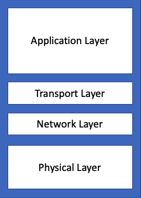
    

**네트워크 인터페이스 계층 (Network Interface Layer)**

- **정의**: 물리적인 네트워크 매체를 통해 데이터를 전송하는 기능을 담당하는 계층임
- **특징**:
    - 이더넷, Wi-Fi 등 다양한 LAN 및 WAN 기술을 지원함
    - 하드웨어 주소(MAC 주소)를 사용하여 네트워크 장치를 식별함

**인터넷 계층 (Internet Layer)**

- **정의**: 패킷의 라우팅 및 주소 지정을 담당하고, 서로 다른 네트워크 간의 데이터 전송을 가능하게 하는 계층임
- **특징**:
    - 데이터를 패킷으로 분할하고, IP 주소를 사용하여 송수신지를 설정함
    - 주요 프로토콜은 IP(Internet Protocol), ICMP(Internet Control Message Protocol)

**전송 계층 (Transport Layer)**

- **정의**: 애플리케이션 간의 통신을 관리하고, 흐름 제어 및 오류 검출 기능을 하는 계층임
- **특징**:
    - 데이터의 신뢰성 있는 전송 및 흐름 제어, 오류 검사를 담당함
    - 주요 프로토콜은 TCP(Transmission Control Protocol), UDP(User Datagram Protocol)

**응용 계층 (Application Layer)**

- **정의**: 사용자가 직접 상호작용하는 네트워크의 가장 상위 계층임
- **특징**:
    - 네트워크 기반 응용 프로그램이 작동함
    - 주요 프로토콜은 HTTP(HyperText Transfer Protocol), FTP (File Transfer Protocol)

## 네트워크의 종류 (Types of Networks)

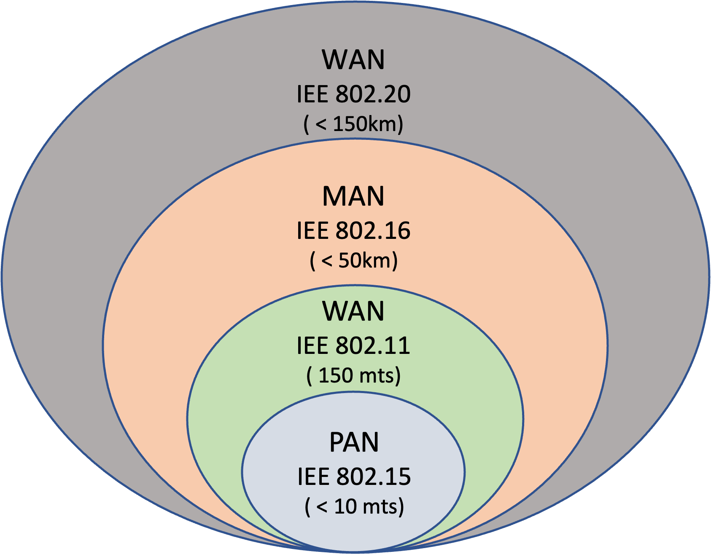

**LAN(Local Area Network)**

- **정의**: 근거리 통신망으로, 지역적인 범위에서 컴퓨터와 기타 장치들이 서로 연결되어 데이터를 공유하는 네트워크임
- **특징**:
    - 조직내부나 동일 건물등 비교적 좁은 지역을 연결하기 위해 사용함
    - 관리자가 직접 관리하는 방식임
- **장점**:
    - 내부 네트워크에서 전송 속도가 빠름
    - 내부적으로 네트워크 관리가 가능해 보안 제어가 용이함
- **단점**:
    - 네트워크 확장이 제한적일 수 있음
    - 한 건물 또는 근거리 내에서만 작동함
- **활용 예시**:
    - 사내 네트워크에서 파일 공유 및 프린터를 사용함

**WAN(Wide Area Network)**

- **정의**: 근거리 통신망으로, 지역적인 범위에서 컴퓨터와 기타 장치들이 서로 연결되어 데이터를 공유하는 네트워크임
- **특징**:
    - 일반적으로 공공 통신 인프라를 통해 데이터 전송을 수행한다
    - 수백 킬로미터에서 수천 킬로미터까지의 범위를 커버함
    - 위성, 전화선, 광섬유 등 다양한 전송 매체를 사용하여 연결됨
- **장점**:
    - 도시, 국가 등의 넓은 범위를 연결함
    - 다양한 네트워크 연결 기술을 지원함
- **단점**:
    - 설치 및 운영 비용이 상대적으로 높음
    - 속도가 느림
- **활용 예시**:
    - 인터넷을 통한 이메일 송수신, 원격 사무실 연결

**MAN(Metropolitan Area Network)**

- **정의**: 특정 도시나 대도시 지역 내에서 여러 LAN을 연결하는 네트워크임
- **특징**:
    - 일반적으로 수십 킬로미터 범위 내에서 운영됨
- **장점**:
    - 도시 전체나 대규모 지역을 연결할 수 있음
    - 새로운 노드의 추가가 쉬움
    - WAN보다 낮은 비용으로 구축 가능함
- **단점**:
    - 초기 구축 비용이 상당히 높음
    - 고급 장비에 의존하여, 장비 고장 시 전체 네트워크에 영향을 줌
- **활용 예시**:
    - 도시 내의 기업 및 기관 간 연결, 대학 캠퍼스 네트워크

**PAN(Personal Area Network)**

- **정의**: 개인의 장치 간에 데이터를 전송하기 위해 사용되는 소규모 네트워크임
- **특징**:
    - 일반적으로 개인이 소지한 장치 간의 연결을 의미함
    - 10~30m 정도의 짧은 범위를 커버함
- **장점**:
    - 작은 범위에서 간단히 네트워크를 구성할 수 있음
    - 통신 과정에서 전력 소모가 낮음
- **단점**:
    - 장치 간 호환성 문제가 발생할 수 있음
    - 동일 주파수 대역에서 작동하는 장치 간 간섭이 발생할 수 있음
- **활용 예시**:
    - Bluetooth, Wi-Fi Direct, Zigbee

### WLAN(Wireless LAN), SAN(Storage Area Network)

**WLAN(Wireless LAN)**

- **정의**: 유선 연결 대신 무선 기술을 사용하여 로컬 네트워크 노드를 연결하는 근거리 통신망(LAN)의 한 유형
- **특징**:
    - 무선 주파수(RF) 또는 적외선 기술을 사용하여 데이터를 공중으로 전송하고 수신함
    - 케이블 없이 디바이스를 네트워크에 연결함
    - 액세스 포인트(AP)를 이용하여 신호를 증폭하고 인터넷에 연결함

## **동작 방식**:

- **장점**:
    - 설치, 유지보수, 재배치가 간편함
    - AP를 이용해 쉽게 네트워크를 확장 할 수 있음
    - 어디서든 무선 네트워크를 사용할 수 있음
- **단점**:
    - 무선 신호의 도청, 신호 스푸핑의 문제가 존재함
    - 유선 LAN보다 느리거나 연결의 안정성이 떨어짐
    - 다수의 사용자가 접속할 경우 네트워크 성능이 낮아짐
- **활용 예시**: Wi-Fi

**SAN(Storage Area Network)**

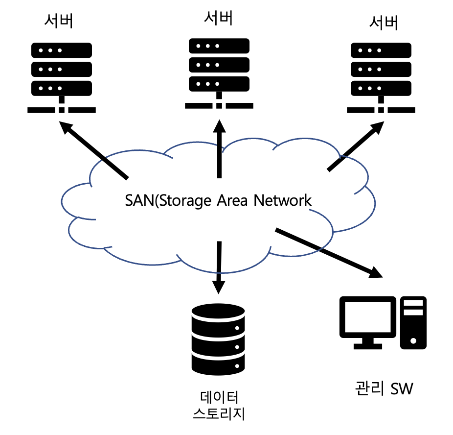

- **정의**: 여러 컴퓨터와 서버가 공유할 수 있는 고속 전용 스토리지 네트워크
- **특징**:
    - 일반 네트워크와 분리된 전용 스토리지 네트워크로 동작함
    - 스토리지 디바이스들이 네트워크로 연결되어 중앙화된 논리 볼륨을 형성함
    - 광섬유 채널(Fibre Channel) 등의 기술을 이용하여 고속 데이터 전송을 지원함
- **동작 방식**:
    - 서버가 스토리지 장치에 데이터 요청을 보냄
    - SAN 스위치가 요청을 전달하고, 스토리지 장치에서 데이터를 검색함
    - 검색된 데이터를 서버로 고속 전송함
- **장점**:
    - 블록 단위 데이터 전송을 지원하여 빠르고 안정적인 데이터 접근을 제공
    - 데이터 백업, 복구가 쉬움
- **단점**:
    - 전용 장비와 인프라 구축 비용이 높음
    - 네트워크 설계를 위한 전문 지식이 필요함
    - 파일 공유가 제한됨
- **활용 예시**: 데이터 센터, 클라우드 서비스

## 네트워크 토폴로지 (Network Topology)

### 스타(Star), 버스(Bus), 링(Ring), 메시(Mesh), 트리(Tree)

**스타(Star)**

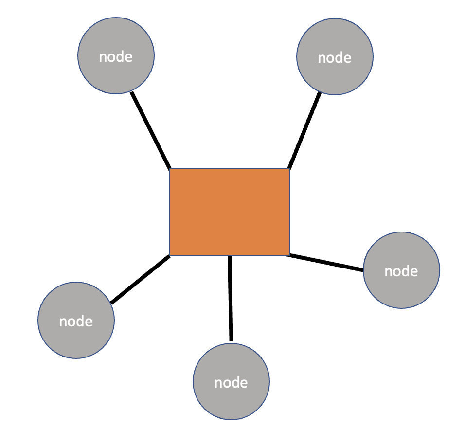

- **정의**: 가장 흔하게 쓰이는 네트워크 토폴로지로, 네트워크 안의 모든 노드가 동축 케이블이나 연선 또는 광케이블을 통해 직접 하나의 중앙 허브에 연결된 형식
- **특징**:
    - 중앙 노드는 서버로서 작동하여 데이터의 흐름을 관리함
    - 각각의 노드에서 보낸 정보가 목적지에 닿기 위해서는 반드시 중앙 노드를 지나야 함
    - 중앙 노드는 리피터처럼 데이터 손실을 막아줌
- **장점**:
    - 한 장소에서 전체 네트워크를 관리할 수 있음
    - 각 노드는 독립적으로 연결되어 있어, 노드 하나의 장애가 발생해도 다른 노드는 운용 가능함
    - 장애가 발생한 경우 원인을 쉽게 찾을 수 있음
- **단점**:
    - 중앙 허브에 문제가 생기면 전체 네트워크가 모두 멈춤
    - 전체 네트워크의 성능이 중앙 노드에 의해 결정됨
- **활용 예시**: 가정용 네트워크, 소규모 사무실 네트워크

**버스(Bus)**

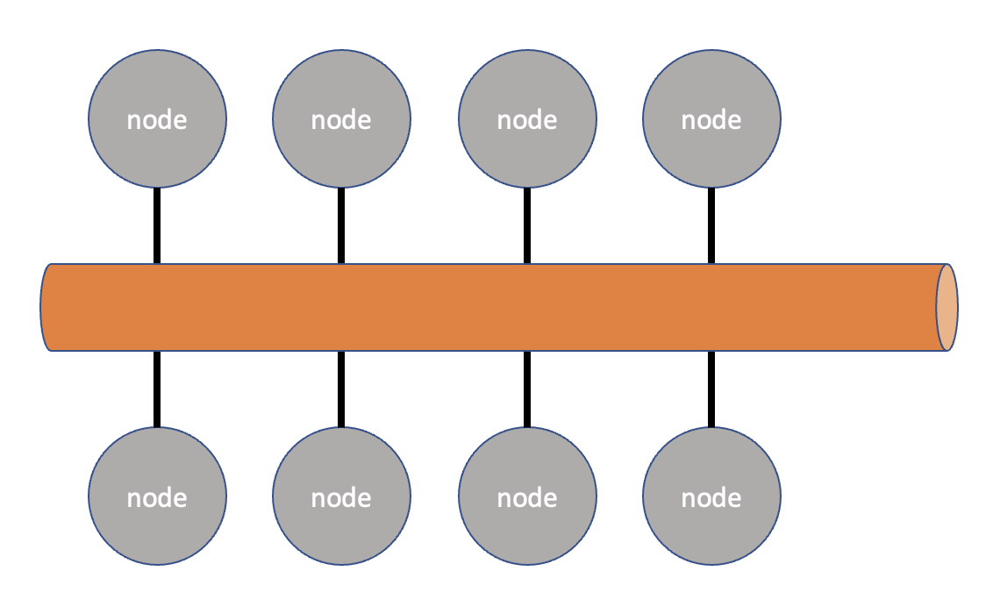

- **정의**: 네트워크상의 모든 장치가 하나의 케이블로 연결되어 있는 유형
- **특징**:
    - 네트워크의 한쪽 끝에서 다른 쪽 끝으로 한 방향으로 연결되어 있음
    - 데이터의 흐름이 케이블의 경로를 따라 한 방향으로 이동함
- **장점**:
    - 구축 비용이 저렴함
    - 장치의 추가, 제거가 쉬움
- **단점**:
    - 케이블에 장애가 발생할 경우, 모든 네트워크가 중단됨
    - 양 방향 통신이 불가능함
    - 노드를 추가할 때마다, 대역폭이 낭비됨
- **활용 예시**: 이벤트, 전시회 등의 임시 네트워크

**링(Ring)**

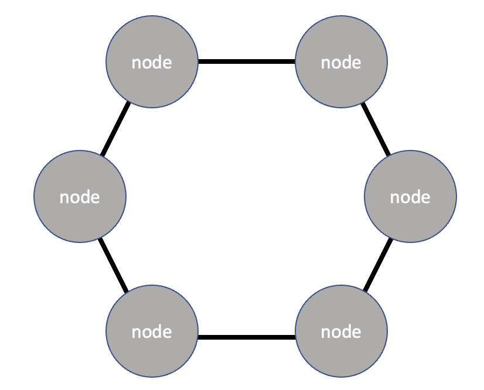

- **정의**: 노드들이 원 또는 고리 모양으로 배열되어 있는 유형
- **특징**:
    - 데이터가 원 모양의 네트워크를 따라 한 방향 또는 양방향으로 흐름
    - 각 노드의 양 옆에는 두 개의 이웃 노드가 존재함
- **장점**:
    - 한 번에 하나의 노드에서만 데이터를 전송할 수 있어 패킷 충돌의 위험이 낮음
    - 설치 비용이 낮고, 문제 발생 시 원인 파악이 쉬움
- **단점**:
    - 한 노드에 문제 발생 시 모든 네트워크가 중단됨
    - 노드 추가, 제거 시에 전체 네트워크가 중단됨
- **활용 예시**:

**메시(Mesh)**

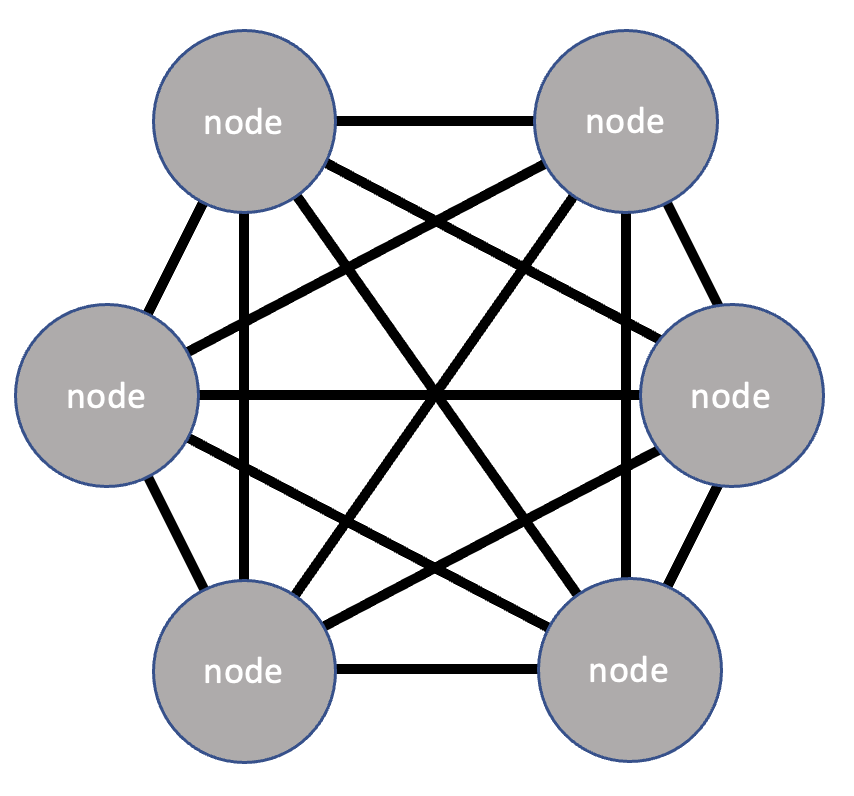

- **정의**: 노드들을 점 대 점으로 상호 연결한 구조로 복잡하고 정교한 유형임
- **특징**:
    - 모든 노드가 상호연결되어 있음
    - 라우팅 방식으로 전송 시, 최단 거리를 결정하여 데이터를 전송함
    - 플러딩 방식으로 전송 시, 네트워크 내부의 모든 노드에 데이터를 전송함
- **장점**:
    - 안정성과 보안성이 높음
    - 노드 간에 상호 연결된 정도가 높고 복합적이어서 하나의 노드에 문제가 발생해도, 나머지는 운용 가능함
- **단점**:
    - 네트워크 관리, 설치, 재구성이 어려움
    - 케이블 등 설치 비용이 많이 듦
- **활용 예시**:

**트리(Tree)**

- **정의**: 노드들이 부모-자식 계층구조로 연결된 유형임

## **특징**:

- **동작 방식**:
- **장점**:
    - 네트워크의 확장이 매우 쉬움
    - 성능에 문제가 생긴 경우, 각 노드에 개별적으로 접근할 수 있어 문제 해결이 쉬움
- **단점**:
    - 상위 계층의 장치에 문제 발생 시, 하위 계층의 장치도 영향을 받을 수 있음
    - 구조가 복잡함
- **활용 예시**: 대규모 기업 네트워크, 캠퍼스 네트워크

## 네트워크 프로토콜 (Network Protocols)

---

### 프로토콜의 개념과 역할 (Concept and Role of Protocols)

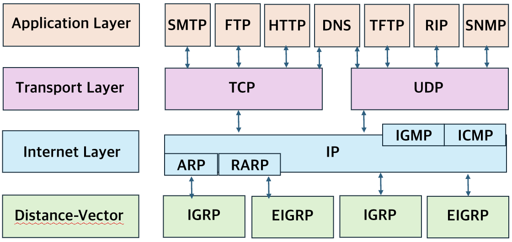

- **정의**
    - 데이터 통신을 수행하기 위한 규칙, 절차 및 형식에 대한 정의임. 통신하는 양 끝 시스템 간에 데이터를 주고받을 수 있게 해주는 규약을 제공함
- **특징**
    - 송신 측과 수신 측 간의 데이터 전송 방식 정의
    - 데이터 포맷, 주소 지정, 오류 처리, 흐름 제어 등 다양한 작업 정의
- **동작 방식**
    - 데이터가 네트워크를 통해 전송될 때, 각 계층에서 프로토콜을 사용하여 송수신을 관리함
- **장단점**
    - **장점**
        - 표준화된 규약으로 다양한 기기와 시스템 간의 통신 가능
    - **단점**
        - 프로토콜이 복잡할 수 있고, 새로운 프로토콜 적용 시 호환성 문제가 발생할 수 있음
- **활용**
    - 모든 네트워크 통신에서 사용되며, 인터넷을 통한 웹 브라우징, 파일 전송, 이메일 전송 등 다양한 서비스에 활용됨

### 데이터 링크 계층 프로토콜 (Data Link Layer Protocols)

**이더넷(Ethernet)**

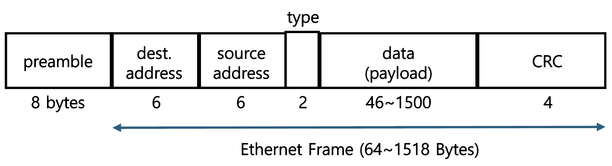

- **정의**
    - LAN(Local Area Network)에서 가장 널리 사용되는 데이터 링크 계층 프로토콜로, 네트워크 장치 간의 데이터 전송을 위해 사용됨
- **특징**
    - MAC 주소를 사용하여 장치를 식별
    - CSMA/CD (Carrier Sense Multiple Access with Collision Detection) 방식으로 충돌을 방지
- **동작 방식**
    - 데이터는 프레임으로 캡슐화되어 송수신됨. 각 프레임은 송신자의 MAC 주소와 수신자의 MAC 주소를 포함함
- **장단점**
    - **장점**
        - 설치와 유지가 용이하며, 표준화되어 있어 다양한 장치가 호환됨
    - **단점**
        - 충돌 문제로 성능 저하가 발생할 수 있음
- **활용**
    - 사무실, 학교, 가정 등에서 로컬 네트워크를 구성할 때 사용됨

**PPP(Point-to-Point Protocol)**

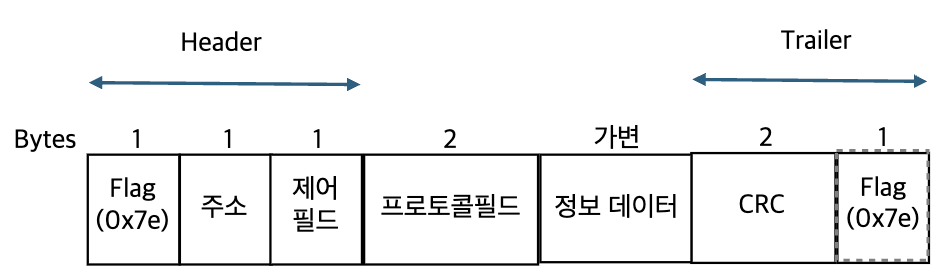

- **정의**
    - 두 지점 간의 직렬 링크를 통해 데이터를 전송하는 프로토콜로, 특히 전화선, DSL, VPN 연결 등에서 사용됨
- **특징**
    - 인증, 암호화 및 압축 기능을 지원
    - 다양한 네트워크 프로토콜을 지원
- **동작 방식**
    - 데이터 링크 계층에서 점대점(Point-to-Point) 연결을 설정하고, 네트워크 계층과 전송 계층에서 데이터를 전송함
- **장단점**
    - **장점**
        - 다양한 네트워크 기술과 호환됨
    - **단점**
        - 연결 수립 및 해제 시 시간이 소요될 수 있음
- **활용**
    - 전화선, DSL, 케이블 모뎀 및 VPN에서 많이 사용됨

**HDLC (High-Level Data Link Control)**

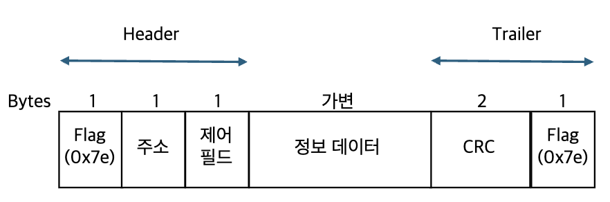

- **정의**
    - 데이터 링크 계층에서 데이터를 전송하는 프레임 기반의 프로토콜로, 데이터 전송의 효율성을 극대화
- **특징**
    - 전이중 모드 지원
    - 프레임 구조를 통해 오류 검출 및 흐름 제어 제공
- **동작 방식**
    - 데이터가 송신될 때 프레임을 캡슐화하고, 수신자는 오류를 검사하여 다시 전송할 수 있도록 함
- **장단점**
    - **장점**
        - 효율적인 데이터 전송 및 오류 검출
    - **단점**
        - 프레임 크기가 제한적일 수 있음
- **활용**
    - LAN, WAN 및 시리얼 연결에서 사용

**MAC (Media Access Control)과 프레임 처리**

- **MAC (Media Access Control)**
    - **정의**
        - 네트워크에서 데이터 링크 계층의 하위 계층으로, 네트워크 장치들이 공유된 통신 매체를 어떻게 접근하고 사용할지에 대한 규칙을 정의하는 프로토콜
    - **특징**
        - 데이터 링크 계층에서의 송수신 규칙을 설정
        - 트워크 장치들이 충돌 없이 데이터를 전송할 수 있도록 매체 접근을 제어
        - Ethernet, Wi-Fi 등 다양한 네트워크 기술에서 MAC 주소를 사용해 장치 식별
    - **동작 방식**
        - 각 네트워크 장치는 고유의 MAC 주소를 가지고 있으며, 이를 통해 네트워크 내에서 데이터 송수신 시 특정 장치를 식별
        - 여러 장치가 같은 통신 매체를 공유할 경우, 이를 효과적으로 제어하기 위해 다양한 매체 접근 제어 방식을 사용
        - 대표적으로 CSMA/CD, CSMA/CA 등의 프로토콜이 사용됨
            - **CSMA/CD (Carrier Sense Multiple Access with Collision Detection)**: Ethernet에서 사용되는 MAC 프로토콜로, 장치가 전송 전 매체를 감지하고, 매체가 비어 있으면 전송하며, 충돌이 발생하면 다시 전송을 시도
            - **CSMA/CA (Carrier Sense Multiple Access with Collision Avoidance)**: Wi-Fi에서 사용되며, 충돌을 미리 방지하는 방식으로, 전송 전에 네트워크가 비어 있는지 확인하고 전송
    - **장단점**
        - **장점**
            - 여러 장치가 동일한 네트워크 자원을 효율적으로 공유 가능
        - **단점**
            - 충돌이 발생할 수 있으며, 충돌이 발생하면 재전송이 필요
    - **활용**
        - Ethernet, Wi-Fi, Bluetooth 등에서의 데이터 전송과 관련된 네트워크 장치 간 통신
    - **코드 예시**
        <details>
            <summary><b>C로 구현한 CSMA/CD 방식</b></summary>
            ```c
        #include <stdio.h>
        #include <stdlib.h>
        #include <time.h>
        
        // 충돌 여부를 랜덤하게 생성하는 함수
        int check_for_collision() {
            return rand() % 2; // 50% 확률로 충돌 발생
        }
        
        // CSMA/CD 프로토콜 적용 예시
        void csma_cd() {
            int transmission_attempts = 0;
            int collision = 1;
            
            while (collision && transmission_attempts < 5) {
                printf("Attempt %d to send data\n", transmission_attempts + 1);
                collision = check_for_collision();  // 충돌 검사
                if (collision) {
                    printf("Collision detected, retrying...\n");
                    transmission_attempts++;
                    sleep(1);  // 대기 시간 후 재전송 시도
                } else {
                    printf("Data sent successfully\n");
                }
            }
        
            if (collision == 0) {
                printf("Transmission successful after %d attempts\n", transmission_attempts + 1);
            } else {
                printf("Failed to transmit after 5 attempts\n");
            }
        }
        
        int main() {
            srand(time(0)); // 랜덤 시드 초기화
            csma_cd(); // CSMA/CD 프로토콜 실행
            return 0;
        }
        ```
        </details>
        <details>
            <summary><b>Python로 구현한 CSMA/CD 방식</b></summary>
            ```python
            import random
            import time
            
            # 충돌 여부를 랜덤하게 생성하는 함수
            def check_for_collision():
                return random.choice([True, False])  # True이면 충돌, False이면 충돌 없음
            
            # CSMA/CD 프로토콜 적용 예시
            def csma_cd():
                transmission_attempts = 0
                collision = True
            
                while collision and transmission_attempts < 5:
                    print(f"Attempt {transmission_attempts + 1} to send data")
                    collision = check_for_collision()  # 충돌 검사
                    if collision:
                        print("Collision detected, retrying...")
                        transmission_attempts += 1
                        time.sleep(1)  # 대기 시간 후 재전송 시도
                    else:
                        print("Data sent successfully")
            
                if not collision:
                    print(f"Transmission successful after {transmission_attempts + 1} attempts")
                else:
                    print("Failed to transmit after 5 attempts")
            
            csma_cd()  # CSMA/CD 프로토콜 실행
            ```
        </details>
            
- **프레임 처리 (Frame Handling)**

- 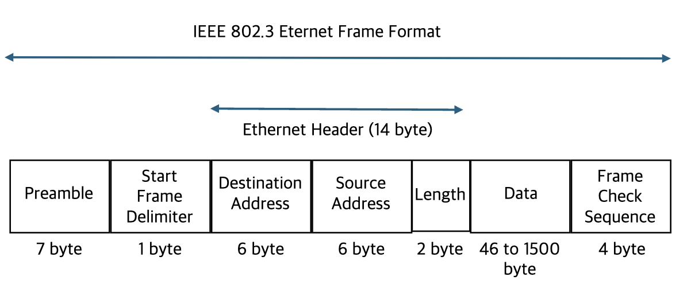

    - **정의**
        - 데이터 링크 계층에서 전송되는 데이터의 최소 단위인 **프레임**을 처리하는 방식
    - **특징**
        - 데이터 링크 계층에서 프레임을 생성하고, 전송 및 수신하는 과정에서 프레임을 다룸
        - 프레임에는 데이터와 함께 헤더, 오류 검출 정보 등이 포함되어 있음
        - MAC 계층에서 다루는 주요 요소는 프레임의 전송 및 수신, 오류 검출 및 수정
    - **동작 방식**
        - 송신 측에서는 데이터를 프레임 단위로 분할하여 전송
        - 수신 측에서는 수신된 프레임을 분석하고, 오류가 있을 경우 오류를 수정하거나 재전송 요청
        - 프레임 헤더에는 MAC 주소, 오류 검출 코드, 데이터 유형 등의 정보가 포함
    - **장단점**
        - **장점**
            - 데이터의 신뢰성 있는 전송을 위해 오류를 검출하고 수정할 수 있음
        - **단점**
            - 오류 검출을 위해 추가적인 시간과 자원이 필요
    - **활용**
        - Ethernet 프레임, Wi-Fi 프레임, Bluetooth 프레임 등에서의 데이터 전송 과정

### 네트워크 계층 프로토콜 (Network Layer Protocols)

**IPv4와 IPv6 - 구조, 헤더, 주소 체계**

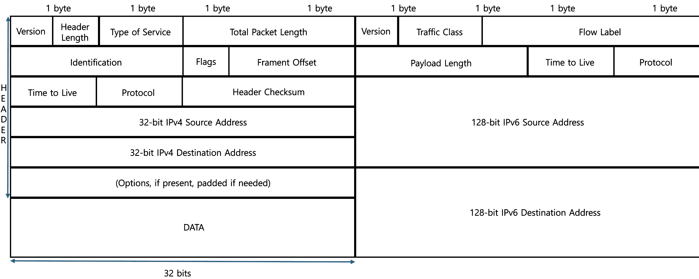

- **IPv4**
    - **구조**
        - 32비트 주소
    - **헤더**
        - 버전, 헤더 길이, 서비스 종류, 총 길이, 식별자, 플래그, TTL, 프로토콜, 헤더 체크섬, 출발지/목적지 주소 등
    - **주소 체계**
        - 32비트로 구성된 4개의 8비트 옥텟으로 표현 (예: 192.168.1.1)
- **IPv6**
    - **구조**
        - 128비트 주소
    - **헤더**
        - 버전, 트래픽 클래스, 흐름 레이블, 페이로드 길이, 프로토콜, 출발지/목적지 주소 등
    - **주소 체계**
        - 128비트로 구성되어 8개의 16비트 블록으로 표현 (예: 2001:0db8:85a3:0000:0000:8a2e:0370:7334)

**ICMP(Internet Control Message Protocol)**

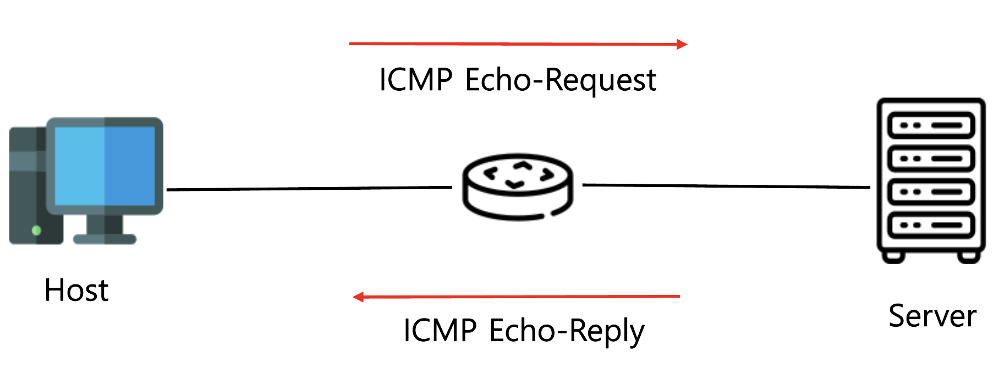

- **정의**
    - 네트워크 통신에서 오류 메시지나 제어 메시지를 전달하는 프로토콜
- **특징**
    - 오류 보고 및 진단 기능 제공
    - 패킷 전송 문제를 진단할 수 있는 ping 명령에 사용
- **동작 방식**
    - ICMP 메시지는 네트워크 장치 간에 전송되어 오류나 진단 정보를 제공
- **장단점**
    - **장점**
        - 네트워크 상태 확인 및 오류 진단에 유용
    - **단점**
        - 보안 취약점(DoS 공격 등에 사용될 수 있음)
- **활용**
    - ping, traceroute 등의 네트워크 진단 도구에 사용

**ARP(Address Resolution Protocol)**

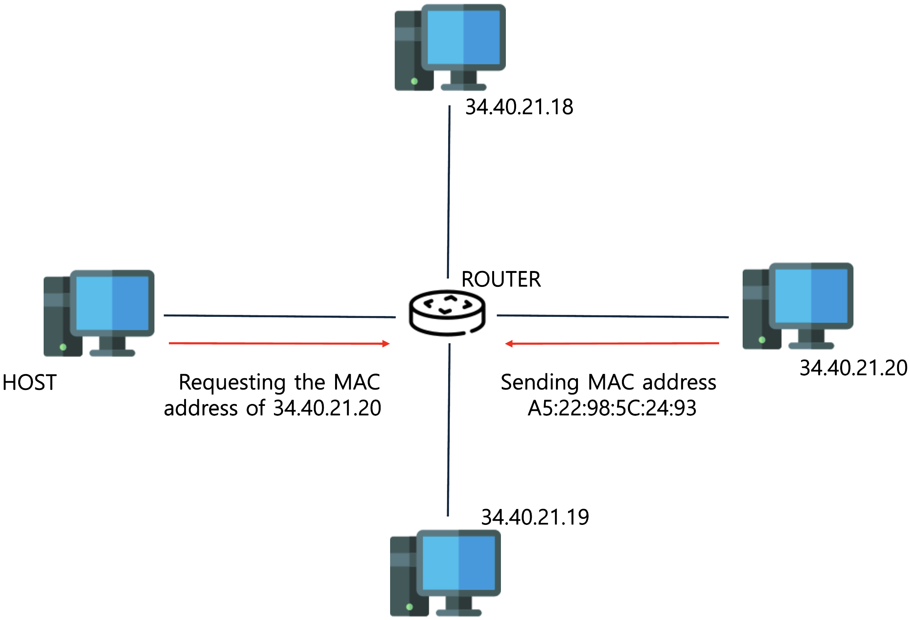

- **정의**
    - IP 주소를 MAC 주소로 변환하는 프로토콜
- **특징**
    - 로컬 네트워크 내에서 IP 주소에 대응하는 MAC 주소를 찾아냄
    - ARP 요청 및 응답 메시지 사용
- **동작 방식**
    - 클라이언트가 네트워크에서 IP 주소에 해당하는 MAC 주소를 요청하여 응답을 받음
- **장단점**
    - **장점**
        - 네트워크 내 장치 간의 효율적인 주소 변환
    - **단점**
        - ARP 스푸핑 공격에 취약할 수 있음
- **활용**
    - 로컬 네트워크에서 IP-MAC 주소 매핑

**RARP(Reverse ARP)**

- **정의**
    - MAC 주소를 이용해 IP 주소를 조회하는 프로토콜
- **특징**
    - 일반적으로 ARP와 반대의 역할을 수행
    - 주로 디스크가 없는 장치가 IP 주소를 얻을 때 사용
- **동작 방식**
    - MAC 주소를 가진 장치가 RARP 요청을 보내 IP 주소를 할당받음
- **장단점**
    - **장점**
        - MAC 주소 기반 IP 주소 할당 가능
    - **단점**
        - 현재는 사용되지 않으며 DHCP로 대체됨
- **활용**
    - 초기 네트워크에서 디스크 없는 장치의 IP 할당

### 전송 계층 프로토콜 (Transport Layer Protocols)

**TCP(Transmission Control Protocol)**

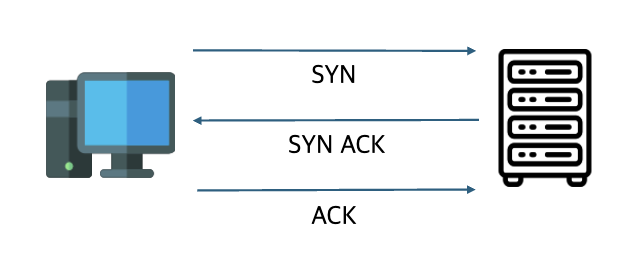

- **정의**
    - 신뢰성 있는 데이터 전송을 제공하는 연결 지향적 프로토콜
- **특징**
    - 데이터 전송 보장, 순서대로 전송
    - 흐름 제어, 오류 제어 및 재전송 기능 제공
- **동작 방식**
    - 3-way handshake를 통해 연결을 수립한 후 데이터를 전송하고, 수신 확인 및 오류가 있을 경우 재전송
- **장단점**
    - **장점**
        - 데이터 손실 방지, 신뢰성 제공
    - **단점**
        - 연결 설정 및 종료에 시간 소모, 속도 저하
- **활용**
    - 웹 브라우징, 이메일 전송, 파일 전송 등

**UDP(User Datagram Protocol)**


- **정의**
    - 비연결형 데이터 전송을 제공하는 프로토콜
- **특징**
    - 신뢰성 없는 빠른 데이터 전송
    - 연결 설정 없이 데이터그램을 전송
- **동작 방식**
    - 데이터를 그대로 전송하며, 수신 확인이나 오류 복구 기능이 없음
- **장단점**
    - **장점**
        - 빠른 전송, 오버헤드가 적음
    - **단점**
        - 신뢰성이 부족, 데이터 손실 가능
- **활용**
    - 실시간 스트리밍, VoIP 등 신속한 전송이 필요한 서비스에 사용

**포트 번호와 소켓 프로그래밍(Socket Programming)**

- **포트 번호 (Port Number)**
    - **정의**
        - 네트워크 상에서 통신하는 애플리케이션을 구별하는 고유 번호
    - **특징**
        - 각 포트 번호는 특정 애플리케이션이나 서비스와 연관됨
        - 16비트 숫자로, 0부터 65535까지의 값 가짐
    - **동작 방식**
        - 송신자와 수신자가 데이터 전송 시, 각 애플리케이션의 포트 번호를 사용하여 특정 애플리케이션에 데이터를 전달
    - **장단점**
        - **장점**
            - 특정 서비스와 애플리케이션을 구별하는 데 유용
        - **단점**
            - 포트 번호가 잘못 지정되면 통신이 실패할 수 있음
    - **활용**
        - 웹 서비스(HTTP: 80, HTTPS: 443), FTP(21), 이메일(SMTP: 25) 등 다양한 네트워크 서비스에 사용
- **소켓 프로그래밍 (Socket Programming)**

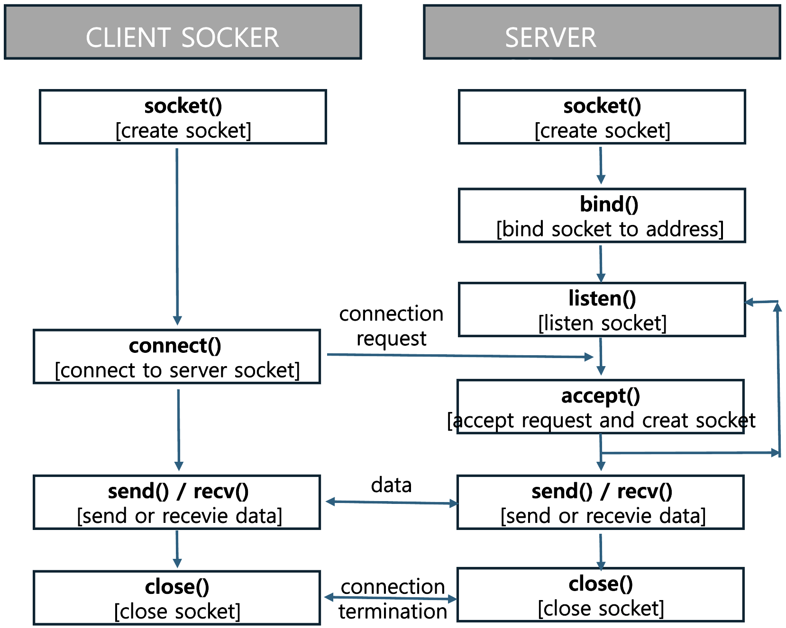

    - **정의**
        - 네트워크 상에서 데이터 송수신을 위한 소프트웨어 인터페이스 제공
    - **특징**
        - 서버와 클라이언트가 서로 연결할 수 있도록 하는 API 제공
        - TCP/IP 프로토콜을 통해 데이터 전송
        - 소켓을 통해 클라이언트와 서버는 연결, 통신, 데이터 전송을 처리
    - **동작 방식**
        - **서버**
            - 소켓을 생성하고, 특정 포트 번호를 통해 클라이언트의 연결을 기다림
            - 클라이언트의 연결 요청을 수락하고, 데이터를 송수신함
        - **클라이언트**
            - 서버의 IP 주소와 포트 번호를 통해 서버와 연결을 시도함
            - 서버와 연결되면, 데이터를 송수신함
    - **장단점**
        - **장점**
            - 네트워크 통신을 위한 강력한 도구, 다양한 프로토콜을 지원
        - **단점**
            - 네트워크 상태에 따라 성능이 영향을 받을 수 있음, 보안 문제 발생 가능
    - **활용**
        - 웹 서버와 클라이언트 간의 통신, 채팅 애플리케이션, 파일 전송 시스템 등
    - **코드 예시**
    - **C로 구현한 서버 코드**
        
        ```c
        #include <stdio.h>
        #include <stdlib.h>
        #include <string.h>
        #include <unistd.h>
        #include <arpa/inet.h>
        
        int main() {
            int server_fd, client_fd;
            struct sockaddr_in server_addr, client_addr;
            socklen_t addr_size;
            char buffer[1024];
        
            // 소켓 생성
            server_fd = socket(AF_INET, SOCK_STREAM, 0);
            if (server_fd < 0) {
                perror("Socket creation failed");
                exit(EXIT_FAILURE);
            }
        
            // 서버 주소 설정
            server_addr.sin_family = AF_INET;
            server_addr.sin_port = 8080;
            server_addr.sin_addr.s_addr = INADDR_ANY;
        
            // 소켓에 주소 바인딩
            if (bind(server_fd, (struct sockaddr*)&server_addr, sizeof(server_addr)) < 0) {
                perror("Binding failed");
                exit(EXIT_FAILURE);
            }
        
            // 클라이언트 연결 대기
            if (listen(server_fd, 10) == 0) {
                printf("Listening...\n");
            } else {
                perror("Listen failed");
                exit(EXIT_FAILURE);
            }
        
            // 클라이언트 연결 수락
            addr_size = sizeof(client_addr);
            client_fd = accept(server_fd, (struct sockaddr*)&client_addr, &addr_size);
            if (client_fd < 0) {
                perror("Client accept failed");
                exit(EXIT_FAILURE);
            }
        
            // 데이터 수신
            recv(client_fd, buffer, sizeof(buffer), 0);
            printf("Message from client: %s\n", buffer);
        
            // 응답 메시지 전송
            send(client_fd, "Hello, client!", 14, 0);
        
            // 소켓 닫기
            close(client_fd);
            close(server_fd);
        
            return 0;
        }
        ```
        
    - **C로 구현한 클라이언트 코드**
        
        ```c
        #include <stdio.h>
        #include <stdlib.h>
        #include <string.h>
        #include <unistd.h>
        #include <arpa/inet.h>
        
        int main() {
            int sock;
            struct sockaddr_in server_addr;
            char buffer[1024];
        
            // 소켓 생성
            sock = socket(AF_INET, SOCK_STREAM, 0);
            if (sock < 0) {
                perror("Socket creation failed");
                exit(EXIT_FAILURE);
            }
        
            // 서버 주소 설정
            server_addr.sin_family = AF_INET;
            server_addr.sin_port = 8080;
            server_addr.sin_addr.s_addr = inet_addr("127.0.0.1");
        
            // 서버와 연결
            if (connect(sock, (struct sockaddr*)&server_addr, sizeof(server_addr)) < 0) {
                perror("Connection failed");
                exit(EXIT_FAILURE);
            }
        
            // 서버로 데이터 전송
            send(sock, "Hello, server!", 14, 0);
        
            // 서버로부터 응답 수신
            recv(sock, buffer, sizeof(buffer), 0);
            printf("Message from server: %s\n", buffer);
        
            // 소켓 닫기
            close(sock);
        
            return 0;
        }
        ```
        
    - **Python으로 구현한 서버 코드**
        
        ```python
        import socket
        
        # 서버 설정
        server_socket = socket.socket(socket.AF_INET, socket.SOCK_STREAM)
        server_socket.bind(('0.0.0.0', 8080))
        server_socket.listen(1)
        
        print("Server listening...")
        
        # 클라이언트 연결 수락
        client_socket, client_address = server_socket.accept()
        print(f"Connection from {client_address}")
        
        # 데이터 수신
        data = client_socket.recv(1024)
        print(f"Message from client: {data.decode()}")
        
        # 응답 전송
        client_socket.sendall("Hello, client!".encode())
        
        # 소켓 닫기
        client_socket.close()
        server_socket.close()
        ```
        
    - **Python으로 구현한 클라이언트 코드**
        
        ```python
        import socket
        
        # 서버 설정
        client_socket = socket.socket(socket.AF_INET, socket.SOCK_STREAM)
        client_socket.connect(('127.0.0.1', 8080))
        
        # 데이터 전송
        client_socket.sendall("Hello, server!".encode())
        
        # 서버로부터 응답 수신
        data = client_socket.recv(1024)
        print(f"Message from server: {data.decode()}")
        
        # 소켓 닫기
        client_socket.close()
        ```
                

### 응용 계층 프로토콜 (Application Layer Protocols)

**HTTP/HTTPS (Web Communication)**

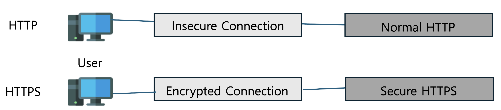

- **정의**
    - HTTP는 클라이언트와 서버 간의 요청-응답 기반 웹 통신 프로토콜, HTTPS는 보안 버전
- **특징**
    - HTTP는 텍스트 기반의 간단한 프로토콜
    - HTTPS는 SSL/TLS 암호화로 보안성 강화
- **동작 방식**
    - 클라이언트가 서버에 HTTP 요청을 보내고, 서버가 응답을 보내 웹 페이지를 표시
- **장단점**
    - **장점**
        - 간단하고 표준화된 방식
    - **단점**
        - 보안 취약점이 존재할 수 있음
- **활용**
    - 웹사이트 접속, RESTful API 호출 등

**FTP(File Transfer Protocol)**

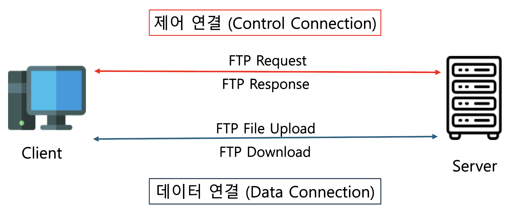

- **정의**
    - 파일 전송을 위한 프로토콜로, 클라이언트와 서버 간에 파일을 업로드 및 다운로드할 수 있음
- **특징**
    - 파일 전송을 위해 별도의 연결을 사용
    - 인증을 통한 접근 제어 제공
- **동작 방식**
    - FTP 클라이언트가 FTP 서버에 연결하여 파일을 전송
- **장단점**
    - **장점**
        - 대용량 파일 전송에 효율적
    - **단점**
        - 보안이 취약할 수 있음
- **활용**
    - 파일 업로드, 다운로드 등

**SMTP/POP3/IMAP**

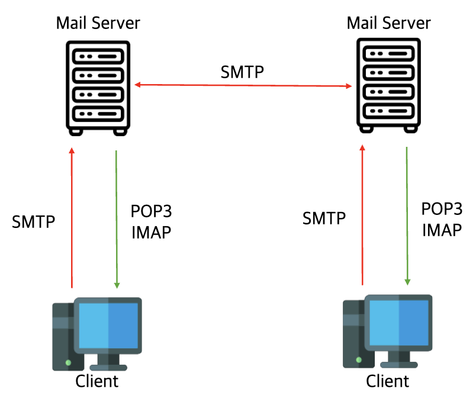

- **정의**
    - 이메일 통신을 위한 프로토콜
        - SMTP: 이메일 발송
        - POP3/IMAP: 이메일 수신 및 관리
- **특징**
    - SMTP는 이메일 송신만 가능
    - POP3는 서버에서 이메일을 다운로드하고 삭제
    - IMAP은 서버에서 이메일을 읽고 관리
- **동작 방식**
    - 데이터그램을 독립적으로 전송하며, 수신자는 응답을 요구하지 않음
- **장단점**
    - **장점**
        - 이메일 송수신을 표준화
    - **단점**
        - POP3는 이메일 서버에서 삭제되며, IMAP은 저장 용량이 커질 수 있음
- **활용**
    - 실시간 스트리밍, VoIP, DNS 요청 등

**DNS(Domain Name System)**

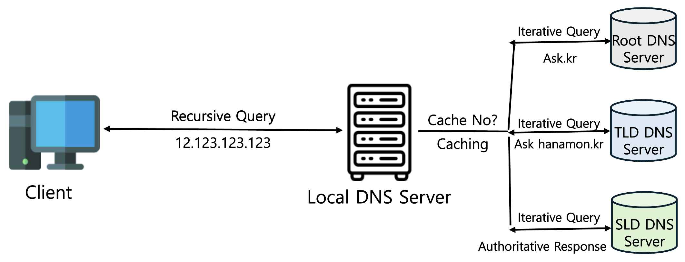

- **정의**
    - 도메인 이름을 IP 주소로 변환하는 시스템
- **특징**
    - 도메인 이름을 IP 주소로 매핑
    - 계층적이고 분산된 시스템
- **동작 방식**
    - DNS 요청이 서버로 전송되어, 도메인 이름을 IP 주소로 변환하여 반환
- **장단점**
    - **장점**
        - 사용자가 도메인 이름을 통해 손쉽게 웹사이트 접속 가능
    - **단점**
        - DNS 서버 장애 시 인터넷 연결 불가능
- **활용**
    - 도메인 이름 관리

**DHCP (Dynamic Host Configuration Protocol)**

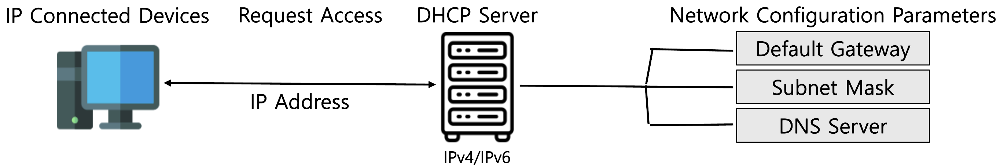

- **정의**
    - 네트워크 상의 장치에 동적으로 IP 주소를 할당하는 프로토콜
- **특징**
    - 자동으로 IP 주소와 기타 네트워크 설정을 할당
    - 효율적인 네트워크 관리
- **동작 방식**
    - 클라이언트가 DHCP 서버에 요청을 보내 IP 주소를 할당받음
- **장단점**
    - **장점**
        - 네트워크 관리가 용이
    - **단점**
        - 서버 장애 시 IP 할당 불가
- **활용**
    - 네트워크 장치의 IP 주소 할당

# 네트워크 설계와 관리 (Network Design and Management)

### 네트워크 설계 원칙 (Principles of Network Design) - 확장성(Scalability), 신뢰성(Reliability), 비용 효율성(Cost Efficiency)

**확장성(Scalability)**

- **정의**: 네트워크는 사용자 수나 트래픽 증가에 따라 쉽게 확장 가능해야 함
- **특징**:
    - 성능 측정을 통해 트래픽 증가에 대응할 방안을 세워야 함
    - 확장성을 높이는 방안
        - 규모 확장
            - 다수의 낮은 사양의 장비에 부하를 분산시킴
        - 용량 확장
            - 성능이 좋은 장비로 교체함

**신뢰성(Reliability)**

- **정의**: 네트워크는 높은 가용성과 장애 발생 시 빠른 복구 능력을 가져야 함
- **특징**:
    - 결함을 0으로 만드는 것을 불가능하므로, 최대한 줄이는 것이 필요함
    - 신뢰성을 저해하는 요소
        - 하드디스크 고장, 램의 결함 등의 하드웨어 결함
        - 내부 시스템 오류 등의 소프트웨어 결함
        - 관리자의 실수 등의 인적 오류

**비용 효율성(Cost Efficiency)**

- **정의**: 네트워크 설계는 산업 표준과 규정을 준수해야 함
- **특징**:
    - 높은 성능을 유지하면서도, 비용을 줄이기 위한 기술과 장비를 선택함

### IP 주소 체계 (IP Addressing System)

- **정의**: 인터넷에 연결되어 있는 각 장치를 식별하기 위해 TCP/IP 프로토콜 모음의 IP계층에서 사용하는 식별자임
- **특징**:
    - IP 주소를 이용하여 인터넷 또는 로컬 네트워크를 통해 컴퓨터에 정보를 공유함
    - IPv4, IPv6 두 가지의 표준이 있음

### IPv4 서브넷팅 및 CIDR(Classless Inter-Domain Routing)

**서브넷팅(Subnetting)**

- **정의**: 네트워크를 더 작은 단위의 네트워크로 분할하는 것임
- **특징**:
    - IP 주소의 일부를 네트워크 주소로 사용하고, 나머지를 호스트 주소로 사용하여 서브넷을 생성함
    - 서브넷 마스크를 사용하여 네트워크와 호스트를 구분함
    - 필요에 따라 서브넷 크기를 조절하여 IP주소를 낭비 없이 사용할 수 있음
- **동작 방식**:
    - `192.168.1.0/24` 네트워크를 두 개로 서브네팅을 함
    - 서브넷 주소는 각각 `192.168.1.0/25`, `192.168.1.128/25`임
    - 사용 가능한 서브넷 주소는 각각 `192.168.1.1` ~ `192.168.1.126`, `192.168.1.129` ~ `192.168.1.254`임
- **장점**:
    - IP 주소 낭비를 최소화함
    - 서브넷이 각각 독립적으로 운영되어 네트워크 트래픽을 분산시킬 수 있음
- **단점**:
    - 계산이 복잡하고, 잘못 설정 시 네트워크가 오히려 비효율적이 됨
    - 서브넷을 너무 많이 나누면 각 서브넷에 할당된 IP 주소의 수가 줄어들어, 전체 성능이 저하됨
- **활용 예시**:
    - 기업에서 부서 별 서브넷팅을 통해 트래픽 분배

**CIDR(Classless Inter-Domain Routing)**

- **정의**: 인터넷 상의 데이터 라우팅 효율성을 향상시키는 IP 주소 할당 방법으로, 클래스 없는 주소임
- **특징**:
    - IP 주소를 보다 효율적으로 배분하고 IP 공간 낭비를 줄이기 위해 도입됨
    - IP 주소 뒤에 슬래시와 숫자가 붙은 형식으로 표현함. (예: 192.168.1.0/24)
    - 가변 길이 서브넷 마스킹(VLSM)을 사용하여 IP 주소의 네트워크와 호스트 주소 비트 간의 비율을 변경함
- **장점**:
    - IP 주소의 낭비를 줄일 수 있음
    - 서브넷을 통해 데이터를 빠르게 전송할 수 있음
- **단점**:
    - 서브넷 마스크를 비트 단위로 설정해야 하므로, 계산이 복잡함
    - 일부 장비는 CIDR을 지원하지 않음
- **활용 예시**:
    - IP 주소 할당 최적화, 대형 네트워크 설계

### IPv6 주소 체계와 활용

**IPv6**

- **정의**: IP의 6번째 버전으로, 기존의 IPv4를 대체하는 역할을 함
- **특징**:
    - `2001:0db8:85a3:0000:0000:8a2e:0370:7334` 와 같은 128비트 또는 16바이트 길이의 주소를 사용함
    - 총 $2^{128}$개의 주소를 제공함
    - 주소는 16진수로 표현되고, 각 블록은 4자리 16진수로 구성됨
    - 연속된 0을 생략할 수 있는 주소 압축이 가능함
- **동작 예시**:
    - 유니캐스트 주소, 애니캐스트 주소, 멀티캐스트 주소 총 3가지가 사용됨
    - 유니캐스트 주소:
        - 일대일 전송 방식에서 사용함
        - 일반적인 인터넷 통신, 이메일 전송 등에서 사용함
        - `2001:0db8:85a3:0000:0000:8a2e:0370:7334`
    - 애니캐스트 주소:
        - client와 가장 가까운 PC에서 응답하는 방식에서 사용함
        - CDN 서비스에서 사용함
        - 
    - 멀티캐스트 주소:
        - 특정 그룹의 다수 수신자에게 전송할 때 사용함
        - 비디오 스트리밍, 화상 회의 등에서 사용함
        - `ff00::/8` 범위 내의 주소
- **장점**:
    - IP주소 부족 문제를 해결할 수 있음
    - 자동으로 IP를 구성할 수 있는 기능을 제공함
- **단점**:
    - IPv4와의 호환이 불가능함
    - IPv6으로의 완전한 전환을 위해 상당한 시간과 비용이 듬
    - 주소 길이가 길어 네트워크 성능이 저하될 수 있음

### VLAN과 네트워크 분리 (VLAN and Network Segmentation)

**VLAN(Virtual Local Area Network)**

- **정의**: 가상의 랜으로 하나의 물리 스위치에서 여러 가지 네트워크를 사용하도록 하는 기술임
- **특징**:
    - 한 스위치에서 서로 다른 논리적 네트워크를 구성할 수 있음
    - 다른 VLAN에 속한 장치는 통신을 하지 않음
    - 서로 다른 VLAN에 속한 장치는 통신하지 않기 때문에 보안이 강화된다.
    - 트래픽을 분리하여 혼잡을 줄이고, 네트워크 혼잡을 줄일 수 있다.
    - 스위치에서 설정되고, 스위치가 각 포트에 어떤 VLAN을 할당 할 지 결정한다.
- **동작 방식**:
- **장점**:
    - 서로 다른 VLAN에 속한 장치는 통신하지 않기 때문에 보안이 강화됨
    - 트래픽이 분리되어 네트워크 혼잡을 줄임
- **단점**:
    - VLAN 간 통신을 위해 추가 라우터가 필요함
    - 스위치가 지원해야 구성할 수 있어, 오래된 장비에서는 사용이 어려움
- **활용 예시**:
    - 학교에서 교사, 학생용 네트워크 분리
    - 공공 네트워크의 고객, 직원용 네트워크 분리

### NAT(Network Address Translation)와 포트 포워딩 (Port Forwarding)

**NAT(Network Address Translation)**

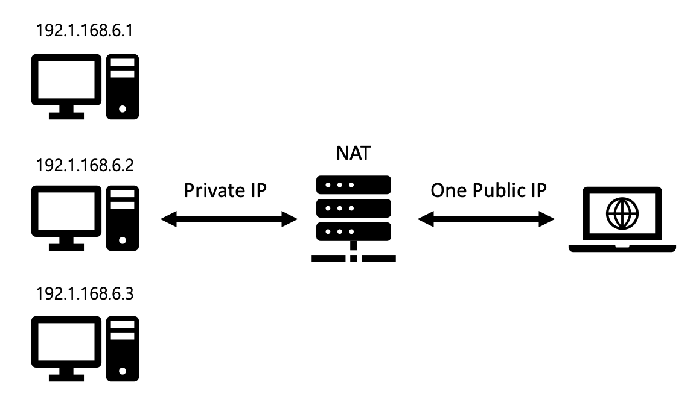

- **정의**: 하나의 공인 IP 주소를 여러 내부 네트워크 장치가 공유할 수 있도록 해주는 기술임
- **특징**:
    - 한 스위치에서 서로 다른 논리적 네트워크를 구성할 수 있음
    - 서로 다른 VLAN에 속한 장치는 통신하지 않기 때문에 보안이 강화됨
    - 트래픽을 분리하여 혼잡을 줄이고, 네트워크 혼잡을 줄일 수 있음
    - 스위치에서 설정되고, 스위치가 각 포트에 어떤 VLAN을 할당 할 지 결정함
- **동작 방식**:
    - 송신자는 패킷 헤더에 출발지와 목적지의 IP주소를 기록함(출발지는 사설IP 주소)
    - 패킷이 게이트웨이를 지나면 출발지의 IP주소를 자신의 공인 IP주소로 변경하고, NAT 테이블에 변경 내역을 저장함
    - 서버에서 패킷 수신 시, NAT 테이블에 저장된 IP주소를 확인하여 각 Host에게 패킷을 전달함
- **장점**:
    - 다수의 장치가 하나의 공인 IP 주소를 사용하므로, IPv4의 주소를 절약할 수 있음
    - 내부 IP가 외부에 알려지지 않아 보안성이 향상됨
    - 내부 네트워크 확장이 자유로움
- **단점**:
    - NAT 변환 작업으로 인한 처리 속도가 저하됨
    - 일부 애플리케이션은 NAT 환경에서 작동하지 않을 수 있음
    - IPv6에서는 사용되지 않음
- **활용 예시**:
    - 가정용 공유기에서 여러 장치 사용

**포트 포워딩 (Port Forwarding)**

- **정의**: 외부 네트워크에서 특정 포트로 들어오는 요청을 내부 네트워크의 특정 장치로 연결하는 방식임
- **특징**:
    - 외부에서 들어오는 특정 포트를 지정함
    - 수동으로 포워딩 규칙을 설정해야 함
- **동작 방식**:
    1. 외부 사용자가 공인 IP와 특정 포트로 요청.
    2. NAT는 요청을 미리 설정된 내부 네트워크 장치와 포트로 전달
    3. 내부 장치에서 응답 시 NAT가 외부 사용자로 응답 반환
- **장점**:
    - 외부에서 내부 서비스에 접근 가능함
    - 고정된 IP가 필요하지 않음
- **단점**:
    - 특정 포트가 외부에 개방되여 보안 문제가 발생할 수 있음
    - 포트를 개방하면, 많은 양의 트래픽이 내부로 전달되므로 성능이 저하됨
- **활용 예시**:
    - 원격으로 다른 PC에 접속함
    - IoT 기기를 가정용 네트워크에 연결함

### 트래픽 관리와 QoS (Traffic Management and Quality of Service)

**트래픽 관리**

- **정의**: 네트워크 장치에서 트래픽의 흐름을 모니터링하고 제어하여 병목 현상을 방지하는 것임
- **특징**:
    - 실시간 서비스와 비실시간 서비스의 차이를 맞추고 트래픽이 원활히 전달되도록 우선순위를 보장함
    - 네트워크 성능에 영향을 미치는 주요 요소:
        - 대기 시간 (Latency):
            - 패킷이 네트워크를 통해 전달되는 데 걸리는 시간임
        - 지연 변동 (Jitter):
            - 패킷이 네트워크를 통해 전달될 때의 지연 시간의 변동임
        - 패킷 손실 (Packet Loss):
            - 네트워크에서 패킷이 손실되는 현상임
        - 대역폭 (Bandwidth):
            - 네트워크가 데이터를 전송할 수 있는 속도임
- **동작 방식**:
    - 트래픽 쉐이핑(Traffic Shaping): 네트워크 트래픽 속도를 제한하여 과도한 사용을 방지함
    - 로드 밸런싱(Load Balancing): 트래픽을 여러 서버로 분산하여 네트워크 부하를 줄임
    - 대역폭 할당(Bandwidth Allocation): 사용자 또는 애플리케이션별로 대역폭을 고정 또는 가변적으로 설정함
- **장점**:
    - 대역폭을 적절히 할당하여 네트워크 혼잡을 줄임
    - QoS를 보장함
    - 비정상적인 트래픽을 감지하여 보안성을 높임
- **단점**:
    - 대규모 트래픽 관리에 높은 비용이 듦
    - 트래픽 정책, 우선순위 등 설정이 복잡하고 성능이 저하될 수 있음
- **활용 예시**: 기업 네트워크에서 직원들이 스트리밍 서비스를 사용하는 것을 제한하고, 업무 관련 트래픽에 더 많은 대역폭을 할당함

**QoS (Traffic Management and Quality of Service)**

- **정의**: 네트워크 트래픽 중 중요 데이터를 우선적으로 처리하여 서비스 품질을 보장하는 기술임
- **특징**:
    - 트래픽 유형 별로 대역폭을 할당함
    - 우선 순위에 따라 처리 순서를 결정함
- **동작 방식**:
    - 네트워크 장비가 트래픽을 분석하고, 패킷 헤더에 QoS 정보를 삽입함
    - 우선순위를 설정하거나, 대역폭을 제한함
- **장점**:
    - 스트리밍 등 실시간 애플리케이션의 성능과 안정성을 보장함
    - 중요 트래픽을 우선 처리하여 효율성을 높임
- **단점**:
    - QoS 설정에 대한 높은 지식이 필요함
    - 대역폭이 부족한 경우 QoS로 해결이 불가능함
    - 모든 장치가 QoS를 지원해야 효과적임
- **활용 예시**: 회사에서 VoIP 통화와 비디오 컨퍼런스 트래픽은 가장 높은 우선순위를 부여하며, 일반 인터넷 브라우징 트래픽은 낮은 우선순위를 부여함

## 라우팅 및 스위치 (Routing and Switching)

### 라우팅의 개념 (Routing Concepts)

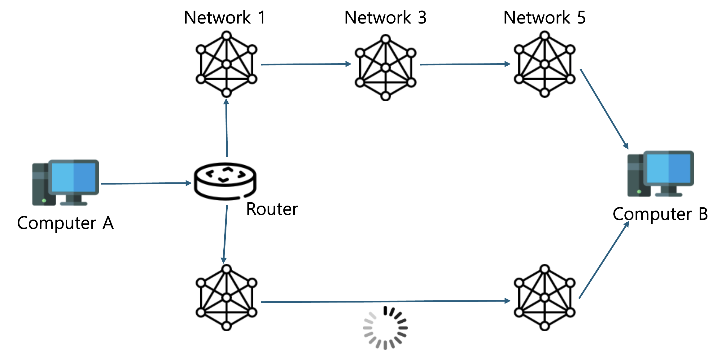

**정적 라우팅(Static Routing)**

- **정의**
    - 네트워크 관리자가 수동으로 라우팅 테이블에 경로를 설정하는 방식. 주로 작은 네트워크에서 사용됨
- **특징**
    - 경로를 수동으로 설정
    - 네트워크 변경 시 수동으로 경로를 수정해야 함
    - 트래픽이 일정하고 예측 가능한 경우에 유용
- **동작 방식**
    - 각 라우터는 직접 설정된 경로를 사용하여 데이터를 전달
    - 네트워크에 변화가 있을 때, 관리자에 의한 경로 수정이 필요
- **장단점**
    - **장점**
        - 간단하고, 네트워크 성능이 예측 가능
    - **단점**
        - 네트워크가 커지거나 변화가 잦을 경우, 관리가 어렵고 비효율적
- **활용**
    - 작은 네트워크, 고정된 경로를 통한 안정적인 연결이 필요한 환경

**동적 라우팅(Dynamic Routing)**

- **정의**
    - 네트워크의 상태를 자동으로 감지하여 라우터가 경로를 자동으로 설정하고 수정하는 방식
- **특징**
    - 네트워크 상황에 따라 동적으로 경로를 선택
    - 라우팅 프로토콜을 사용하여 네트워크 상태를 자동으로 공유
    - 대규모 네트워크에서 효율적
- **동작 방식**
    - 라우터는 라우팅 프로토콜을 통해 경로 정보를 서로 교환
    - 라우터는 최신 네트워크 상태를 기반으로 경로를 결정
    - 네트워크 변경에 따라 경로를 자동으로 갱신
- **장단점**
    - **장점**
        - 자동화된 경로 선택, 확장성 및 관리 용이
    - **단점**
        - 경로 계산에 시간이 소요되며, 네트워크가 복잡할 경우 라우팅이 불안정해질 수 있음
- **활용**
    - 대규모 네트워크, 네트워크 상태가 자주 변경되는 환경

### 라우팅 프로토콜 (Routing Protocols)

**내부 라우팅 프로토콜 (Interior Gateway Protocol, IGP)**

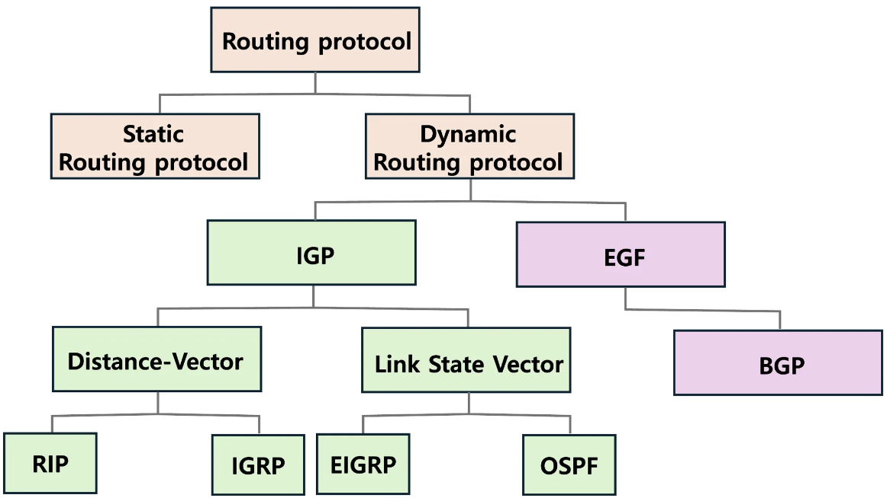

- **RIP (Routing Information Protocol)**
    - **정의**
        - 거리 벡터 라우팅 프로토콜로, 라우터 간에 경로 정보를 주기적으로 교환함
        - 각 라우터는 목적지까지의 거리만을 사용하여 경로를 계산함
    - **특징**
        - 최대 홉 수 15로 제한됨, 16 이상은 도달 불가
        - 라우팅 정보는 주기적으로 갱신됨
        - 간단하고 작은 네트워크에 적합함
    - **동작 방식**
        - 라우터는 인접 라우터로부터 경로 정보를 수신하고, 이를 기반으로 라우팅 테이블을 갱신함
        - 경로 정보는 주기적으로 교환되며, 변경 사항은 라우터에 즉시 반영됨
    - **장단점**
        - **장점**
            - 구현이 간단하고 설정이 쉬움
            - 작은 네트워크에서 효율적임
        - **단점**
            - 대규모 네트워크에서는 성능이 떨어짐
            - 15 홉 제한으로 큰 네트워크에서 사용이 불가능함
    - **활용**
        - 소규모 네트워크에서 주로 사용됨
        - 교육용 네트워크나 간단한 사무실 환경에서 적합함
- **OSPF (Open Shortest Path First)**
    - **정의**
        - 링크 상태 라우팅 프로토콜로, 각 라우터는 네트워크의 전체 상태를 알고리즘을 사용하여 최단 경로를 계산함
        - Dijkstra 알고리즘을 사용하여 최단 경로를 계산함
    - **특징**
        - 링크 상태 정보를 주기적으로 교환함
        - 각 라우터가 전체 네트워크의 상태를 이해하고 경로를 결정함
        - 대규모 네트워크에서 효율적으로 동작함
    - **동작 방식**
        - 각 라우터는 링크 상태 정보를 통해 네트워크 전체의 구조를 파악함
        - Dijkstra 알고리즘을 사용해 최단 경로를 계산함
        - 계층적 네트워크 설계를 지원하여 대규모 네트워크에서 유리함
    - **장단점**
        - **장점**
            - 대규모 네트워크에서 효율적임
            - 빠른 경로 계산과 빠른 네트워크 복구가 가능함
        - **단점**
            - 설정이 복잡함
            - 자원이 많이 소모되며, 라우터 간의 데이터 전송량이 많음
    - **활용**
        - 대규모 기업 네트워크에서 사용됨
        - ISPs와 대형 데이터 센터에서 유용하게 사용됨
- **EIGRP (Enhanced Interior Gateway Routing Protocol)**
    - **정의**
        - Cisco에서 개발한 하이브리드 라우팅 프로토콜로, 거리 벡터와 링크 상태의 특성을 결합함
        - DUAL 알고리즘을 사용하여 안정적인 경로를 계산함
    - **특징**
        - 빠른 경로 계산과 회복 속도가 빠름
        - 네트워크 상태 변화에 빠르게 반응하며, 효율적인 경로 선택이 가능함
    - **동작 방식**
        - 각 라우터는 DUAL 알고리즘을 통해 최적의 경로를 계산함
        - 경로 정보는 주기적으로 업데이트되며, 네트워크 변화가 있을 때 빠르게 경로를 갱신함
    - **장단점**
        - **장점**
            - 빠른 경로 계산과 빠른 회복
            - 작은 네트워크부터 대규모 네트워크까지 사용 가능
        - **단점**
            - Cisco 장비에서만 사용할 수 있음
            - 고급 설정이 필요함
    - **활용**
        - Cisco 기반의 대규모 네트워크에서 사용됨
        - 기업의 내부 네트워크에서 효율적으로 운용됨

**외부 라우팅 프로토콜 (Exterior Gateway Protocol, EGP)**

- **BGP (Border Gateway Protocol)**
    - **정의**
        - 자율 시스템(AS) 간 라우팅을 위한 프로토콜로, 인터넷에서 라우팅을 관리함
        - 경로 벡터 프로토콜로, 경로 선택 시 정책 기반으로 경로를 설정할 수 있음
    - **특징**
        - 자율 시스템(AS) 간 라우팅 정보를 교환함
        - 경로 선택 시 정책에 따라 경로를 선택하며, 인터넷 라우팅의 핵심 프로토콜임
    - **동작 방식**
        - AS 간에 경로 정보를 교환하며, BGP 라우터는 경로를 선택하는 데 정책을 사용함
        - 경로 선택을 위해 BGP는 경로의 길이, AS 경로 등을 고려함
    - **장단점**
        - **장점**
            - 인터넷 라우팅에서 핵심 역할을 수행함
            - 경로 선택 시 정책을 설정할 수 있음
        - **단점**
            - 설정과 운영이 복잡함
            - 라우팅 업데이트가 많아 네트워크에 부담을 줄 수 있음
    - **활용**
        - 인터넷 서비스 제공자(ISP) 및 대기업의 외부 네트워크에서 사용됨
        - 인터넷의 핵심 인프라에서 필수적인 역할을 함

### 스위치와 데이터 전달 (Switching and Data Transmission)

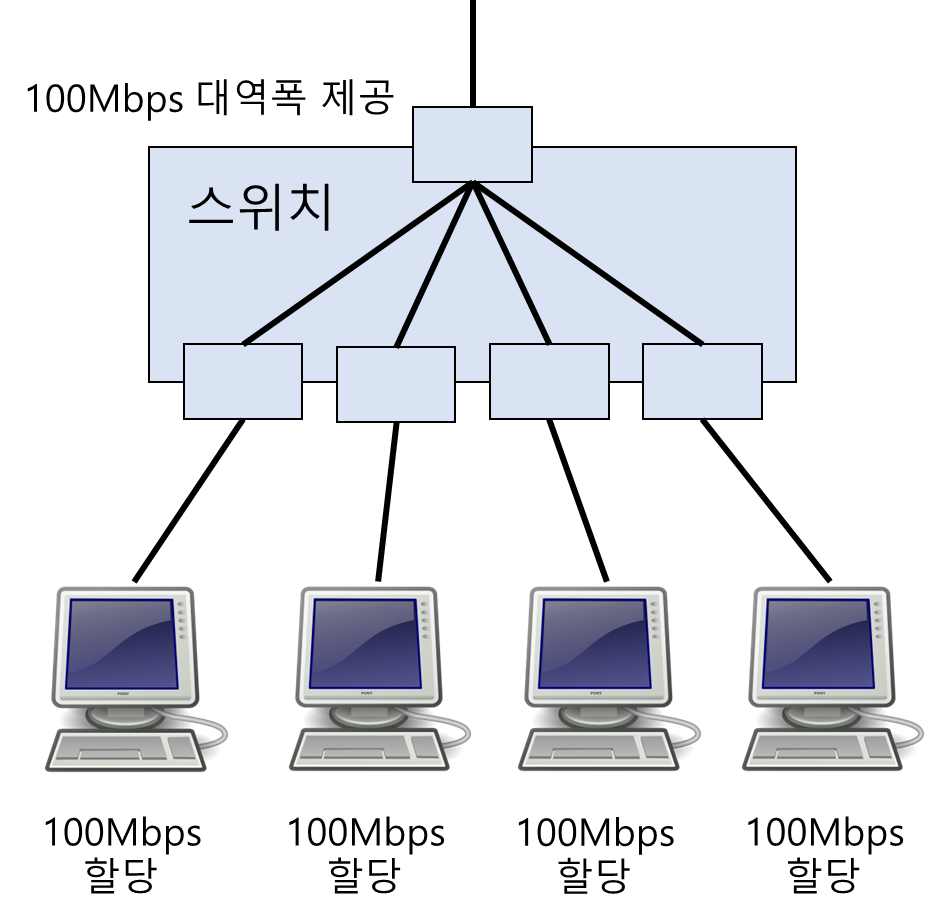

- **MAC(Media Access Control) 주소 테이블 관리**
        
    - **정의**
        - 스위치에서 각 포트에 연결된 장치들의 MAC 주소를 기록하여, 데이터 전송 시 이를 기반으로 목적지 포트를 결정
        - 16진수로 구성되며, 각 2자리씩 6개의 그룹으로 나뉨 (예: 00:1A:2B:3C:4D:5E)
     
          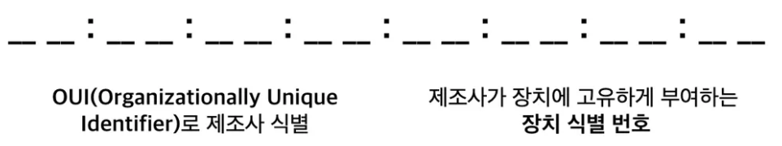
                        
    - **특징**
        - 스위치는 MAC 주소를 사용하여 네트워크 내 장치를 식별
        - 스위치는 수신된 데이터 프레임의 MAC 주소를 분석하여 목적지 장치로 전달
    - **동작 방식**
        - 각 포트에서 수신된 MAC 주소를 테이블에 기록
        - 테이블에 있는 MAC 주소를 통해 목적지 포트를 찾고, 데이터를 해당 포트로 전달
    - **장단점**
        - **장점**
            - 네트워크 트래픽을 효율적으로 처리하고, 브로드캐스트 영역을 줄일 수 있음
        - **단점**
            - 스위치 테이블이 너무 커지면 성능 저하가 발생할 수 있음
    - **활용**
        - LAN 환경에서 효율적인 데이터 전송 및 장치 간 통신
- **STP (Spanning Tree Protocol)**

    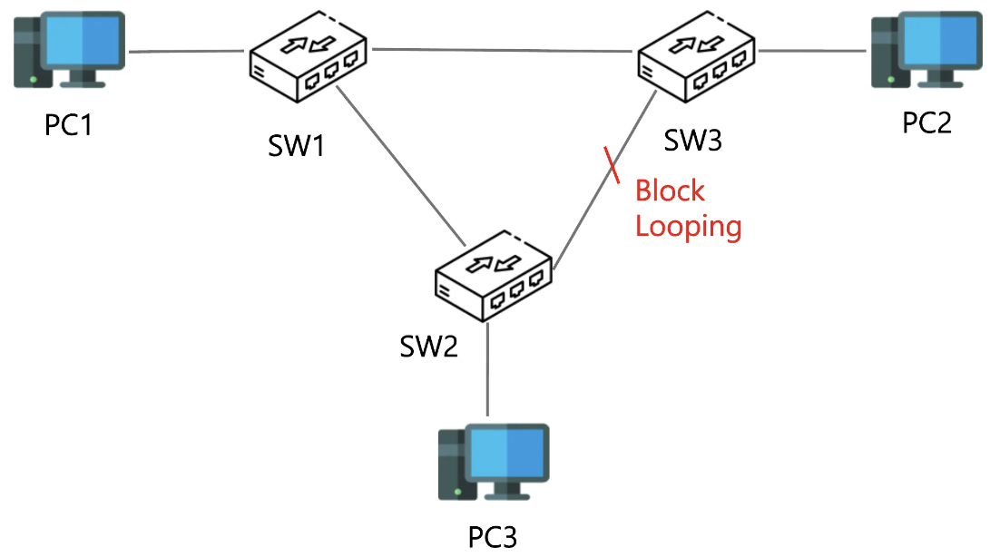
        
    - **정의**
        - 스위치 네트워크에서 루프를 방지하고, 최적의 경로를 선택하여 데이터 전송을 처리하는 프로토콜
    - **특징**
        - 네트워크에서 루프를 방지하기 위해 하나의 루트 스위치를 선정하고, 다른 스위치들이 루프를 만들지 않도록 경로를 차단
        - 트리 형태의 네트워크 구조를 유지
    - **동작 방식**
        - 각 스위치는 브리지 ID와 우선 순위를 사용하여 루트 스위치를 선출
        - 루프가 발생하지 않도록 최적의 경로를 설정하고, 장애 발생 시 대체 경로를 자동으로 활성화
    - **장단점**
        - **장점**
            - 네트워크 내에서 루프 방지 및 안정적인 데이터 전송
        - **단점**
            - 경로 전환에 시간이 걸려서 수초 동안 네트워크 연결이 끊길 수 있음
    - **활용**
        - 이더넷 스위치 환경에서의 안정적인 데이터 전송 및 네트워크 확장

# 네트워크 성능 평가 및 최적화 (Network Performance Evaluation and Optimization)

## 네트워크 성능 지표 (Network Performance Metrics)

**대역폭(Bandwidth)**

- **정의**: 단위 시간 동안 통신 매체를 통해 송수신할 수 있는 최대 정보량
- **특징**:
    - 주로 초당 비트수(bps) 단위로 측정함
    - 대역폭이 크면 전송 속도가 빨라짐

**지연(Latency)**

- **정의**: 데이터가 송신자에서 수신자까지 도달하는 데 걸리는 시간
- **특징**:
    - 네트워크의 응답 시간을 측정하는 지표임
    - 낮을 수록 네트워크의 성능이 좋음

**처리량(Throughput)**

- **정의**: 단위 시간당 네트워크를 통해 실제로 전송되는 정보량
- **특징**:
    - 네트워크를 통해 얼마나 많은 양의 데이터가 전송될 수 있는 지 나타냄
    - 
- **동작 방식**:

## 네트워크 트래픽 분석 (Traffic Analysis)

- **정의**: 네트워크에서 발생하는 데이터를 모니터링하고 분석하여 성능 문제를 해결하고, 최적화 방안을 찾는 과정임
- **특징**:
    - 성능을 모니터링하고, 최적화 하는 것이 목적임
    - 주로 흐름 데이터, 패킷 데이터를 가지고 정보를 수집함
    - 트래픽 분석 도구
        - Wireshark: 네트워크 트래픽을 실시간으로 캡처하고 분석할 수 있는 도구
        - SolarWinds: 네트워크 성능 모니터링 및 트래픽 분석 도구
        - NetFlow Analyzer: 네트워크 트래픽 패턴을 분석하여 성능 최적화 및 용량 계획에 활용되는 도구
- **활용 예시**:
    - 트래픽 급증 분석, DDoS 공격 대응

## 부하 분산과 로드 밸런싱 (Load Balancing)

- **정의**: 애플리케이션을 지원하는 리소스 풀 전체에 네트워크 트래픽을 균등하게 배포하는 방법
- **특징**:
    
    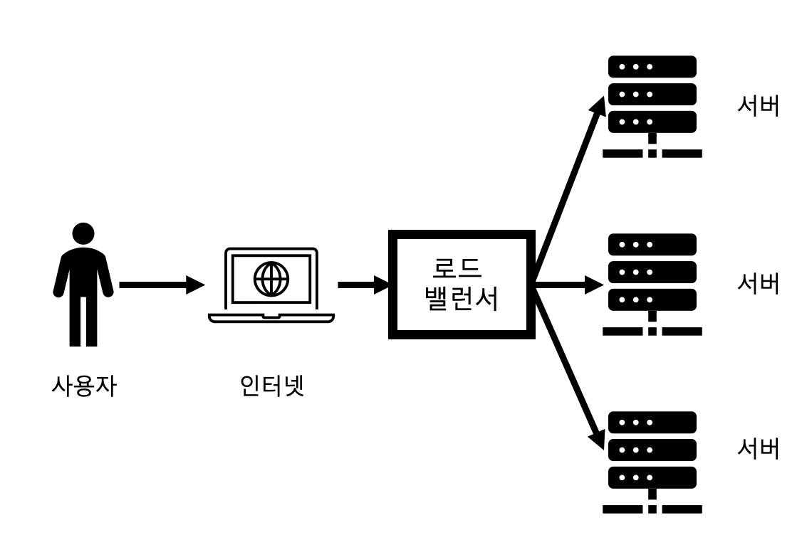
    
    - 애플리케이션 서버와 방문자 또는 클라이언트 간의 인터넷 트래픽을 지시하고 제어함
    - 오토 스케일링을 하여 조건에 맞추어 서버 용량을 변경함
    - L4와 L7에서의 정보를 바탕으로 각각 수행됨
- **동작 방식**:
    - 로드 밸런싱 알고리즘
        - 라운드 로빈(Round Robin)
            - 정적 로드 밸런싱 방법으로, 여러 서버에게 균등하게 분산하는 알고리즘
            - 서버 별로 요청을 균등하게 처리할 수 있음
            - 구현이 간단하고 효율적이지만, 특정 대상이 부하를 많이 받는 문제 발생할 수 있음
        - 최소 연결 방법
            - 동적 로드 밸런싱 방법으로, 현재 연결된 수가 가장 적은 서버에 우선적으로 요청하는 알고리즘
            - 대상의 부하 상태나 성능을 고려하지 않고, 연결 수가 적은 서버에 많은 요청을 보냄
            - 서버의 성능이나 상태를 고려하지 않으므로, 불균형한 로드 밸런싱이 발생함
- **장점**:
    - 여러 서버 간의 네트워크 트래픽을 지능적으로 처리 가능함
    - 트래픽을 모니터링하여 DDoS 공격 등을 방어함
    - 서버 간에 로드를 균등하게 배포하여 애플리케이션의 성능을 향상함
- **단점**:
    - 초기 시스템 구축 시 하드웨어 및 소프트웨어의 비용이 발생함
    - 환경에 따른 알고리즘 도입 등의 구성이 복잡함
- **활용 예시**:
    - AWS의 ALB, NLB
 
## 심화 주제

---

### SDN(Software-Defined Networking)과 NFV(Network Function Virtualization)

**SDN (Software-Defined Networking)**

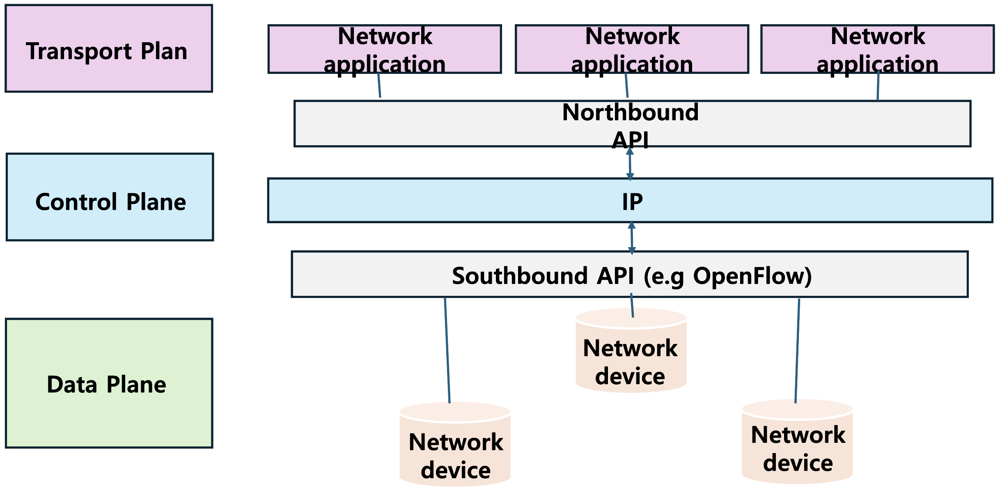

- **정의**
    - 네트워크 제어와 데이터 전달을 분리하여, 중앙 집중식으로 네트워크를 관리할 수 있도록 하는 기술
    - 네트워크의 제어 plane과 데이터 plane을 분리하여 유연하게 네트워크를 구성하고 관리함
- **특징**
    - 중앙집중식 제어 방식으로 네트워크 관리가 용이함
    - 프로그래밍 가능한 네트워크를 제공하여 빠르게 네트워크 구성을 변경할 수 있음
    - 하드웨어 독립적이고, 오픈 소스 기반의 다양한 솔루션이 존재함
- **동작 방식**
    - 네트워크 제어를 중앙에서 수행하고, 이를 통해 네트워크 장치들의 동작을 제어함
    - 네트워크 장치들은 제어 plane에서 오는 명령을 받아 데이터 전달을 수행함
    - SDN Controller가 네트워크 장비들을 제어하며, OpenFlow 프로토콜을 통해 장비와의 통신을 수행함
- **장단점**
    - **장점**
        - 네트워크 관리의 유연성 향상
        - 네트워크 자원 할당을 자동화하고 최적화할 수 있음
        - 빠른 서비스 배포가 가능함
    - **단점**
        - 보안과 개인정보 보호에 취약할 수 있음
        - SDN 네트워크를 구축하기 위한 초기 투자 비용이 높을 수 있음
- **활용**
    - 데이터 센터 및 클라우드 환경에서 많이 사용됨
    - 대규모 네트워크 인프라 및 트래픽 관리에 유리함
    - 네트워크 가상화와 리소스 관리를 최적화하는데 사용됨

**NFV (Network Function Virtualization)**

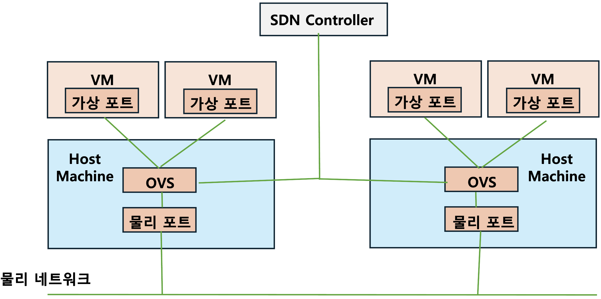

- **정의**
    - 하드웨어 기반 네트워크 기능을 소프트웨어 기반으로 구현하여 가상화된 인프라에서 실행할 수 있도록 하는 기술
    - 네트워크 기능을 소프트웨어로 분리하여, 물리적인 장비 없이 유연한 네트워크 구성을 가능하게 함
- **특징**
    - 네트워크 기능을 소프트웨어로 구현하여 비용 절감과 유연성을 제공함
    - 가상화 기술을 통해 네트워크 장비의 독립성 및 확장성을 향상시킴
    - 중앙에서 네트워크 기능을 동적으로 프로비저닝하고 관리할 수 있음
- **동작 방식**
    - 네트워크 기능들은 가상화된 환경에서 실행되며, 물리적인 장비에 의존하지 않음
    - VNF(Virtualized Network Function)를 통해 다양한 네트워크 기능(방화벽, 라우터, 로드 밸런서 등)을 가상화하여 제공함
    - NFV 관리자는 중앙에서 모든 네트워크 기능을 모니터링하고, 리소스 할당을 자동화함
- **장단점**
    - **장점**
        - 네트워크 기능을 유연하게 추가, 삭제, 변경할 수 있음
        - 하드웨어 비용 절감
        - 중앙 집중형 관리가 가능하고, 네트워크 리소스를 효율적으로 활용함
    - **단점**
        - 초기 도입 시 인프라 구성과 설정이 복잡할 수 있음
        - 고성능 네트워크 기능을 요구하는 경우 성능 저하가 있을 수 있음
- **활용**
    - 통신사 네트워크에서 가상화된 네트워크 기능을 제공하기 위해 사용됨
    - 클라우드 서비스 제공자들이 네트워크 기능을 가상화하여 비용을 절감하고 유연성을 높임
    - 데이터 센터 및 가상화된 인프라 환경에서 많이 활용됨

### MPLS(Multi-Protocol Label Switching) 기술

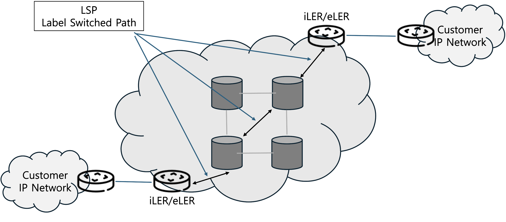

- **정의**
    - 패킷을 전송할 때, 라벨을 사용하여 패킷 전달 경로를 지정하는 기술
    - 패킷에 라벨을 부여하고, 해당 라벨을 통해 빠르고 효율적으로 패킷을 전달함
- **특징**
    - 라벨 기반의 전송 방식으로, IP 주소를 사용하는 것보다 더 빠르고 효율적임
    - 다양한 프로토콜을 지원하여 확장성이 뛰어남
    - 네트워크의 성능과 안정성을 향상시킴
- **동작 방식**
    - 패킷은 송신 측에서 라벨을 부여받고, 라우터를 거쳐 목적지까지 전송됨
    - 각 라우터는 라벨을 기반으로 패킷을 전달하며, 라벨을 변경하거나 제거함
    - 패킷의 라벨을 사용하여 전송 경로를 효율적으로 관리하고, QoS(서비스 품질)을 보장함
- **장단점**
    - **장점**
        - 빠르고 효율적인 라우팅을 제공함
        - 네트워크 트래픽을 효과적으로 관리하고, QoS 보장이 가능함
        - IP 기반의 라우팅에 비해 성능이 향상됨
    - **단점**
        - MPLS 구현을 위한 추가적인 인프라와 비용이 발생함
        - 설정이 복잡하고, 전문 지식이 필요함
- **활용**
    - 대규모 기업 및 통신망에서 널리 사용됨
    - 인터넷 서비스 제공자(ISP)에서 MPLS를 활용하여 트래픽을 최적화함
    - 서비스 품질 보장이 필요한 네트워크에서 활용됨
