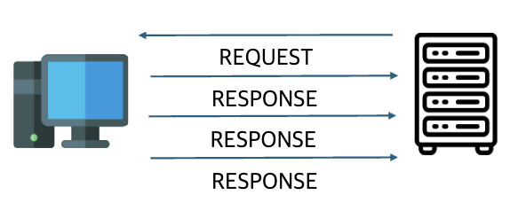

# 네트워크

# 네트워크 개요

## 네트워크의 정의와 필요성

- **정의**
    - 통신 및 데이터 교환을 용이하게 하기 위해 함께 연결된 컴퓨터, 서버, 라우터, 스위치 및 기타 네트워킹 장비와 같은 상호 연결된 장치의 모음
- **네트워크의 필요성**
    - 프린터 등의 공유 자원을 사용하기 위함
    - 이메일, 채팅, 화상 회의 등의 정보 교환을 위함
    - 서버의 데이터에 접근하기 위함

---

## 데이터 통신의 기본 구성 요소

**송신자(Sender)**

- **정의**
    - 데이터 메시지를 전송하는 장치
- **특징**
    - 데이터를 전송하기 위해 적절한 포맷으로 변환함
- **예시**
    - 이메일 작성자, 서버에서 데이터를 전송하는 애플리케이션

**수신자(Receiver)**

- **정의**
    - 송신자가 보낸 메시지를 받는 장치
- **특징**
    - 데이터를 수신하고 이를 적절히 표현하거나 저장함
- **예시**
    - 이메일 수신자, 서버에서 데이터를 처리하는 애플리케이션

**메시지(Message)**

- **정의**
    - 송신자가 보내는 실제 데이터
- **특징**
    - 텍스트, 이미지, 비디오 등 다양한 형태임
- **예시**
    - 이메일 본문, 데이터 패킷

**전송 매체(Medium)**

- **정의**
    - 송신자에서 수신자로 이동하는 물리적인 경로
- **특징**
    - 유선, 무선 또는 혼합 형태로 구현 가능함
- **예시**
    - LAN 케이블, Wi-Fi

**프로토콜(Protocol)**

- **정의**
    - 컴퓨터나 원거리 통신 장비 사이에서 메시지를 주고 받는 양식과 규칙의 체계
- **특징**
    - 데이터의 형식, 순서, 오류 처리 등을 정의함
- **예시**
    - HTTP/HTTPS, TCP, DHCP
 
---

## 네트워크 모델 (Network Models)

### OSI 7계층 모델


- **정의**
    - 국제표준화기구(ISO)에서 개발한 모델로, 컴퓨터 네트워크 프로토콜 디자인과 통신을 계층으로 7단계로 나누어 설명한 것임

**물리 계층 (Physical Layer)**

- **정의**
    - 장치 간 전기적 신호를 전달하는 계층으로, 데이터 프레임 내부의 각 bit를 한 노드에서 다음 노드로 실제로 이동시키는 계층임
- **특징**
    - 통신 데이터의 단위는 Bit
    - 디지털 신호를 전기적인 신호로 변환하여 주고받는 기능 수행함
    - 주요 프로토콜은 RS-232, X.25/X.21
    - 관련 장비로는 케이블(Cable), 리피터(Repeater), 더미허브(Dummy Hub)

**데이터 링크 계층 (Data Link Layer)**

- **정의**
    - 물리 계층을 통해 송수신되는 정보의 오류와 흐름을 관리하여 안전한 정보의 전달을 수행할 수 있도록 도와주는 역할을 하는 계층임
- **특징**
    - 통신 데이터의 단위는 Frame
    - MAC 주소를 이용하여, hop-to-hop 방식으로 물리계층에서 받은 정보를 전달함
    - 주요 프로토콜은 Ethernet, HDLC(High-Level Data-Link Control), PPP(Point-to-Point Protocol)
    - 관련 장비로는 L2 스위치(Switch), 브릿지(Bridge)

**네트워크 계층 (Network Layer)**

- **정의** 경로를 선택하고 주소를 정하고 경로에 따라 패킷을 전달해주는 역할을 하는 계층임
- **특징**
    - 통신 데이터의 단위는 Packet
    - 라우팅, 트래픽 제어, 패킷 정보 전송 등을 수행함
    - 주요 프로토콜은 IP(Internet Protocol), ICMP, RIP
    - 관련 장비로는 라우터(Router), L3 스위치

**전송 계층 (Transport Layer)**

- **정의**
    - 데이터 전송의 오류 검출, 수정 및 흐름 제어를 수행하는 계층임
- **특징**
    - 통신 데이터의 단위는 Segment
    - 오류검출 및 복구, 흐름제어와 중복검사 등을 수행함
    - 주요 프로토콜은 TCP(Transmission Control Protocol), UDP(User Datagram Protocol)
    - 관련 장비로는 게이트웨이(Gateway), L4 스위치

**세션 계층 (Session Layer)**

- **정의**
    - 응용 프로그램 간의 대화를 유지하기 위한 구조를 제공하고, 이를 처리하기 위해 프로세스들의 논리적인 연결을 담당하는 계층임
- **특징**
    - 통신 데이터의 단위는 Message
    - 통신을 하기 위한 세션 확립, 유지, 중단을 수행한다.
    - 주요 프로토콜은 RPC(Remote Procedure Call), NetBIOS

**표현 계층 (Presentation Layer)**

- **정의**
    - 애플리케이션이 다루는 정보를 통신에 알맞은 형태로 만들거나, 하위 계층에서 온 데이터를 사용자가 이해할 수 있는 형태로 만드는 역할을 담당하는 계층임
- **특징**
    - 통신 데이터의 단위는 Message
    - 데이터를 응용, 세션 계층에 보내기 전에 변환함
    - 주요 프로토콜은 SSL(Secure Socket Layer), ASCII(American Standard Code for Information Interchange)

**응용 계층 (Application Layer)**

- **정의**
    - 응용 프로세스와 직접 관계하여 일반적인 응용 서비스를 수행하는 역할을 담당하는 계층임
- **특징**
    - 사용자가 OSI 환경에 접속할 수 있도록 서비스 제공함
    - 응용 프로세스 간의 정보 교환, 파일 전송 등의 서비스를 제공함
    - 주요 프로토콜은 HTTP(HyperText Transfer Protocol), SMTP(Simple Mail Transfer Protocol)
 
---

**TCP/IP 모델**


- **정의**
    - 미국 국방성의 DARPA(Defense Advanced Research Projects Agency)에 의해 개발된 모델로, 컴퓨터 네트워크 프로토콜 디자인과 통신을 계층으로 7단계로 나누어 설명한 것임
    
**네트워크 인터페이스 계층 (Network Interface Layer)**

- **정의**
    - 물리적인 네트워크 매체를 통해 데이터를 전송하는 기능을 담당하는 계층임
- **특징**
    - 이더넷, Wi-Fi 등 다양한 LAN 및 WAN 기술을 지원함
    - 하드웨어 주소(MAC 주소)를 사용하여 네트워크 장치를 식별함

**인터넷 계층 (Internet Layer)**

- **정의**
    - 패킷의 라우팅 및 주소 지정을 담당하고, 서로 다른 네트워크 간의 데이터 전송을 가능하게 하는 계층임
- **특징**
    - 데이터를 패킷으로 분할하고, IP 주소를 사용하여 송수신지를 설정함
    - 주요 프로토콜은 IP(Internet Protocol), ICMP(Internet Control Message Protocol)

**전송 계층 (Transport Layer)**

- **정의**
    - 애플리케이션 간의 통신을 관리하고, 흐름 제어 및 오류 검출 기능을 하는 계층임
- **특징**
    - 데이터의 신뢰성 있는 전송 및 흐름 제어, 오류 검사를 담당함
    - 주요 프로토콜은 TCP(Transmission Control Protocol), UDP(User Datagram Protocol)

**응용 계층 (Application Layer)**

- **정의**
    - 사용자가 직접 상호작용하는 네트워크의 가장 상위 계층임
- **특징**
    - 네트워크 기반 응용 프로그램이 작동함
    - 주요 프로토콜은 HTTP(HyperText Transfer Protocol), FTP (File Transfer Protocol)

---

## 네트워크의 종류 (Types of Networks)


**LAN(Local Area Network)**

- **정의**
    - 근거리 통신망으로, 지역적인 범위에서 컴퓨터와 기타 장치들이 서로 연결되어 데이터를 공유하는 네트워크임
- **특징**
    - 조직내부나 동일 건물등 비교적 좁은 지역을 연결하기 위해 사용함
    - 관리자가 직접 관리하는 방식임
- **장점**
    - 내부 네트워크에서 전송 속도가 빠름
    - 내부적으로 네트워크 관리가 가능해 보안 제어가 용이함
- **단점**
    - 네트워크 확장이 제한적일 수 있음
    - 한 건물 또는 근거리 내에서만 작동함
- **활용 예시**
    - 사내 네트워크에서 파일 공유 및 프린터를 사용함

**WAN(Wide Area Network)**

- **정의**
    - 근거리 통신망으로, 지역적인 범위에서 컴퓨터와 기타 장치들이 서로 연결되어 데이터를 공유하는 네트워크임
- **특징**
    - 일반적으로 공공 통신 인프라를 통해 데이터 전송을 수행한다
    - 수백 킬로미터에서 수천 킬로미터까지의 범위를 커버함
    - 위성, 전화선, 광섬유 등 다양한 전송 매체를 사용하여 연결됨
- **장점**
    - 도시, 국가 등의 넓은 범위를 연결함
    - 다양한 네트워크 연결 기술을 지원함
- **단점**
    - 설치 및 운영 비용이 상대적으로 높음
    - 속도가 느림
- **활용 예시**
    - 인터넷을 통한 이메일 송수신, 원격 사무실 연결

**MAN(Metropolitan Area Network)**

- **정의**
    - 특정 도시나 대도시 지역 내에서 여러 LAN을 연결하는 네트워크임
- **특징**
    - 일반적으로 수십 킬로미터 범위 내에서 운영됨
- **장점**
    - 도시 전체나 대규모 지역을 연결할 수 있음
    - 새로운 노드의 추가가 쉬움
    - WAN보다 낮은 비용으로 구축 가능함
- **단점**
    - 초기 구축 비용이 상당히 높음
    - 고급 장비에 의존하여, 장비 고장 시 전체 네트워크에 영향을 줌
- **활용 예시**
    - 도시 내의 기업 및 기관 간 연결, 대학 캠퍼스 네트워크

**PAN(Personal Area Network)**

- **정의**
    - 개인의 장치 간에 데이터를 전송하기 위해 사용되는 소규모 네트워크임
- **특징**
    - 일반적으로 개인이 소지한 장치 간의 연결을 의미함
    - 10~30m 정도의 짧은 범위를 커버함
- **장점**
    - 작은 범위에서 간단히 네트워크를 구성할 수 있음
    - 통신 과정에서 전력 소모가 낮음
- **단점**
    - 장치 간 호환성 문제가 발생할 수 있음
    - 동일 주파수 대역에서 작동하는 장치 간 간섭이 발생할 수 있음
- **활용 예시**
    - Bluetooth, Wi-Fi Direct, Zigbee
 
---

**WLAN(Wireless LAN)**

- **정의**
    - 유선 연결 대신 무선 기술을 사용하여 로컬 네트워크 노드를 연결하는 근거리 통신망(LAN)의 한 유형
- **특징**
    - 무선 주파수(RF) 또는 적외선 기술을 사용하여 데이터를 공중으로 전송하고 수신함
    - 케이블 없이 디바이스를 네트워크에 연결함
    - 액세스 포인트(AP)를 이용하여 신호를 증폭하고 인터넷에 연결함

- **동작 방식**

- **장점**
    - 설치, 유지보수, 재배치가 간편함
    - AP를 이용해 쉽게 네트워크를 확장 할 수 있음
    - 어디서든 무선 네트워크를 사용할 수 있음
- **단점**
    - 무선 신호의 도청, 신호 스푸핑의 문제가 존재함
    - 유선 LAN보다 느리거나 연결의 안정성이 떨어짐
    - 다수의 사용자가 접속할 경우 네트워크 성능이 낮아짐
- **활용 예시**
    - Wi-Fi

**SAN(Storage Area Network)**


- **정의**
    - 여러 컴퓨터와 서버가 공유할 수 있는 고속 전용 스토리지 네트워크
- **특징**
    - 일반 네트워크와 분리된 전용 스토리지 네트워크로 동작함
    - 스토리지 디바이스들이 네트워크로 연결되어 중앙화된 논리 볼륨을 형성함
    - 광섬유 채널(Fibre Channel) 등의 기술을 이용하여 고속 데이터 전송을 지원함
- **동작 방식**
    - 서버가 스토리지 장치에 데이터 요청을 보냄
    - SAN 스위치가 요청을 전달하고, 스토리지 장치에서 데이터를 검색함
    - 검색된 데이터를 서버로 고속 전송함
- **장점**
    - 블록 단위 데이터 전송을 지원하여 빠르고 안정적인 데이터 접근을 제공
    - 데이터 백업, 복구가 쉬움
- **단점**
    - 전용 장비와 인프라 구축 비용이 높음
    - 네트워크 설계를 위한 전문 지식이 필요함
    - 파일 공유가 제한됨
- **활용 예시**
    - 데이터 센터, 클라우드 서비스
 
---

# 2. 데이터 통신 및 전송 기술

## 2.1. 데이터 표현과 신호

### 아날로그 신호

- **정의**:
    - 데이터를 시간에 따라 변하는(연속적인) 전압과 주파수로 표현
- **주기와 주파수:**
    - **주기(periodic)**: 신호가 한 사이클(패턴)을 완성하는데 필요한 시간(초 단위)를 나타냄 (주파수의 역)
    - **주파수(frequency):** 헤르츠로 나타내며, 1초 동안 생성되는 주기의 수를 말함 (주기의 역)
- **신호의 종류:**
    - **단순(simple) 신호:** 하나의 주파수 성분만 포함하는 신호
        - 예: 피아노의 단일 음
        - **정현파(sinewave):** 수학적으로 정의된 가장 단순한 형태의 주기적인 파형(sin)
    - **복합 신호(composite signal):** 여러 개의 단순 정현파를 포함하는 신호
        - 예: 사람 목소리, 음악
- **파장(wavelenght):**
    - 신호가 매체를 통해 이동할 때, 주기적인 패턴이 공간에서 얼마나 길게 반복되는 지를 나타냄
    - 파장: λ(람다), 전파 속도: c(빛의 속도), 주파수: f 일 때, 아래 식을 얻음:
        
        $$
        λ=c/f=c \times T
        $$
        
- **신호 특성:**
    - **최대 진폭(peak amplitude)**: 전송하는 신호의 에너지에 비례하는 가장 큰 세기의 절댓값
    - **위상(phase)**: 파형이 시간 축에서 어디에 위치하고 있는지 나타냄 (각도(°) 또는 라디안 단위)
- **신호 표현 방식:**
    - **시간-영역 도면(time-domain plot)**: 시간을 고려한 신호 진폭의 변화를 보여줌
    - **주파수-영역 도면(frequency-domain plot)**: 진폭과 주파수 간의 관계를 보여줌
- **대역폭(bandwidth):**
    - 복합 신호에 포함된 주파수 범위
    - 신호에서 최고 주파수와 최저 주파수의 차이

### 디지털 신호

- **정의**:
    - 데이터를 이산적(0 또는 1)으로 표현
- **전송 특성:**
    - **비트율(bit rate)**: 주파수 대신, 1초 동안 전송된 비트의 수를 말함 (bps: bits per second)
    - **비트 길이(bit length):** 한 비트가 전송 매체를 통해 차지하는 길이
- **전송 방식:**
    - **기저대역 전송(baseband transmission)**: 디지털 신호를 아날로그 신호로 바꾸지 않고 있는 그대로 채널을 통해 전송하는 것
    - **광대역 전송(broadband transmission)**: 전송을 위해 디지털 신호를 아날로그 신호로 변경하여 전송하는 것


> 위 그림은 아날로그 신호와 디지털 신호를 나타냄
> 

## 2.2. 디지털 전송

### 디지털-대-디지털 변환

**회선 부호화**

- **정의**:
    - 디지털 데이터(일련의 비트)를 디지털 신호로 바꾸는 작업
    - 디지털-대-디지털 변환 시 항상 필요한 작업
- **동작 방식**:
    1. **전송 측**: 디지털 데이터를 부호화하여 디지털 신호 생성
    2. **수신 측**: 디지털 신호를 복호화하여 원래 데이터를 복원


> 위 그림은 회선 부호화와 복호화하는 과정을 나타냄
> 

**블록 부호화**

- **정의**:
    - 오류 검출 및 교정을 위해 데이터를 일정한 길이의 블록으로 나누는 작업
    - mB/nB 부호화라고 불림
- **동작 방식:**
    1. **나누기(division)**: 일련의 비트를 m개 비트의 그룹으로 나눔
    2. **대치(substitution)**: 각 m개의 비트 그룹을 n개의 비트 그룹으로 바꿈
    3. **조합(combination)**: n개의 비트 그룹들을 하나의 스트림으로 조합

### 아날로그-대-디지털 변환

**펄스 코드 변조(PCM, pulse code modulation)**

- **정의:**
    - 아날로그 신호를 디지털 데이터로 변환하기 위해 가장 널리 사용되는 방법으로, 신호를 표본화한 후 진폭 값을 이산적인 디지털 값으로 변환하여 전송
- **동작 방식:**
    1. **표본화(Sampling)**: 아날로그 신호를 일정한 시간 간격으로(Ts) 채집
    2. **계수화 또는 양자화(Quantization)**: 표본화된 진폭 값을 특정한 이산적인 값으로 변환
    3. **부호화(Encoding)**: 양자화된 값(펄스)을 비트 스트림으로 부호화


> 위 그림은 PCM를 통해 아날로그 신호를 디지털 신호로 변환하는 과정을 나타냄
> 

**델타 변조(DM, delta modulation)**

- **정의**:
    - 아날로그 신호를 디지털 신호로 변환하는 단순화된 방식으로, 샘플 간의 변화량(Δ)을 기준으로 부호화함
- **동작 방식:**
    1. **표본화(Sampling)**: 아날로그 신호를 일정한 시간 간격으로(Ts) 채집
    2. **계수화 또는 양자화(Quantization)**: 각 표본에서 이전 표본의 진폭 값을 뺀 차이(Δ)를 계산
        1. **양자화 방식:** 
            - 신호의 변화량이 양의 방향이면 +Δ 값으로 양자화
            - 신호의 변화량이 음의 방향이면 −Δ 값으로 양자화
    3. **부호화(Encoding):** 양자화된 차이 값을 1비트로 부호화하여 전송
        - Δ>0: **1**
        - Δ<0: **0**

## 2.3. 아날**로그 전송**

### **디지털-대-아날로그 변환**

**진폭 편이 변조(ASK, amplitude shift keying)**

- **정의**:
    - 송신 신호의 진폭을 변화시켜 신호 요소를 생성하는 변조 방식
    - 주파수와 위상은 변하지 않고, 진폭만 변화
- **특징**:
    1. **Binary ASK(BASK)**: 
        - 송신 주파수의 진폭을 활용하여 디지털 '0'과 '1'을 전달하는 변조 방식
    2. **Multilevel ASK**: 
        - 4, 8, 16, 그 이상의 여러 진폭을 사용하여 데이터를 동시에 변조하는 방식
    3. **대역폭**: 
        - 신호의 속도(보드율)에 비례함
        - 공식:
            
            $$
            B = (1 + d) \times S
            $$
            
        - **d:** 0과 1 사이의 값으로, 변조와 필터링 과정에 따라 결정됨
- **구현**:
    - NRZ(Non-Return to Zero) 신호와 오실레이터에서 나오는 캐리어 신호를 곱해 ASK 신호를 생성
        - NRZ(Non-Return to Zero): 신호가 0으로 되돌아가지 않는 방식
    - NRZ 신호의 진폭이 '1'일 때, 송신 주파수의 진폭이 유지됨
    - NRZ 신호의 진폭이 '0'일 때, 송신 주파수의 진폭이 0이 됨


> 위 그림은 이진 ASK의 개념적인 파형을 나타냄
> 

**주파수 편이 변조(FSK, frequency shift keying)**

- **정의**:
    - 데이터 전송 시 캐리어 신호의 주파수를 변화시켜 데이터를 표현하는 변조 방식
    - 신호 요소 동안 주파수는 일정하지만, 데이터 요소가 바뀌면 주파수가 변함
- **특징**:
    1. **Binary FSK(BFSK)**: 
        - 두 개의 캐리어 주파수를 사용하는 방식으로, 데이터 요소에 따라 두 주파수를 번갈아 사용
    2. **대역폭**:
        - 두 주파수의 차이에 따라 결정됨
        - 두 주파수의 차이가 Δf일 때, 공식:
            
            $$
            B=(1+d)×S+2Δf
            $$
            
- **구현**:
    1. **비공동 BFSK(noncoherent)**:
        - 위상 단절이 발생할 수 있는 변조 방식
        - 두 ASK 변조와 두 개의 캐리어 주파수를 사용하여 구현됨
    2. **공동 BFSK(coherent)**:
        - 입력 전압에 따라 주파수가 변하는 전압제어 발진기(VCXO) 사용
        - NRZ 신호의 진폭에 따라 주파수가 변화함


> 위 그림은 이진 FSK의 개념적인 파형을 나타냄
> 

**위상 편이 변조(PSK, phase shift keying)**

- **정의**:
    - 데이터 정보를 캐리어 신호의 위상을 변조하여 전달하는 방식
    - 주파수나 진폭은 그대로 유지됨
- **특징**:
    1. **Binary PSK(BPSK):**
        - 데이터를 두 개의 위상(0° 및 180°)으로 표현
        - 예를 들어, 신호의 위상을 0°로 하면 데이터는 **0**을 나타내고, 위상을 180°로 하면 데이터는 **1**을 나타냄
    2. **대역폭**:
        - BASK와 동일하지만 BFSK보다 적음 (왜냐하면 0°와 180°인 두 개의 신호 상태만 필요하기 때문)
- **구현**:
    - BPSK는 ASK와 유사하게 구현되지만, 180° 위상과 0° 위상을 사용하여 변조
    - 1 비트일 때는 위상이 0°에서 시작되고, 0 비트일 때는 위상이 180°에서 시작됨
    - PSK는 폴라 NRZ 신호와 함께 사용되며, 유니폴 NRZ 신호를 이용해 변조
        - 폴라 NRZ 신호: 전압의 상태(양의 전압 or 음의 전압)가 "1"과 "0"을 구분하는 방식으로, 신호가 0으로 되돌아가지 않는(Non-Return-to-Zero) 방식
        - 유니폴 NRZ 신호: 전압의 상태가 하나의 값(예: 양의 전압)을 가지며, "0"과 "1"을 구분하는 방식으로, 신호가 0으로 되돌아가지 않는(Non-Return-to-Zero) 방식


> 위 그림은 이진 PSK의 개념적인 파형을 나타냄
> 

### 아날로그-대-아날로그 변환

**진폭 변조(AM, amplitude modulation)**

- **정의**:
    - 변조 신호의 진폭 변화에 따라 반송파(캐리어 신호) 진폭이 같이 바뀌는식으로 변조하는 방식
- **특징**:
    1. **주파수 및 위상 유지**: 주파수와 위상은 변하지 않고, 오직 진폭만 변함
    2. **진폭 변화**: 반송파의 진폭이 변조 신호의 진폭에 따라 변화
    3. **정보 전달**: 반송 주파수 위와 아래의 신호 성분들이 같은 정보를 전달
    4. **대역폭**: 
        - 변조 신호의 대역폭의 두 배 크기의 대역을 포함하며, 보통 반송 주파수를 중심으로 확장
        - 공식:
            
            $$
            B=2B
            $$
            
    5. **방송국 대역폭**: AM 라디오 방송국은 10 kHz의 대역폭이 필요하며, 방송국의 반송 주파수 간 최소 10 kHz의 간격이 필요함
- **구현**:
    - 반송파의 진폭을 변조 되는 신호의 진폭에 따라 바꿔야 하기 때문에, 일반적으로 단순 곱셈(multiplier)을 사용하여 구현
    - 어떤 경우엔 신호의 절반을 버려 대역폭 절반만 사용하여 구현


> 위 그림은 간단한 곱셈기를 사용해 반송파 신호를 AM으로 변조하는 구조를 나타냄
> 

**주파수 변조(FM, frequency modulation)**

- **정의**:
    - 반송파 신호의 주파수가 변조 신호의 전압 준위(진폭) 변화에 따라 변조 되는 방식
- **특징**:
    1. **최고 진폭과 위상 유지**: 반송파 신호의 최고 진폭과 위상은 일정하게 유지됨
    2. **주파수 변화**: 정보 신호의 진폭이 변화하는 것에 비례하여 반송파 신호의 주파수가 변함
    3. **대역폭**: 
        - 정확하게 실제 대역폭을 계산하는 것은 어려움
        - 공식:
            
            $$
            B=2(1+β)B
            $$
            
        - β: 변조 기술에 따라 다르지만 흔히, 4가 되는 값을 가짐
- **구현**:
    - 보통 전압 제어 진동기(VCO)를 사용하여 구현


> 위 그림은 VCO를 사용해 FM를 구현하는 구조를 나타냄
> 

**위상 변조(PM, phase modulation)**

- **정의**:
    - 반송파 신호의 위상이 변조 신호의 전압 준위(진폭)의 변화에 따라 변조 되는 방식
- **특징**:
    1. **최고 진폭과 주파수 유지**: 반송파의 최고 진폭과 주파수는 일정하게 유지됨
    2. **위상 변화**: 정보 신호의 진폭이 변화함에 따라 반송파의 위상이 비례하여 변함
    3. **대역폭**:
        - 실제 대역폭 계산은 어렵지만, 아날로그 신호의 약 서너 배의 대역폭이 필요함
        - FM과 PM의 대역폭 공식은 동일하지만, PM의 경우 β(베타) 값이 더 낮음
- **구현**:
    - 보통 변화율과 함께 전압에 의해 제어되는 진동기(VCO)를 사용하여 구현
    - 진동기의 주파수는 변조 되는 신호의 진폭이 되는 전압의 변화율에 따라 바뀜


> 위 그림은 VCO와 도함수를 사용해 PM를 구현하는 구조를 나타냄
> 

## 2.4. 다중화

### 다중화(Multiplexing)

- **정의**:
    - 하나의 데이터 링크를 통해 여러 신호를 동시에 전송하는 기술
- **기본 구성 요소**:
    - **멀티플렉서(MUX)**: 여러 전송 스트림을 하나의 스트림으로 통합
    - **디멀티플렉서(DEMUX)**: 통합된 스트림을 다시 구성 요소 신호로 나눠서 각 선으로 전달
    - **링크**: 물리적 경로
    - **채널**: 링크의 특정 부분으로, 하나의 링크에서 여러 개의 채널이 존재할 수 있음
- **목적**:
    - 데이터 통신에서 대역폭의 낭비를 줄이고, 고대역폭 링크를 통해 여러 신호를 동시에 전달하여 자원의 효율적 활용을 극대화하는 것

### 주파수 분할 다중화(FDM, Frequency-Division Multiplexing)

- **정의**:
    - 하나의 링크를 통해 여러 신호를 주파수 대역을 나누어 동시에 전송하는 아날로그 다중화 기술
- **기본 원리**:
    - 각 송신 장치에서 생성된 신호가 서로 다른 캐리어 주파수로 변조됨
    - 변조된 신호들은 하나의 복합 신호로 통합되어 링크를 통해 전송됨
- **특징**:
    1. **주파수 대역의 분리**:
        - 캐리어 주파수는 충분히 넓은 간격으로 설정해 서로 간섭을 방지.
    2. **가드 밴드 사용**:
        - 신호 간의 겹침(간섭)을 방지하기 위해 사용되지 않는 대역폭(가드 밴드)을 삽입.
    3. **아날로그 신호 결합**:
        - 아날로그 신호를 효율적으로 결합 및 전송.
    4. **디지털 신호와의 호환성**:
        - 디지털 신호도 아날로그로 변환하여 FDM 방식으로 전송 가능.
    5. **간섭 방지 필요**:
        - 가드 밴드로 신호 간 간섭 방지 가능하지만, 가드 밴드로 인해 일부 대역폭이 낭비될 수 있음


> 위 그림은 전송 경로를 세 부분으로 나누어, 각 채널에서 하나의 전송을 운반하는 FDM의 개념적인 구조를 나타냄
> 

### 시분할 다중화(TDM, Time-Division Multiplexing)

- **정의**:
    - 하나의 링크의 높은 대역폭을 여러 연결이 공유할 수 있도록 하는 디지털 처리 기술
- **기본 원리**:
    - 여러 신호가 시간적으로 번갈아가며 하나의 링크를 사용
    - 링크는 시간 단위로 나뉘며, 각 신호가 순차적으로 링크를 점유
- **특징**:
    1. **Multiplexing, Not Switching**:
        - TDM은 단순히 다중화를 수행하며 스위칭과는 다름
        - 즉, 소스 1에서 나온 데이터는 항상 고정된 특정 목적지(예: 1, 2, 3, 4)로 전달됩니다.
    2. **디지털 다중화 기술**:
        - TDM은 기본적으로 디지털 데이터 다중화 기술임
        - 아날로그 데이터도 샘플링, 디지털 변환 후 TDM을 통해 다중화할 수 있음


> 위 그림은 Input line 1에서 들어오는 모든 데이터가 항상 하나의 특정 목적지(1, 2, 3, 또는 4)으로 전달된다는 것을 보여주는 멀티플렉싱 구조를 나타냄
> 

## 2.5. 전송 매체

### 유선 전송 매체

**동축 케이블(Coaxial Cable)**

- **정의**:
    - 두 개의 전도체로 구성되어 하나는 중앙 와이어, 다른 하나는 와이어를 감싸는 차폐용 그물망
- **특징**:
    - 설치가 용이
    - 관리가 어려움

**꼬임선(Twisted Pair), 이중 나선 케이블**

- **정의**:
    - 플라스틱으로 덮인 두 가닥의 절연된 구리선을 나선형으로 꼬아서 여러 개의 쌍으로 묶은 하나의 케이블
- **특징**:
    - 저렴함
    - 감쇠 현상 비율이 높음
    - 고속 전송 부적합

**광섬유 케이블(Optical Fiber Cable)**

- **정의**:
    - 머리카락보다 가늘고 휘어지며, 빛을 이용한 데이터 전송 매체
- **특징**:
    - 높은 대역폭 지원
    - 감쇠 현상 비율이 낮음
    - 외부 간섭에 강함
    - 설치가 복잡하고 비용이 비쌈

### 무선 전송 매체

**라디오파(Radio Wave)**

- **정의**:
    - 빛의 속도(1초에 30만 km)로 데이터를 전송하며, 진공 상태나 대기를 통과할 수 있어 유용하게 사용됨
- **특징**:
    - 파라볼라 안테나(쟁반처럼 생긴거) 필요 없음
    - 방송 및 무선 네트워크에 주로 사용

**마이크로파(Microwave)**

- **정의**:
    - 주파수가 매우 높은 전파를 말하며, 통신과 레이더 등 광범위한 용도에 사용됨
- **특징**:
    - 파라볼라 안테나 필요함
    - 유선 선로를 설치하기 힘든 지역에서 주로 사용

---

### 네트워크 토폴로지 (Network Topology)

**스타(Star)**


- **정의**
    - 가장 흔하게 쓰이는 네트워크 토폴로지로, 네트워크 안의 모든 노드가 동축 케이블이나 연선 또는 광케이블을 통해 직접 하나의 중앙 허브에 연결된 형식
- **특징**
    - 중앙 노드는 서버로서 작동하여 데이터의 흐름을 관리함
    - 각각의 노드에서 보낸 정보가 목적지에 닿기 위해서는 반드시 중앙 노드를 지나야 함
    - 중앙 노드는 리피터처럼 데이터 손실을 막아줌
- **장점**
    - 한 장소에서 전체 네트워크를 관리할 수 있음
    - 각 노드는 독립적으로 연결되어 있어, 노드 하나의 장애가 발생해도 다른 노드는 운용 가능함
    - 장애가 발생한 경우 원인을 쉽게 찾을 수 있음
- **단점**
    - 중앙 허브에 문제가 생기면 전체 네트워크가 모두 멈춤
    - 전체 네트워크의 성능이 중앙 노드에 의해 결정됨
- **활용 예시**
    - 가정용 네트워크, 소규모 사무실 네트워크

**버스(Bus)**


- **정의**
    - 네트워크상의 모든 장치가 하나의 케이블로 연결되어 있는 유형
- **특징**
    - 네트워크의 한쪽 끝에서 다른 쪽 끝으로 한 방향으로 연결되어 있음
    - 데이터의 흐름이 케이블의 경로를 따라 한 방향으로 이동함
- **장점**
    - 구축 비용이 저렴함
    - 장치의 추가, 제거가 쉬움
- **단점**
    - 케이블에 장애가 발생할 경우, 모든 네트워크가 중단됨
    - 양 방향 통신이 불가능함
    - 노드를 추가할 때마다, 대역폭이 낭비됨
- **활용 예시**
    - 이벤트, 전시회 등의 임시 네트워크

**링(Ring)**


- **정의**
    - 노드들이 원 또는 고리 모양으로 배열되어 있는 유형
- **특징**
    - 데이터가 원 모양의 네트워크를 따라 한 방향 또는 양방향으로 흐름
    - 각 노드의 양 옆에는 두 개의 이웃 노드가 존재함
- **장점**
    - 한 번에 하나의 노드에서만 데이터를 전송할 수 있어 패킷 충돌의 위험이 낮음
    - 설치 비용이 낮고, 문제 발생 시 원인 파악이 쉬움
- **단점**
    - 한 노드에 문제 발생 시 모든 네트워크가 중단됨
    - 노드 추가, 제거 시에 전체 네트워크가 중단됨
- **활용 예시**
    - 

**메시(Mesh)**


- **정의**
    - 노드들을 점 대 점으로 상호 연결한 구조로 복잡하고 정교한 유형임
- **특징**
    - 모든 노드가 상호연결되어 있음
    - 라우팅 방식으로 전송 시, 최단 거리를 결정하여 데이터를 전송함
    - 플러딩 방식으로 전송 시, 네트워크 내부의 모든 노드에 데이터를 전송함
- **장점**
    - 안정성과 보안성이 높음
    - 노드 간에 상호 연결된 정도가 높고 복합적이어서 하나의 노드에 문제가 발생해도, 나머지는 운용 가능함
- **단점**
    - 네트워크 관리, 설치, 재구성이 어려움
    - 케이블 등 설치 비용이 많이 듦
- **활용 예시**
    - 

**트리(Tree)**

- **정의**
    - 노드들이 부모-자식 계층구조로 연결된 유형임
- **동작 방식**
    - 
- **장점**
    - 네트워크의 확장이 매우 쉬움
    - 성능에 문제가 생긴 경우, 각 노드에 개별적으로 접근할 수 있어 문제 해결이 쉬움
- **단점**
    - 상위 계층의 장치에 문제 발생 시, 하위 계층의 장치도 영향을 받을 수 있음
    - 구조가 복잡함
- **활용 예시**
    - 대규모 기업 네트워크, 캠퍼스 네트워크

---

## 네트워크 프로토콜 (Network Protocols)

### 프로토콜의 개념과 역할 (Concept and Role of Protocols)


- **정의**
    - 데이터 통신을 수행하기 위한 규칙, 절차 및 형식에 대한 정의임. 통신하는 양 끝 시스템 간에 데이터를 주고받을 수 있게 해주는 규약을 제공함
- **특징**
    - 송신 측과 수신 측 간의 데이터 전송 방식 정의
    - 데이터 포맷, 주소 지정, 오류 처리, 흐름 제어 등 다양한 작업 정의
- **동작 방식**
    - 데이터가 네트워크를 통해 전송될 때, 각 계층에서 프로토콜을 사용하여 송수신을 관리함
- **장단점**
    - **장점**
        - 표준화된 규약으로 다양한 기기와 시스템 간의 통신 가능
    - **단점**
        - 프로토콜이 복잡할 수 있고, 새로운 프로토콜 적용 시 호환성 문제가 발생할 수 있음
- **활용**
    - 모든 네트워크 통신에서 사용되며, 인터넷을 통한 웹 브라우징, 파일 전송, 이메일 전송 등 다양한 서비스에 활용됨
 
---

### 데이터 링크 계층 프로토콜 (Data Link Layer Protocols)

**이더넷(Ethernet)**


- **정의**
    - LAN(Local Area Network)에서 가장 널리 사용되는 데이터 링크 계층 프로토콜로, 네트워크 장치 간의 데이터 전송을 위해 사용됨
- **특징**
    - MAC 주소를 사용하여 장치를 식별
    - CSMA/CD (Carrier Sense Multiple Access with Collision Detection) 방식으로 충돌을 방지
- **동작 방식**
    - 데이터는 프레임으로 캡슐화되어 송수신됨. 각 프레임은 송신자의 MAC 주소와 수신자의 MAC 주소를 포함함
- **장단점**
    - **장점**
        - 설치와 유지가 용이하며, 표준화되어 있어 다양한 장치가 호환됨
    - **단점**
        - 충돌 문제로 성능 저하가 발생할 수 있음
- **활용**
    - 사무실, 학교, 가정 등에서 로컬 네트워크를 구성할 때 사용됨

**PPP(Point-to-Point Protocol)**


- **정의**
    - 두 지점 간의 직렬 링크를 통해 데이터를 전송하는 프로토콜로, 특히 전화선, DSL, VPN 연결 등에서 사용됨
- **특징**
    - 인증, 암호화 및 압축 기능을 지원
    - 다양한 네트워크 프로토콜을 지원
- **동작 방식**
    - 데이터 링크 계층에서 점대점(Point-to-Point) 연결을 설정하고, 네트워크 계층과 전송 계층에서 데이터를 전송함
- **장단점**
    - **장점**
        - 다양한 네트워크 기술과 호환됨
    - **단점**
        - 연결 수립 및 해제 시 시간이 소요될 수 있음
- **활용**
    - 전화선, DSL, 케이블 모뎀 및 VPN에서 많이 사용됨

**HDLC (High-Level Data Link Control)**


- **정의**
    - 데이터 링크 계층에서 데이터를 전송하는 프레임 기반의 프로토콜로, 데이터 전송의 효율성을 극대화
- **특징**
    - 전이중 모드 지원
    - 프레임 구조를 통해 오류 검출 및 흐름 제어 제공
- **동작 방식**
    - 데이터가 송신될 때 프레임을 캡슐화하고, 수신자는 오류를 검사하여 다시 전송할 수 있도록 함
- **장단점**
    - **장점**
        - 효율적인 데이터 전송 및 오류 검출
    - **단점**
        - 프레임 크기가 제한적일 수 있음
- **활용**
    - LAN, WAN 및 시리얼 연결에서 사용

**MAC (Media Access Control)과 프레임 처리**

- **MAC (Media Access Control)**
    - **정의**
        - 네트워크에서 데이터 링크 계층의 하위 계층으로, 네트워크 장치들이 공유된 통신 매체를 어떻게 접근하고 사용할지에 대한 규칙을 정의하는 프로토콜
    - **특징**
        - 데이터 링크 계층에서의 송수신 규칙을 설정
        - 트워크 장치들이 충돌 없이 데이터를 전송할 수 있도록 매체 접근을 제어
        - Ethernet, Wi-Fi 등 다양한 네트워크 기술에서 MAC 주소를 사용해 장치 식별
    - **동작 방식**
        - 각 네트워크 장치는 고유의 MAC 주소를 가지고 있으며, 이를 통해 네트워크 내에서 데이터 송수신 시 특정 장치를 식별
        - 여러 장치가 같은 통신 매체를 공유할 경우, 이를 효과적으로 제어하기 위해 다양한 매체 접근 제어 방식을 사용
        - 대표적으로 CSMA/CD, CSMA/CA 등의 프로토콜이 사용됨
            - **CSMA/CD (Carrier Sense Multiple Access with Collision Detection)**: Ethernet에서 사용되는 MAC 프로토콜로, 장치가 전송 전 매체를 감지하고, 매체가 비어 있으면 전송하며, 충돌이 발생하면 다시 전송을 시도
            - **CSMA/CA (Carrier Sense Multiple Access with Collision Avoidance)**: Wi-Fi에서 사용되며, 충돌을 미리 방지하는 방식으로, 전송 전에 네트워크가 비어 있는지 확인하고 전송
    - **장단점**
        - **장점**
            - 여러 장치가 동일한 네트워크 자원을 효율적으로 공유 가능
        - **단점**
            - 충돌이 발생할 수 있으며, 충돌이 발생하면 재전송이 필요
    - **활용**
        - Ethernet, Wi-Fi, Bluetooth 등에서의 데이터 전송과 관련된 네트워크 장치 간 통신
    - **코드 예시**
      <details>
        <summary><b>C로 구현한 CSMA/CD 방식</b></summary>
    
        ```c
        #include <stdio.h>
        #include <stdlib.h>
        #include <time.h>
        
        // 충돌 여부를 랜덤하게 생성하는 함수
        int check_for_collision() {
            return rand() % 2; // 50% 확률로 충돌 발생
        }
        
        // CSMA/CD 프로토콜 적용 예시
        void csma_cd() {
            int transmission_attempts = 0;
            int collision = 1;
        
            while (collision && transmission_attempts < 5) {
                printf("Attempt %d to send data\n", transmission_attempts + 1);
                collision = check_for_collision();  // 충돌 검사
                if (collision) {
                    printf("Collision detected, retrying...\n");
                    transmission_attempts++;
                    sleep(1);  // 대기 시간 후 재전송 시도
                } else {
                    printf("Data sent successfully\n");
                }
            }
        
            if (collision == 0) {
                printf("Transmission successful after %d attempts\n", transmission_attempts + 1);
            } else {
                printf("Failed to transmit after 5 attempts\n");
            }
        }
        
        int main() {
            srand(time(0)); // 랜덤 시드 초기화
            csma_cd(); // CSMA/CD 프로토콜 실행
            return 0;
        }
        ```
      </details>
      
      <details>
        <summary><b>Python로 구현한 CSMA/CD 방식</b></summary>
    
        ```python
        import random
        import time
        
        # 충돌 여부를 랜덤하게 생성하는 함수
        def check_for_collision():
            return random.choice([True, False])  # True이면 충돌, False이면 충돌 없음
        
        # CSMA/CD 프로토콜 적용 예시
        def csma_cd():
            transmission_attempts = 0
            collision = True
        
            while collision and transmission_attempts < 5:
                print(f"Attempt {transmission_attempts + 1} to send data")
                collision = check_for_collision()  # 충돌 검사
                if collision:
                    print("Collision detected, retrying...")
                    transmission_attempts += 1
                    time.sleep(1)  # 대기 시간 후 재전송 시도
                else:
                    print("Data sent successfully")
        
            if not collision:
                print(f"Transmission successful after {transmission_attempts + 1} attempts")
            else:
                print("Failed to transmit after 5 attempts")
        
        csma_cd()  # CSMA/CD 프로토콜 실행
        ```
      </details>
            
- **프레임 처리 (Frame Handling)**

    

    - **정의**
        - 데이터 링크 계층에서 전송되는 데이터의 최소 단위인 **프레임**을 처리하는 방식
    - **특징**
        - 데이터 링크 계층에서 프레임을 생성하고, 전송 및 수신하는 과정에서 프레임을 다룸
        - 프레임에는 데이터와 함께 헤더, 오류 검출 정보 등이 포함되어 있음
        - MAC 계층에서 다루는 주요 요소는 프레임의 전송 및 수신, 오류 검출 및 수정
    - **동작 방식**
        - 송신 측에서는 데이터를 프레임 단위로 분할하여 전송
        - 수신 측에서는 수신된 프레임을 분석하고, 오류가 있을 경우 오류를 수정하거나 재전송 요청
        - 프레임 헤더에는 MAC 주소, 오류 검출 코드, 데이터 유형 등의 정보가 포함
    - **장단점**
        - **장점**
            - 데이터의 신뢰성 있는 전송을 위해 오류를 검출하고 수정할 수 있음
        - **단점**
            - 오류 검출을 위해 추가적인 시간과 자원이 필요
    - **활용**
        - Ethernet 프레임, Wi-Fi 프레임, Bluetooth 프레임 등에서의 데이터 전송 과정
     
---

### 네트워크 계층 프로토콜 (Network Layer Protocols)

**IPv4와 IPv6 - 구조, 헤더, 주소 체계**


- **IPv4**
    - **구조**
        - 32비트 주소
    - **헤더**
        - 버전, 헤더 길이, 서비스 종류, 총 길이, 식별자, 플래그, TTL, 프로토콜, 헤더 체크섬, 출발지/목적지 주소 등
    - **주소 체계**
        - 32비트로 구성된 4개의 8비트 옥텟으로 표현 (예: 192.168.1.1)
- **IPv6**
    - **구조**
        - 128비트 주소
    - **헤더**
        - 버전, 트래픽 클래스, 흐름 레이블, 페이로드 길이, 프로토콜, 출발지/목적지 주소 등
    - **주소 체계**
        - 128비트로 구성되어 8개의 16비트 블록으로 표현 (예: 2001:0db8:85a3:0000:0000:8a2e:0370:7334)

**ICMP(Internet Control Message Protocol)**


- **정의**
    - 네트워크 통신에서 오류 메시지나 제어 메시지를 전달하는 프로토콜
- **특징**
    - 오류 보고 및 진단 기능 제공
    - 패킷 전송 문제를 진단할 수 있는 ping 명령에 사용
- **동작 방식**
    - ICMP 메시지는 네트워크 장치 간에 전송되어 오류나 진단 정보를 제공
- **장단점**
    - **장점**
        - 네트워크 상태 확인 및 오류 진단에 유용
    - **단점**
        - 보안 취약점(DoS 공격 등에 사용될 수 있음)
- **활용**
    - ping, traceroute 등의 네트워크 진단 도구에 사용

**ARP(Address Resolution Protocol)**


- **정의**
    - IP 주소를 MAC 주소로 변환하는 프로토콜
- **특징**
    - 로컬 네트워크 내에서 IP 주소에 대응하는 MAC 주소를 찾아냄
    - ARP 요청 및 응답 메시지 사용
- **동작 방식**
    - 클라이언트가 네트워크에서 IP 주소에 해당하는 MAC 주소를 요청하여 응답을 받음
- **장단점**
    - **장점**
        - 네트워크 내 장치 간의 효율적인 주소 변환
    - **단점**
        - ARP 스푸핑 공격에 취약할 수 있음
- **활용**
    - 로컬 네트워크에서 IP-MAC 주소 매핑

**RARP(Reverse ARP)**

- **정의**
    - MAC 주소를 이용해 IP 주소를 조회하는 프로토콜
- **특징**
    - 일반적으로 ARP와 반대의 역할을 수행
    - 주로 디스크가 없는 장치가 IP 주소를 얻을 때 사용
- **동작 방식**
    - MAC 주소를 가진 장치가 RARP 요청을 보내 IP 주소를 할당받음
- **장단점**
    - **장점**
        - MAC 주소 기반 IP 주소 할당 가능
    - **단점**
        - 현재는 사용되지 않으며 DHCP로 대체됨
- **활용**
    - 초기 네트워크에서 디스크 없는 장치의 IP 할당
 
---

### 전송 계층 프로토콜 (Transport Layer Protocols)

**TCP(Transmission Control Protocol)**


- **정의**
    - 신뢰성 있는 데이터 전송을 제공하는 연결 지향적 프로토콜
- **특징**
    - 데이터 전송 보장, 순서대로 전송
    - 흐름 제어, 오류 제어 및 재전송 기능 제공
- **동작 방식**
    - 3-way handshake를 통해 연결을 수립한 후 데이터를 전송하고, 수신 확인 및 오류가 있을 경우 재전송
- **장단점**
    - **장점**
        - 데이터 손실 방지, 신뢰성 제공
    - **단점**
        - 연결 설정 및 종료에 시간 소모, 속도 저하
- **활용**
    - 웹 브라우징, 이메일 전송, 파일 전송 등

**UDP(User Datagram Protocol)**



- **정의**
    - 비연결형 데이터 전송을 제공하는 프로토콜
- **특징**
    - 신뢰성 없는 빠른 데이터 전송
    - 연결 설정 없이 데이터그램을 전송
- **동작 방식**
    - 데이터를 그대로 전송하며, 수신 확인이나 오류 복구 기능이 없음
- **장단점**
    - **장점**
        - 빠른 전송, 오버헤드가 적음
    - **단점**
        - 신뢰성이 부족, 데이터 손실 가능
- **활용**
    - 실시간 스트리밍, VoIP 등 신속한 전송이 필요한 서비스에 사용

**포트 번호와 소켓 프로그래밍(Socket Programming)**

- **포트 번호 (Port Number)**
    - **정의**
        - 네트워크 상에서 통신하는 애플리케이션을 구별하는 고유 번호
    - **특징**
        - 각 포트 번호는 특정 애플리케이션이나 서비스와 연관됨
        - 16비트 숫자로, 0부터 65535까지의 값 가짐
    - **동작 방식**
        - 송신자와 수신자가 데이터 전송 시, 각 애플리케이션의 포트 번호를 사용하여 특정 애플리케이션에 데이터를 전달
    - **장단점**
        - **장점**
            - 특정 서비스와 애플리케이션을 구별하는 데 유용
        - **단점**
            - 포트 번호가 잘못 지정되면 통신이 실패할 수 있음
    - **활용**
        - 웹 서비스(HTTP: 80, HTTPS: 443), FTP(21), 이메일(SMTP: 25) 등 다양한 네트워크 서비스에 사용
- **소켓 프로그래밍 (Socket Programming)**

    - 

    - **정의**
        - 네트워크 상에서 데이터 송수신을 위한 소프트웨어 인터페이스 제공
    - **특징**
        - 서버와 클라이언트가 서로 연결할 수 있도록 하는 API 제공
        - TCP/IP 프로토콜을 통해 데이터 전송
        - 소켓을 통해 클라이언트와 서버는 연결, 통신, 데이터 전송을 처리
    - **동작 방식**
        - **서버**
            - 소켓을 생성하고, 특정 포트 번호를 통해 클라이언트의 연결을 기다림
            - 클라이언트의 연결 요청을 수락하고, 데이터를 송수신함
        - **클라이언트**
            - 서버의 IP 주소와 포트 번호를 통해 서버와 연결을 시도함
            - 서버와 연결되면, 데이터를 송수신함
    - **장단점**
        - **장점**
            - 네트워크 통신을 위한 강력한 도구, 다양한 프로토콜을 지원
        - **단점**
            - 네트워크 상태에 따라 성능이 영향을 받을 수 있음, 보안 문제 발생 가능
    - **활용**
        - 웹 서버와 클라이언트 간의 통신, 채팅 애플리케이션, 파일 전송 시스템 등
    - **코드 예시**
      <details>
        <summary><b>C로 구현한 서버 코드</b></summary>

        ```c
        #include <stdio.h>
        #include <stdlib.h>
        #include <string.h>
        #include <unistd.h>
        #include <arpa/inet.h>
            
        int main() {
            int server_fd, client_fd;
            struct sockaddr_in server_addr, client_addr;
            socklen_t addr_size;
            char buffer[1024];
            
            // 소켓 생성
            server_fd = socket(AF_INET, SOCK_STREAM, 0);
            if (server_fd < 0) {
                perror("Socket creation failed");
                exit(EXIT_FAILURE);
            }
            
            // 서버 주소 설정
            server_addr.sin_family = AF_INET;
            server_addr.sin_port = 8080;
            server_addr.sin_addr.s_addr = INADDR_ANY;
            
            // 소켓에 주소 바인딩
            if (bind(server_fd, (struct sockaddr*)&server_addr, sizeof(server_addr)) < 0) {
                perror("Binding failed");
                exit(EXIT_FAILURE);
            }
            
            // 클라이언트 연결 대기
            if (listen(server_fd, 10) == 0) {
                printf("Listening...\n");
            } else {
                perror("Listen failed");
                exit(EXIT_FAILURE);
            }
            
            // 클라이언트 연결 수락
            addr_size = sizeof(client_addr);
            client_fd = accept(server_fd, (struct sockaddr*)&client_addr, &addr_size);
            if (client_fd < 0) {
                perror("Client accept failed");
                exit(EXIT_FAILURE);
            }
            
            // 데이터 수신
            recv(client_fd, buffer, sizeof(buffer), 0);
            printf("Message from client: %s\n", buffer);
            
            // 응답 메시지 전송
            send(client_fd, "Hello, client!", 14, 0);
            
            // 소켓 닫기
            close(client_fd);
            close(server_fd);
            
            return 0;
        }
        ```
      </details>

      <details>
          <summary><b>C로 구현한 클라이언트 코드</b></summary>
 
          ```c
          #include <stdio.h>
          #include <stdlib.h>
          #include <string.h>
          #include <unistd.h>
          #include <arpa/inet.h>
        
          int main() {
              int sock;
              struct sockaddr_in server_addr;
              char buffer[1024];
        
              // 소켓 생성
              sock = socket(AF_INET, SOCK_STREAM, 0);
              if (sock < 0) {
                  perror("Socket creation failed");
                  exit(EXIT_FAILURE);
              }
        
              // 서버 주소 설정
              server_addr.sin_family = AF_INET;
              server_addr.sin_port = 8080;
              server_addr.sin_addr.s_addr = inet_addr("127.0.0.1");
        
              // 서버와 연결
              if (connect(sock, (struct sockaddr*)&server_addr, sizeof(server_addr)) < 0) {
                  perror("Connection failed");
                  exit(EXIT_FAILURE);
              }
        
              // 서버로 데이터 전송
              send(sock, "Hello, server!", 14, 0);
        
              // 서버로부터 응답 수신
              recv(sock, buffer, sizeof(buffer), 0);
              printf("Message from server: %s\n", buffer);
        
              // 소켓 닫기
              close(sock);
        
              return 0;
          }
          ```
        </details>

        <details>
          <summary><b>Python으로 구현한 서버 코드</b></summary>
 
          ```python
          import socket
        
          # 서버 설정
          server_socket = socket.socket(socket.AF_INET, socket.SOCK_STREAM)
          server_socket.bind(('0.0.0.0', 8080))
          server_socket.listen(1)
        
          print("Server listening...")
        
          # 클라이언트 연결 수락
          client_socket, client_address = server_socket.accept()
          print(f"Connection from {client_address}")
        
          # 데이터 수신
          data = client_socket.recv(1024)
          print(f"Message from client: {data.decode()}")
        
          # 응답 전송
          client_socket.sendall("Hello, client!".encode())
        
          # 소켓 닫기
          client_socket.close()
          server_socket.close()
          ```
        </details>

        <details>
          <summary><b>Python으로 구현한 클라이언트 코드</b></summary>
 
          ```python
          import socket
        
          # 서버 설정
          client_socket = socket.socket(socket.AF_INET, socket.SOCK_STREAM)
          client_socket.connect(('127.0.0.1', 8080))
        
          # 데이터 전송
          client_socket.sendall("Hello, server!".encode())
        
          # 서버로부터 응답 수신
          data = client_socket.recv(1024)
          print(f"Message from server: {data.decode()}")
        
          # 소켓 닫기
          client_socket.close()
          ```
        </details>

---

### 응용 계층 프로토콜 (Application Layer Protocols)

**HTTP/HTTPS (Web Communication)**


- **정의**
    - HTTP는 클라이언트와 서버 간의 요청-응답 기반 웹 통신 프로토콜, HTTPS는 보안 버전
- **특징**
    - HTTP는 텍스트 기반의 간단한 프로토콜
    - HTTPS는 SSL/TLS 암호화로 보안성 강화
- **동작 방식**
    - 클라이언트가 서버에 HTTP 요청을 보내고, 서버가 응답을 보내 웹 페이지를 표시
- **장단점**
    - **장점**
        - 간단하고 표준화된 방식
    - **단점**
        - 보안 취약점이 존재할 수 있음
- **활용**
    - 웹사이트 접속, RESTful API 호출 등

**FTP(File Transfer Protocol)**


- **정의**
    - 파일 전송을 위한 프로토콜로, 클라이언트와 서버 간에 파일을 업로드 및 다운로드할 수 있음
- **특징**
    - 파일 전송을 위해 별도의 연결을 사용
    - 인증을 통한 접근 제어 제공
- **동작 방식**
    - FTP 클라이언트가 FTP 서버에 연결하여 파일을 전송
- **장단점**
    - **장점**
        - 대용량 파일 전송에 효율적
    - **단점**
        - 보안이 취약할 수 있음
- **활용**
    - 파일 업로드, 다운로드 등

**SMTP/POP3/IMAP**


- **정의**
    - 이메일 통신을 위한 프로토콜
        - SMTP: 이메일 발송
        - POP3/IMAP: 이메일 수신 및 관리
- **특징**
    - SMTP는 이메일 송신만 가능
    - POP3는 서버에서 이메일을 다운로드하고 삭제
    - IMAP은 서버에서 이메일을 읽고 관리
- **동작 방식**
    - 데이터그램을 독립적으로 전송하며, 수신자는 응답을 요구하지 않음
- **장단점**
    - **장점**
        - 이메일 송수신을 표준화
    - **단점**
        - POP3는 이메일 서버에서 삭제되며, IMAP은 저장 용량이 커질 수 있음
- **활용**
    - 실시간 스트리밍, VoIP, DNS 요청 등

**DNS(Domain Name System)**


- **정의**
    - 도메인 이름을 IP 주소로 변환하는 시스템
- **특징**
    - 도메인 이름을 IP 주소로 매핑
    - 계층적이고 분산된 시스템
- **동작 방식**
    - DNS 요청이 서버로 전송되어, 도메인 이름을 IP 주소로 변환하여 반환
- **장단점**
    - **장점**
        - 사용자가 도메인 이름을 통해 손쉽게 웹사이트 접속 가능
    - **단점**
        - DNS 서버 장애 시 인터넷 연결 불가능
- **활용**
    - 도메인 이름 관리

**DHCP (Dynamic Host Configuration Protocol)**


- **정의**
    - 네트워크 상의 장치에 동적으로 IP 주소를 할당하는 프로토콜
- **특징**
    - 자동으로 IP 주소와 기타 네트워크 설정을 할당
    - 효율적인 네트워크 관리
- **동작 방식**
    - 클라이언트가 DHCP 서버에 요청을 보내 IP 주소를 할당받음
- **장단점**
    - **장점**
        - 네트워크 관리가 용이
    - **단점**
        - 서버 장애 시 IP 할당 불가
- **활용**
    - 네트워크 장치의 IP 주소 할당
 
---

# 4. 네트워크 장비

## 4.1. 스위치(Switch)와 허브(Hub)

### 허브

- **정의**: 여러 개의 입출력 포트가 있는 형태의 네트워크 장치
- **특징**:
    - 세 대 이상의 컴퓨터를 연결
    - 브로드캐스트, 반이중 통신 방식
    - OSI L1
- **더미 허브:**
    - 받은 데이터를 단순히 접속된 모든 컴퓨터에 전송
    - 네트워크 전체 대역폭을 노드 수만큼 분할하여 사용


> 위 그림은 허브가 100bps 대역폭을 제공할 때, 허브에 연결된 각 장치가 전체 대역폭을 분배 받는 방식을 나타냄
> 

### 스위치

- **정의**: 컴퓨터에 할당되는 대역폭을 극대화하는 장치
- **특징**:
    - 받은 데이터에서 수신지 주소를 읽고 그 주소의 컴퓨터로 전송 (스위칭)
    - 각 노드를 점대점으로 연결하여 할당된 대역폭을 보장 받음


> 위 그림은 스위치가 100bps 대역폭을 제공할 때, 스위치에 연결된 각 장치가 전체 대역폭을 동일하게 할당 받는 방식을 나타냄
> 

## 4.2. 라우터(Router)와 게이트웨이(Gateway)

### 게이트웨이

- **정의**: 종류가 다른 두 개 이상의 네트워크를 상호 접속하여 정보를 주고 받을 수 있는 장치
- **특징**:
    - 다양한 프로토콜을 지원하여 서로 다른 프로토콜 간에 프로토콜을 변환하여 통신 가능
    - 데이터 전송 중에 보안 기능(방화벽, 암호화)을 제공하여 네트워크 간 안전한 통신을 보장
    - 네트워크 간 데이터를 효율적으로 라우팅하여 패킷 전송

### 라우터

- **정의**: 서로 다른 네트워크 간에 통신을 위해 사용하는 장치
- **특징**:
    - 둘 이상의 네트워크를 연결하는데 사용
    - IP 주소를 바탕으로 트래픽을 수신지까지 갈 수 있는 가장 효율적인 경로를 선택
    - 오류 패킷 폐기와 혼잡 제어 기능 수행
    - 송신지 요청을 수신지로 전송하는데 결정적인 역할을 수행

## 4.3. 방화벽(Firewall)과 IDS/IPS

### 방화벽(Firewall)

- **정의**:
    - 전체 인터넷으로부터 기관의 내부 네트워크를 분리 시킨 하드웨어와 소프트웨어의 조합
    - 네트워크 관리자가 해당 네트워크에 대한 트래픽 출입을 관리함으로써 외부와 네트워크 내 자원 간의 접속을 제어할 수 있게 함
- **유형**:
    - **전통적인 패킷 필터(traditional packet filter)**: 네트워크에 들어오는 모든 입출력 패킷에 대한 필터링을 적용
    - **상황 고려 필터(stateful filter)**: 연결 상태를 유지하며 패킷의 흐름을 추적하여, 기존 세션의 상태를 바탕으로 트래픽을 제어
    - **애플리케이션 게이트웨이(application gateway)**: 애플리케이션 계층에서 발생하는 트래픽을 제어하기 위한, 모든 애플리케이션 데이터가 반드시 통과하고 나오는 애플리케이션 맞춤 서버


> 위 그림은 방화벽 시스템을 통해 외부 네트워크로부터 내부 네트워크를 보호하는 과정을 나타냄
> 

### IDS/IPS

- **정의**:
    - 패킷의 헤더뿐만 아니라 실제 애플리케이션 데이터의 내용을 자세히 분석하여, 악의적일 수 있는 트래픽을 탐지하는 장치
- **침입 탐지 시스템(IDS: Intrusion Detection System):**
    - 악성 트래픽을 발견하면 경고를 발생 시키는 장치
- **침입 방지 시스템(IPS: Intrusion Prevention System):**
    - 의심스러운 트래픽을 걸러내는 장치
- **유형**:
    - **시그너처 기반 시스템**: 공격 시그니처(침입 행위에 관련된 규칙들의 집합)를 바탕으로 공격을 탐지
    - **이상 기반 시스템**: 평소 트래픽 분석표에서 통계학적으로 비정상적인 패킷을 탐지


> 위 그림은 방화벽과 침입 방지 시스템을 설치하여 외부 네트워크로부터 들어오는 트래픽에서 정상 트래픽만 필터링하고 전달하는 과정을 나타냄
> 


> 위 그림은 네트워크, 장치, 서버로부터 침입을 탐지하기 위한 설치 구조의 예를 나타냄
> 

## 4.4. 무선 액세스 포인트(Wireless Access Point)

- **정의**:
    - 유선 네트워크에 무선으로 연결하는 장치(노트북, 무선 컴퓨터 등)
- **특징**:
    1. **무선 네트워크 연결:**
        - 허브나 스위치, 유선 라우터에 연결되어 무선 신호를 통해 유선 이더넷 네트워크에 접속
    2. **1:다수 연결 지원:**
        - 다수의 무선 장치가 동시에 네트워크에 접속할 수 있도록 설계
    3. **유선 네트워크의 확장:**
        - 유선 네트워크를 무선 네트워크로 확장하여, 기존의 유선 장비와 무선 장치 간의 원활한 통신을 가능하게 함
    4. **다양한 환경에서의 활용:**
        - 가정, 사무실, 공공장소(도서관, 카페 등)에서 Wi-Fi 서비스를 제공하며, IoT 및 스마트 홈 환경에서도 사용
    5. **보안 기능:**
        - 암호화(WPA-PSK, WPA2 등) 및 인증 프로토콜을 통해 네트워크 보안을 강화
- **기술 진화:**
    - **Wi-Fi 6 및 Wi-Fi 6E:**
        - 최신 WAP는 더 많은 대역폭과 낮은 지연 시간을 지원하여 많은 장치가 동시 접속할 수 있도록 최적화되어 있음
    - **메시 네트워크:**
        - WAP를 연결하여 넓은 지역에 끊김 없는 무선 네트워크를 구축하는 데 사용됨
    - **IoT 및 스마트 홈 지원:**
        - 최신 WAP는 스마트 장치와의 통합을 지원함

---

# 네트워크 설계와 관리 (Network Design and Management)

## 네트워크 설계 원칙 (Principles of Network Design)

**확장성(Scalability)**

- **정의**
    - 네트워크는 사용자 수나 트래픽 증가에 따라 쉽게 확장 가능해야 함
- **특징**
    - 성능 측정을 통해 트래픽 증가에 대응할 방안을 세워야 함
    - 확장성을 높이는 방안
        - 규모 확장
            - 다수의 낮은 사양의 장비에 부하를 분산시킴
        - 용량 확장
            - 성능이 좋은 장비로 교체함

**신뢰성(Reliability)**

- **정의**
    -  네트워크는 높은 가용성과 장애 발생 시 빠른 복구 능력을 가져야 함
- **특징**
    - 결함을 0으로 만드는 것을 불가능하므로, 최대한 줄이는 것이 필요함
    - 신뢰성을 저해하는 요소
        - 하드디스크 고장, 램의 결함 등의 하드웨어 결함
        - 내부 시스템 오류 등의 소프트웨어 결함
        - 관리자의 실수 등의 인적 오류

**비용 효율성(Cost Efficiency)**

- **정의**
    - 네트워크 설계는 산업 표준과 규정을 준수해야 함
- **특징**
    - 높은 성능을 유지하면서도, 비용을 줄이기 위한 기술과 장비를 선택함
 
---

## IP 주소 체계 (IP Addressing System)

- **정의**
    - 인터넷에 연결되어 있는 각 장치를 식별하기 위해 TCP/IP 프로토콜 모음의 IP계층에서 사용하는 식별자임
- **특징**
    - IP 주소를 이용하여 인터넷 또는 로컬 네트워크를 통해 컴퓨터에 정보를 공유함
    - IPv4, IPv6 두 가지의 표준이 있음

### IPv4 서브넷팅 및 CIDR(Classless Inter-Domain Routing)

**서브넷팅(Subnetting)**

- **정의**
    - 네트워크를 더 작은 단위의 네트워크로 분할하는 것임
- **특징**
    - IP 주소의 일부를 네트워크 주소로 사용하고, 나머지를 호스트 주소로 사용하여 서브넷을 생성함
    - 서브넷 마스크를 사용하여 네트워크와 호스트를 구분함
    - 필요에 따라 서브넷 크기를 조절하여 IP주소를 낭비 없이 사용할 수 있음
- **동작 방식**
    - `192.168.1.0/24` 네트워크를 두 개로 서브네팅을 함
    - 서브넷 주소는 각각 `192.168.1.0/25`, `192.168.1.128/25`임
    - 사용 가능한 서브넷 주소는 각각 `192.168.1.1` ~ `192.168.1.126`, `192.168.1.129` ~ `192.168.1.254`임
- **장점**
    - IP 주소 낭비를 최소화함
    - 서브넷이 각각 독립적으로 운영되어 네트워크 트래픽을 분산시킬 수 있음
- **단점**
    - 계산이 복잡하고, 잘못 설정 시 네트워크가 오히려 비효율적이 됨
    - 서브넷을 너무 많이 나누면 각 서브넷에 할당된 IP 주소의 수가 줄어들어, 전체 성능이 저하됨
- **활용 예시**
    - 기업에서 부서 별 서브넷팅을 통해 트래픽 분배

**CIDR(Classless Inter-Domain Routing)**

- **정의**
    - 인터넷 상의 데이터 라우팅 효율성을 향상시키는 IP 주소 할당 방법으로, 클래스 없는 주소임
- **특징**
    - IP 주소를 보다 효율적으로 배분하고 IP 공간 낭비를 줄이기 위해 도입됨
    - IP 주소 뒤에 슬래시와 숫자가 붙은 형식으로 표현함. (예: 192.168.1.0/24)
    - 가변 길이 서브넷 마스킹(VLSM)을 사용하여 IP 주소의 네트워크와 호스트 주소 비트 간의 비율을 변경함
- **장점**
    - IP 주소의 낭비를 줄일 수 있음
    - 서브넷을 통해 데이터를 빠르게 전송할 수 있음
- **단점**
    - 서브넷 마스크를 비트 단위로 설정해야 하므로, 계산이 복잡함
    - 일부 장비는 CIDR을 지원하지 않음
- **활용 예시**
    - IP 주소 할당 최적화, 대형 네트워크 설계
 
---

### IPv6 주소 체계와 활용

**IPv6**

- **정의**
    - IP의 6번째 버전으로, 기존의 IPv4를 대체하는 역할을 함
- **특징**
    - `2001:0db8:85a3:0000:0000:8a2e:0370:7334` 와 같은 128비트 또는 16바이트 길이의 주소를 사용함
    - 총 $2^{128}$개의 주소를 제공함
    - 주소는 16진수로 표현되고, 각 블록은 4자리 16진수로 구성됨
    - 연속된 0을 생략할 수 있는 주소 압축이 가능함
- **동작 예시**
    - 유니캐스트 주소, 애니캐스트 주소, 멀티캐스트 주소 총 3가지가 사용됨
    - **유니캐스트 주소**
        - 일대일 전송 방식에서 사용함
        - 일반적인 인터넷 통신, 이메일 전송 등에서 사용함
        - `2001:0db8:85a3:0000:0000:8a2e:0370:7334`
    - **애니캐스트 주소**
        - client와 가장 가까운 PC에서 응답하는 방식에서 사용함
        - CDN 서비스에서 사용함
        - 
    - **멀티캐스트 주소**
        - 특정 그룹의 다수 수신자에게 전송할 때 사용함
        - 비디오 스트리밍, 화상 회의 등에서 사용함
        - `ff00::/8` 범위 내의 주소
- **장점**
    - IP주소 부족 문제를 해결할 수 있음
    - 자동으로 IP를 구성할 수 있는 기능을 제공함
- **단점**
    - IPv4와의 호환이 불가능함
    - IPv6으로의 완전한 전환을 위해 상당한 시간과 비용이 듬
    - 주소 길이가 길어 네트워크 성능이 저하될 수 있음

---

### VLAN과 네트워크 분리 (VLAN and Network Segmentation)

**VLAN(Virtual Local Area Network)**

- **정의**
    - 가상의 랜으로 하나의 물리 스위치에서 여러 가지 네트워크를 사용하도록 하는 기술임
- **특징**
    - 한 스위치에서 서로 다른 논리적 네트워크를 구성할 수 있음
    - 다른 VLAN에 속한 장치는 통신을 하지 않음
    - 서로 다른 VLAN에 속한 장치는 통신하지 않기 때문에 보안이 강화된다.
    - 트래픽을 분리하여 혼잡을 줄이고, 네트워크 혼잡을 줄일 수 있다.
    - 스위치에서 설정되고, 스위치가 각 포트에 어떤 VLAN을 할당 할 지 결정한다.
- **동작 방식**
- **장점**
    - 서로 다른 VLAN에 속한 장치는 통신하지 않기 때문에 보안이 강화됨
    - 트래픽이 분리되어 네트워크 혼잡을 줄임
- **단점**
    - VLAN 간 통신을 위해 추가 라우터가 필요함
    - 스위치가 지원해야 구성할 수 있어, 오래된 장비에서는 사용이 어려움
- **활용 예시**
    - 학교에서 교사, 학생용 네트워크 분리
    - 공공 네트워크의 고객, 직원용 네트워크 분리

---

### NAT(Network Address Translation)와 포트 포워딩 (Port Forwarding)

**NAT(Network Address Translation)**


- **정의**
    - 하나의 공인 IP 주소를 여러 내부 네트워크 장치가 공유할 수 있도록 해주는 기술임
- **특징**
    - 한 스위치에서 서로 다른 논리적 네트워크를 구성할 수 있음
    - 서로 다른 VLAN에 속한 장치는 통신하지 않기 때문에 보안이 강화됨
    - 트래픽을 분리하여 혼잡을 줄이고, 네트워크 혼잡을 줄일 수 있음
    - 스위치에서 설정되고, 스위치가 각 포트에 어떤 VLAN을 할당 할 지 결정함
- **동작 방식**
    - 송신자는 패킷 헤더에 출발지와 목적지의 IP주소를 기록함(출발지는 사설IP 주소)
    - 패킷이 게이트웨이를 지나면 출발지의 IP주소를 자신의 공인 IP주소로 변경하고, NAT 테이블에 변경 내역을 저장함
    - 서버에서 패킷 수신 시, NAT 테이블에 저장된 IP주소를 확인하여 각 Host에게 패킷을 전달함
- **장점**
    - 다수의 장치가 하나의 공인 IP 주소를 사용하므로, IPv4의 주소를 절약할 수 있음
    - 내부 IP가 외부에 알려지지 않아 보안성이 향상됨
    - 내부 네트워크 확장이 자유로움
- **단점**
    - NAT 변환 작업으로 인한 처리 속도가 저하됨
    - 일부 애플리케이션은 NAT 환경에서 작동하지 않을 수 있음
    - IPv6에서는 사용되지 않음
- **활용 예시**
    - 가정용 공유기에서 여러 장치 사용

**포트 포워딩 (Port Forwarding)**

- **정의**
    - 외부 네트워크에서 특정 포트로 들어오는 요청을 내부 네트워크의 특정 장치로 연결하는 방식임
- **특징**
    - 외부에서 들어오는 특정 포트를 지정함
    - 수동으로 포워딩 규칙을 설정해야 함
- **동작 방식**
    - 외부 사용자가 공인 IP와 특정 포트로 요청.
    - NAT는 요청을 미리 설정된 내부 네트워크 장치와 포트로 전달
    - 내부 장치에서 응답 시 NAT가 외부 사용자로 응답 반환
- **장점**
    - 외부에서 내부 서비스에 접근 가능함
    - 고정된 IP가 필요하지 않음
- **단점**
    - 특정 포트가 외부에 개방되여 보안 문제가 발생할 수 있음
    - 포트를 개방하면, 많은 양의 트래픽이 내부로 전달되므로 성능이 저하됨
- **활용 예시**
    - 원격으로 다른 PC에 접속함
    - IoT 기기를 가정용 네트워크에 연결함
 
---

### 트래픽 관리와 QoS (Traffic Management and Quality of Service)

**트래픽 관리**

- **정의**
    - 네트워크 장치에서 트래픽의 흐름을 모니터링하고 제어하여 병목 현상을 방지하는 것임
- **특징**
    - 실시간 서비스와 비실시간 서비스의 차이를 맞추고 트래픽이 원활히 전달되도록 우선순위를 보장함
    - 네트워크 성능에 영향을 미치는 주요 요소:
        - **대기 시간 (Latency)**
            - 패킷이 네트워크를 통해 전달되는 데 걸리는 시간임
        - **지연 변동 (Jitter)**
            - 패킷이 네트워크를 통해 전달될 때의 지연 시간의 변동임
        - **패킷 손실 (Packet Loss)**
            - 네트워크에서 패킷이 손실되는 현상임
        - **대역폭 (Bandwidth**)
            - 네트워크가 데이터를 전송할 수 있는 속도임
- **동작 방식**
    - **트래픽 쉐이핑(Traffic Shaping)**
        - 네트워크 트래픽 속도를 제한하여 과도한 사용을 방지함
    - **로드 밸런싱(Load Balancing)**
        - 트래픽을 여러 서버로 분산하여 네트워크 부하를 줄임
    - **대역폭 할당(Bandwidth Allocation)**
        - 사용자 또는 애플리케이션별로 대역폭을 고정 또는 가변적으로 설정함
- **장점**
    - 대역폭을 적절히 할당하여 네트워크 혼잡을 줄임
    - QoS를 보장함
    - 비정상적인 트래픽을 감지하여 보안성을 높임
- **단점**
    - 대규모 트래픽 관리에 높은 비용이 듦
    - 트래픽 정책, 우선순위 등 설정이 복잡하고 성능이 저하될 수 있음
- **활용 예시**
    - 기업 네트워크에서 직원들이 스트리밍 서비스를 사용하는 것을 제한하고, 업무 관련 트래픽에 더 많은 대역폭을 할당함

**QoS (Traffic Management and Quality of Service)**

- **정의**
    - 네트워크 트래픽 중 중요 데이터를 우선적으로 처리하여 서비스 품질을 보장하는 기술임
- **특징**
    - 트래픽 유형 별로 대역폭을 할당함
    - 우선 순위에 따라 처리 순서를 결정함
- **동작 방식**
    - 네트워크 장비가 트래픽을 분석하고, 패킷 헤더에 QoS 정보를 삽입함
    - 우선순위를 설정하거나, 대역폭을 제한함
- **장점**
    - 스트리밍 등 실시간 애플리케이션의 성능과 안정성을 보장함
    - 중요 트래픽을 우선 처리하여 효율성을 높임
- **단점**
    - QoS 설정에 대한 높은 지식이 필요함
    - 대역폭이 부족한 경우 QoS로 해결이 불가능함
    - 모든 장치가 QoS를 지원해야 효과적임
- **활용 예시**
    - 회사에서 VoIP 통화와 비디오 컨퍼런스 트래픽은 가장 높은 우선순위를 부여하며, 일반 인터넷 브라우징 트래픽은 낮은 우선순위를 부여함
 
---

## 라우팅 및 스위치 (Routing and Switching)

### 라우팅의 개념 (Routing Concepts)


**정적 라우팅(Static Routing)**

- **정의**
    - 네트워크 관리자가 수동으로 라우팅 테이블에 경로를 설정하는 방식. 주로 작은 네트워크에서 사용됨
- **특징**
    - 경로를 수동으로 설정
    - 네트워크 변경 시 수동으로 경로를 수정해야 함
    - 트래픽이 일정하고 예측 가능한 경우에 유용
- **동작 방식**
    - 각 라우터는 직접 설정된 경로를 사용하여 데이터를 전달
    - 네트워크에 변화가 있을 때, 관리자에 의한 경로 수정이 필요
- **장단점**
    - **장점**
        - 간단하고, 네트워크 성능이 예측 가능
    - **단점**
        - 네트워크가 커지거나 변화가 잦을 경우, 관리가 어렵고 비효율적
- **활용**
    - 작은 네트워크, 고정된 경로를 통한 안정적인 연결이 필요한 환경

**동적 라우팅(Dynamic Routing)**

- **정의**
    - 네트워크의 상태를 자동으로 감지하여 라우터가 경로를 자동으로 설정하고 수정하는 방식
- **특징**
    - 네트워크 상황에 따라 동적으로 경로를 선택
    - 라우팅 프로토콜을 사용하여 네트워크 상태를 자동으로 공유
    - 대규모 네트워크에서 효율적
- **동작 방식**
    - 라우터는 라우팅 프로토콜을 통해 경로 정보를 서로 교환
    - 라우터는 최신 네트워크 상태를 기반으로 경로를 결정
    - 네트워크 변경에 따라 경로를 자동으로 갱신
- **장단점**
    - **장점**
        - 자동화된 경로 선택, 확장성 및 관리 용이
    - **단점**
        - 경로 계산에 시간이 소요되며, 네트워크가 복잡할 경우 라우팅이 불안정해질 수 있음
- **활용**
    - 대규모 네트워크, 네트워크 상태가 자주 변경되는 환경

---

### 라우팅 프로토콜 (Routing Protocols)

**내부 라우팅 프로토콜 (Interior Gateway Protocol, IGP)**


- **RIP (Routing Information Protocol)**
    - **정의**
        - 거리 벡터 라우팅 프로토콜로, 라우터 간에 경로 정보를 주기적으로 교환함
        - 각 라우터는 목적지까지의 거리만을 사용하여 경로를 계산함
    - **특징**
        - 최대 홉 수 15로 제한됨, 16 이상은 도달 불가
        - 라우팅 정보는 주기적으로 갱신됨
        - 간단하고 작은 네트워크에 적합함
    - **동작 방식**
        - 라우터는 인접 라우터로부터 경로 정보를 수신하고, 이를 기반으로 라우팅 테이블을 갱신함
        - 경로 정보는 주기적으로 교환되며, 변경 사항은 라우터에 즉시 반영됨
    - **장단점**
        - **장점**
            - 구현이 간단하고 설정이 쉬움
            - 작은 네트워크에서 효율적임
        - **단점**
            - 대규모 네트워크에서는 성능이 떨어짐
            - 15 홉 제한으로 큰 네트워크에서 사용이 불가능함
    - **활용**
        - 소규모 네트워크에서 주로 사용됨
        - 교육용 네트워크나 간단한 사무실 환경에서 적합함
- **OSPF (Open Shortest Path First)**
    - **정의**
        - 링크 상태 라우팅 프로토콜로, 각 라우터는 네트워크의 전체 상태를 알고리즘을 사용하여 최단 경로를 계산함
        - Dijkstra 알고리즘을 사용하여 최단 경로를 계산함
    - **특징**
        - 링크 상태 정보를 주기적으로 교환함
        - 각 라우터가 전체 네트워크의 상태를 이해하고 경로를 결정함
        - 대규모 네트워크에서 효율적으로 동작함
    - **동작 방식**
        - 각 라우터는 링크 상태 정보를 통해 네트워크 전체의 구조를 파악함
        - Dijkstra 알고리즘을 사용해 최단 경로를 계산함
        - 계층적 네트워크 설계를 지원하여 대규모 네트워크에서 유리함
    - **장단점**
        - **장점**
            - 대규모 네트워크에서 효율적임
            - 빠른 경로 계산과 빠른 네트워크 복구가 가능함
        - **단점**
            - 설정이 복잡함
            - 자원이 많이 소모되며, 라우터 간의 데이터 전송량이 많음
    - **활용**
        - 대규모 기업 네트워크에서 사용됨
        - ISPs와 대형 데이터 센터에서 유용하게 사용됨
- **EIGRP (Enhanced Interior Gateway Routing Protocol)**
    - **정의**
        - Cisco에서 개발한 하이브리드 라우팅 프로토콜로, 거리 벡터와 링크 상태의 특성을 결합함
        - DUAL 알고리즘을 사용하여 안정적인 경로를 계산함
    - **특징**
        - 빠른 경로 계산과 회복 속도가 빠름
        - 네트워크 상태 변화에 빠르게 반응하며, 효율적인 경로 선택이 가능함
    - **동작 방식**
        - 각 라우터는 DUAL 알고리즘을 통해 최적의 경로를 계산함
        - 경로 정보는 주기적으로 업데이트되며, 네트워크 변화가 있을 때 빠르게 경로를 갱신함
    - **장단점**
        - **장점**
            - 빠른 경로 계산과 빠른 회복
            - 작은 네트워크부터 대규모 네트워크까지 사용 가능
        - **단점**
            - Cisco 장비에서만 사용할 수 있음
            - 고급 설정이 필요함
    - **활용**
        - Cisco 기반의 대규모 네트워크에서 사용됨
        - 기업의 내부 네트워크에서 효율적으로 운용됨

**외부 라우팅 프로토콜 (Exterior Gateway Protocol, EGP)**

- **BGP (Border Gateway Protocol)**
    - **정의**
        - 자율 시스템(AS) 간 라우팅을 위한 프로토콜로, 인터넷에서 라우팅을 관리함
        - 경로 벡터 프로토콜로, 경로 선택 시 정책 기반으로 경로를 설정할 수 있음
    - **특징**
        - 자율 시스템(AS) 간 라우팅 정보를 교환함
        - 경로 선택 시 정책에 따라 경로를 선택하며, 인터넷 라우팅의 핵심 프로토콜임
    - **동작 방식**
        - AS 간에 경로 정보를 교환하며, BGP 라우터는 경로를 선택하는 데 정책을 사용함
        - 경로 선택을 위해 BGP는 경로의 길이, AS 경로 등을 고려함
    - **장단점**
        - **장점**
            - 인터넷 라우팅에서 핵심 역할을 수행함
            - 경로 선택 시 정책을 설정할 수 있음
        - **단점**
            - 설정과 운영이 복잡함
            - 라우팅 업데이트가 많아 네트워크에 부담을 줄 수 있음
    - **활용**
        - 인터넷 서비스 제공자(ISP) 및 대기업의 외부 네트워크에서 사용됨
        - 인터넷의 핵심 인프라에서 필수적인 역할을 함

---

### 스위치와 데이터 전달 (Switching and Data Transmission)


**MAC(Media Access Control) 주소 테이블 관리**
        
- **정의**
    - 스위치에서 각 포트에 연결된 장치들의 MAC 주소를 기록하여, 데이터 전송 시 이를 기반으로 목적지 포트를 결정
    - 16진수로 구성되며, 각 2자리씩 6개의 그룹으로 나뉨 (예: 00:1A:2B:3C:4D:5E)
     
    
                        
- **특징**
    - 스위치는 MAC 주소를 사용하여 네트워크 내 장치를 식별
    - 스위치는 수신된 데이터 프레임의 MAC 주소를 분석하여 목적지 장치로 전달
- **동작 방식**
    - 각 포트에서 수신된 MAC 주소를 테이블에 기록
    - 테이블에 있는 MAC 주소를 통해 목적지 포트를 찾고, 데이터를 해당 포트로 전달
- **장단점**
    - **장점**
        - 네트워크 트래픽을 효율적으로 처리하고, 브로드캐스트 영역을 줄일 수 있음
    - **단점**
        - 스위치 테이블이 너무 커지면 성능 저하가 발생할 수 있음
- **활용**
    - LAN 환경에서 효율적인 데이터 전송 및 장치 간 통신

**STP (Spanning Tree Protocol)**


        
 - **정의**
     - 스위치 네트워크에서 루프를 방지하고, 최적의 경로를 선택하여 데이터 전송을 처리하는 프로토콜
- **특징**
    - 네트워크에서 루프를 방지하기 위해 하나의 루트 스위치를 선정하고, 다른 스위치들이 루프를 만들지 않도록 경로를 차단
    - 트리 형태의 네트워크 구조를 유지
- **동작 방식**
    - 각 스위치는 브리지 ID와 우선 순위를 사용하여 루트 스위치를 선출
    - 루프가 발생하지 않도록 최적의 경로를 설정하고, 장애 발생 시 대체 경로를 자동으로 활성화
- **장단점**
    - **장점**
        - 네트워크 내에서 루프 방지 및 안정적인 데이터 전송
    - **단점**
        - 경로 전환에 시간이 걸려서 수초 동안 네트워크 연결이 끊길 수 있음
- **활용**
    - 이더넷 스위치 환경에서의 안정적인 데이터 전송 및 네트워크 확장
 
---

# 7. 네트워크 보안

## 7.1. 네트워크 위협과 공격

### 소극적 공격(passive attack)

**메시지 내용 갈취(release of message contents)**

- **정의**: 민감하거나 비밀스러운 정보를 전달하는 경우, 공격자가 이를 몰래 취득하거나 보는 것을 말함
- **예**: 스니핑(Sniffing), MITM(Man-In-The-Middle)
- **대응 방안**: 암호화

**트래픽 분석(traffic analysis)**

- **정의**: 암호화된 메시지의 패턴을 분석하여 송수신자 간의 위치, 주기, 길이 등 정보를 추출하여 의사소통의 내용을 추측하는 공격
- **예**: 패킷 분석 (도구 사용), IP 스캔, 프로토콜 분석
- **대응 방안**: 암호화

### 적극적 공격(active attack)

**신분위장(masquerade)**

- **정의**: 한 개체가 다른 개체의 행세를 하는 것
- **예:** 사용자 인증 과정에서 사용되는 메시지를 갈취하여 공격자가 인증을 시도
- **대응 방안:** 로깅

**재전송(replay)**

- **정의**: 획득한 데이터를 가지고 있다가 재전송함으로써 인가 되지 않은 사항에 접근하는 효과를 노리는 행위
- **예**: 패킷 스니핑을 통해 얻은 인증 메시지를 다시 전송하는 공격
- **대응 방안:** 인증 토큰, 메시지 일회성화

**매시지 수정(modification)**

- **정의**: 단순히 적법한 메시지의 일부를 불법으로 수정하거나, 메시지 전송을 지연 또는 순서를 뒤바꾸어서 인가 되지 않은 효과를 노리는 행위
- **예**: “홍길동이 비밀 문서 파일을 읽을 권한을 부여한다” 라는 내용을 “김길동이 비밀 문서 파일을 읽을 권한을 부여한다”라고 수정
- **대응 방안:** 해시 함수, 디지털 서명

**서비스 거부(denial of service)**

- **정의**: 통신 장치가 정상적으로 운용되거나 관리되지 못하도록 방해하는 행위
- **예**: 특정 목적지로 전송되는 모든 메시지를 어느 개체가 가지지 못하도록 억류
- **대응 방안:** 데이터 이중화, 백업


> 위 그림은 사용자 1의 데이터를 공격자가 탈취하는 소극적 공격의 구조를 나타냄
> 


> 위 그림은 사용자 1의 데이터를 공격자가 탈취하여 위장하는 적극적 공격의 구조를 나타냄
> 

## 7.2. 보안 기술

### 암호화

**대칭키**

- **정의**: 암호화와 복호화에 동일한 키를 사용하는 암호화 방식
- **구조**:
    - **평문(Plaintext)**: 원문이나 데이터로서 알고리즘의 입력으로 이용됨
    - **암호 알고리즘(Encryption algorithm)**: 입력으로 들어온 원문을 다양한 방법으로 치환 및 변환함
    - **비밀 키(Secret key)**: 비밀키도 알고리즘의 한 입력으로 이용되고, 이 키를 이용하는 알고리즘에 의해서 정확한 대체와 전환이 이루어짐
    - **암호문(Ciphertext)**: 출력으로 나오는 암호화된 메시지로, 평문과 비밀키에 따라서 달라짐
    - **복호 알고리즘(Decryption algorithm)**: 암호 알고리즘을 역으로 수행하는 것과 같으며, 암호문에 알고리즘과 암호에 사용했던 동일한 키를 적용하여 원문을 복구하는 것임
- **필수 요구 사항:**
    1. **강력한 암호화 알고리즘**: 상대방이 알고리즘과 암호문에 접근하더라도, 암호문을 해독하거나 키를 알아낼 수 없어야 함
    2. **비밀 키의 안전한 공유 및 유지**: 송신자와 수신자는 비밀 키를 안전하게 전달받아야 하며, 키를 반드시 기밀로 유지해야 함
- **암호화 과정:**
    1. **평문 입력**
    2. **암호화**: 평문을 비밀 키와 함께 암호화 알고리즘에 입력하고 암호문을 전송함 
    3. **복호화**: 수신자는 자신이 보유한 비밀 키와 암호문을 입력 받아 평문으로 복구
    4. **평문 출력**
- **알고리즘**:
    - DES(Data Encryption Standard)
    - 3DES
    - AES(Advanced Encryption Standard)


> 위 그림은 대칭키를 암호화하는 방식을 나타냄
> 

**공개키**

- **정의**: 공개키와 개인키 라는 서로 다른 키를 사용하는 암호화 방식
- **구조**:
    - **평문(Plaintext):** 사람이 읽을 수 있는 메시지나 데이터로서 알고리즘의 입력으로 사용됨
    - **암호 알고리즘(Encryption algorithm)**: 평문을 여러 가지 형태로 변환 시킴
    - **공개키와 개인키(Public and private key):**
        - 한 쌍의 키로 이루어졌고 한 개는 암호화에 사용, 다른 하나는 복호화에 사용함
        - 암호 알고리즘에 의한 변환은 입력으로 사용되는 공개키나 개인키를 이용해서 이루어짐
    - **암호문(Ciphertext)**: 출력으로 나오는 스크램블된 메시지로, 암호문은 평문과 키에 의해서 생성됨
    - **복호 알고리즘(Decryption algorithm)**: 평문을 암호화할 때 사용한 키에 대응하는 키를 이용하여 암호문을 원래의 평문으로 변환함
- **암호화 과정:**
    1. **키 쌍 생성**: 각 사용자, 메시지 암호화 및 복호화에 사용할 키 쌍을 생성
    2. **공개 키 등록**: 한 키를 공개 등록소나 접근 가능한 파일에 보관하며, 나머지 키는 비공개로 유지
    3. **메시지 암호화**: 메시지를 보내고자 하는 사용자가 상대방의 공개 키를 사용해 메시지를 암호화
    4. **메시지 복호화**: 수신자가 자신의 비공개 키를 사용해 메시지를 복호화
- **알고리즘**:
    - RSA(Rivest Shamir Adleman)
    - Diffie-Hellman


> 위 그림은 공개키를 암호화하는 방식을 나타냄
> 

### SSL(Secure Socket Layer)와 TLS(Transport Layer Security)

- **정의**: 전송 계층에서 데이터를 암호화하여 보안 서비스를 제공하는 프로토콜
- **SSL**: 초기 버전의 보안 프로토콜로, 넷스케이프(Netscape)에서 개발
- **TLS**: SSL의 업그레이드 버전으로, 인터넷 표준 버전으로 정의됨
- **특징**:
    - 대칭 암호를 이용해서 기밀성을 제공
    - 메시지 인증 코드를 이용해서 메시지 무결성을 제공
    - 서버의 신원을 검증할 수 있는 인증 방식을 제공?
- **구조**:
    - **Record Protocol**: TLS 연결에서 데이터 보호 및 암호와 (데이터 기밀성과 무결성 보장)
    - **Change Cipher Spec Protocol**: 암호화 설정을 활성화 (암호화 협상 완료)
    - **Alert Protocol**: TLS와 관련된 경고 및 오류 메시지를 전달
    - **Handshake Protocol**: 서버와 클라이언트가 서로를 인증하고 암호화 알고리즘 및 키 협상을 위한 절차
- **동작 과정(Handshake Protocol):**
    1. **보안 기능 설정**: 논리적 연결을 시작하고 해당 연결과 연관될 보안 기능을 설정
    2. **서버 인증과 키 교환**: 서버가 필요하다고 생각되면, 인증서와 키 교환을 보내고 인증서를 요청
    3. **클라이언트 인증과 키 교환**: 클라이언트는 요청된 인증서를 보내고, 키 교환을 보냄
    4. **종료**: 암호 조합을 교환하고 프로토콜을 종료


> 위 그림은 서버와 클라이언트 간의 보안 연결을 설정하는 핸드쉐이크 과정을 나타냄
> 

### IPsec

- **정의**: 현재 사용 중인 인터넷 프로토콜에 추가적인 헤더를 붙여서 보안 기능을 제공하는 보안 프로토콜
- **특징**:
    - 캡슐화 보안 페이로드(ESP)라고 알려진 암호 형식을 이용하여 기밀성, 무결성 제공
    - HMAC 메시지 인증 코드를 사용
- **모드**:
    - **전송 모드(Transport Mode)**: IP 패킷의 페이로드(실제 데이터) 범위까지 보호
    - **터널 모드(Tunnel Mode)**: IP 패킷 전부를 보호    


> 위 그림은 전송 모드 및 터널 모드의 암호화 및 인증 범위를 나타냄
>

- **구조**:
    - **인증 프로토콜**:
        - **인증 헤더(Authentication Headed)**라는 확장 헤더를 사용하여 메시지 인증을 제공
        - 무결성 제공 (기밀성 제공 X)
    - **암호화 및 인증 프로토콜**:
        - **캡슐화 보안 페이로드(Encapsulating Security Payload)**을 통해 암호화 또는 암호화/인증 결합을 제공
        - 인증, 무결성, 기밀성 제공
    - **자동 키 교환 프로토콜**:
        - **Oakley 키 결정 프로토콜(Oakley Key Determination Protocol)**: Diffie-Hellman 알고리즘 기반으로 추가적인 보안을 제공
        - **인터넷 보안 연관과 키 관리 프로토콜(ISAKMP: Internet Security Association and Key Management Protocol)**: 인터넷 키 관리에 대한 구조를 지원하고 보안 속성 협상을 위한 특정 프로토콜을 제공
    - **보안 연관 데이터베이스(Security Association Database)**: 송신자와 수신자 사이 보안 속성을 설정
    - **보안 정책 데이터베이스(Security Policy Database)**: ****IP 트래픽을 특정 보안 연관(SA)에 연관 시킴
    - **SA(Security Association)**: 송신자와 수신자 사이의 논리적인 단 방향 연결
- **IP 트래픽 처리:**
    - **인바운드 패킷:**
        1. IP 프로토콜 필드(IPv4 or IPv6)를 조사하여 보호되지 않은 패킷인지, AH 또는 ESP를 가진 패킷인지 검사
        2. 패킷이 보호되어 있지 않다면, 해당 패킷에 일치하는 정책을 SPD에서 검색
            1. 일치하는 정책이 우회(BYPASS)라면, IP 헤더가 벗겨지고 패킷의 몸체는 상위 계층(TCP, UDP)으로 전달
            2. 일치하는 정책이 없다면, 패킷을 폐기
        3. 패킷이 보호되어 있다면, 해당 패킷에 대해 SAD를 검사
            1. 일치하는 것이 있다면, AH 및 ESP 처리 후 상위 계층(TCP, UDP)으로 패킷 전달
            2. 일치하는 것이 없다면, 패킷을  폐기
    - **아웃바운드 패킷:**
        1. 해당 패킷에 일치 하는 정책을 SPD에서 검색
        2. 일치 하는 정책이 없으면, 패킷은 폐기 되고 오류 메시지 생성
        3. 일치 하는 정책이 있다면, 패킷에 대한 정책을 확인
            1. 보호(PROTECT) 정책에 해당된다면 SAD를 검색
                1. 일치 하는 것이 있다면, AH 및 ESP 처리 후 네트워크로 발송
                2. 일치 하는 것이 없다면, 인터넷 키 교환(IKE) 수행
            2. 우회(BYPASS) 정책에 해당된다면 네트워크로 발송
- **장점**:
    1. **강력한 보안**: 방화벽이나 라우터에서 구현 시 네트워크 경계를 지나는 모든 트래픽에 강력한 보안을 제공
    2. **우회 방지**: 방화벽이 외부 트래픽의 유일한 진입점일 경우, 우회가 어려움
    3. **애플리케이션 투명성**: 전송 계층 아래에서 작동하여 소프트웨어 변경 없이 사용 가능
    4. **사용자 편의성**: 별도의 사용자 학습이나 키 관리가 필요 없음
    5. **개별 사용자 보안**: 외부 근무자 및 민감한 애플리케이션을 위한 안전한 가상 네트워크 구축 가능


> 위 그림은 IP Security의 프로토콜 구조를 나타냄
> 

## 7.3. 방화벽과 ACL

### **방화벽(Firewall)**

- **정의**:
    - 전체 인터넷으로부터 기관의 내부 네트워크를 분리 시킨 하드웨어와 소프트웨어의 조합
    - 네트워크 관리자가 해당 네트워크에 대한 트래픽 출입을 관리함으로써 외부와 네트워크 내 자원 간의 접속을 제어할 수 있게 함
- **유형**:
    - **전통적인 패킷 필터(traditional packet filter)**: 네트워크에 들어오는 모든 입출력 패킷에 대한 필터링을 적용
    - **상황 고려 필터(stateful filter)**: 연결 상태를 유지하며 패킷의 흐름을 추적하여, 기존 세션의 상태를 바탕으로 트래픽을 제어
    - **애플리케이션 게이트웨이(application gateway)**: 애플리케이션 계층에서 발생하는 트래픽을 제어하기 위한, 모든 애플리케이션 데이터가 반드시 통과하고 나오는 애플리케이션 맞춤 서버
- **예**: 외부에서 내부로 들어오는 HTTP 및 HTTPS 트래픽 허용, 기타 모든 트래픽 차단

### **ACL(Access Control List)**

- **정의**: 네트워크 트래픽의 허용/차단 규칙을 정의한 리스트
- **유형**:
    - **패킷 필터 기반 ACL**: IP 주소, 포트, 프로토콜을 기반으로 트래픽을 필터링
    - **상태 기반 ACL**: 연결 상태를 기반으로 제어하는 ACL
- **예**: 192.168.1.0/24 네트워크에서 오는 SSH(포트 22) 요청 허용하는 규칙 설정

**방화벽과 ACL 주요 차이점**

| **구분** | **방화벽(Firewall)** | **ACL(Access Control List)** |
| --- | --- | --- |
| **적용 범위** | 네트워크 경계에서 전체 트래픽 관리 | 특정 장치나 인터페이스에서 트래픽 제어 |
| **작동 방식** | 패킷 필터링, 상태 추적, 애플리케이션 계층 제어 | 패킷 필터링, 상태 추적 기반 규칙 |
| **복잡성** | 고급 기능 지원으로 설정 복잡 | 간단한 규칙 기반 설정 |
| **사용 사례** | 네트워크 보호 및 세분화 | 특정 트래픽 허용/차단 |

## 7.4. VPN

- **정의**: 가상 사설 네트워크(Virtual Private Network)로, 인터넷을 통해 안전하게 개인 네트워크를 구축하는 기술
- **특징**:
    - **암호화**: 데이터를 암호화하여 다른 사용자가 데이터를 읽거나 조작하지 못하도록 보호
    - **터널링 프로토콜**: PPTP, L2TP/IPsec, OpenVPN 등과 같은 터널링 프로토콜을 사용하여 트래픽을 캡슐화하여 전송
    - **원격 접근**: 특정 지역의 네트워크에 원격으로 접속이 가능하여 지리적 위치 제한 해제

## 7.5. Zero Trust 네트워크

- **정의**: 모든 사용자, 장치, 트래픽을 절대 신뢰하지 않고, 네트워크 위치와 관계없이 지속적으로 인증하고 접근을 제어하는 보안 모델
- **특징**:
    - 네트워크에는 항상 해커가 존재한다고 가정
    - 네트워크에는 항상 내부 및 외부 위협이 존재한다고 가정
    - 네트워크 물리적인 위치는 네트워크의 신뢰를 보장하는 기준이 되지 않음
    - 모든 디바이스, 사용자, 네트워크 연결은 항상 인증과 허가를 거쳐야 함
    - 보안 정책은 유연해야 하며 가능한 많은 정보를 종합해 보안 정책을 결정해야 함
    - 모든 패킷은 암호화됨
- **구조:**
    - **컨트롤 플레인**: 네트워크 설정(사용자 인증, 보안 정책 등)을 담당하는 시스템
    - **데이터 플레인**: 컨트롤 플레인을 제외한 다른 모든 부분
- **동작 방식** :
    1. **사용자와 애플리케이션에 대한 인증:** 요청 주체의 신원을 확인
    2. **디바이스 인증:**  네트워크에 연결된 장치도 인증
    3. **신뢰도 계산**: 사용자 및 애플리케이션, 디바이스 인증 결과를 바탕으로 신뢰 점수를 계산
    4. **에이전트 기반 정책 적용**: 
        - 인증된 사용자, 애플리케이션, 장치, 신뢰 점수를 결합하여 에이전트라는 객체를 생성
        - 신뢰도 점수에 따라 보안 정책을 적용하고 접근 권한을 설정
    5. **컨트롤 플레인 요청**: 접근 요청이 승인되면 컨트롤 플레인이 데이터 플레인에게 해당 요청을 받아들이라는 명령을 전달
    6. **암호화 채널 생성**: 인증 및 허가되면 컨트롤 플레인의 도움을 받아 암호화 채널을 생성

---

# 네트워크 성능 평가 및 최적화 (Network Performance Evaluation and Optimization)

## 네트워크 성능 지표 (Network Performance Metrics)

**대역폭(Bandwidth)**

- **정의**
    - 단위 시간 동안 통신 매체를 통해 송수신할 수 있는 최대 정보량
- **특징**
    - 주로 초당 비트수(bps) 단위로 측정함
    - 대역폭이 크면 전송 속도가 빨라짐

**지연(Latency)**

- **정의**
    - 데이터가 송신자에서 수신자까지 도달하는 데 걸리는 시간
- **특징**
    - 네트워크의 응답 시간을 측정하는 지표임
    - 낮을 수록 네트워크의 성능이 좋음

**처리량(Throughput)**

- **정의**
    - 단위 시간당 네트워크를 통해 실제로 전송되는 정보량
- **특징**
    - 네트워크를 통해 얼마나 많은 양의 데이터가 전송될 수 있는 지 나타냄
    - 
- **동작 방식**
    - 

## 네트워크 트래픽 분석 (Traffic Analysis)

- **정의**
    - 네트워크에서 발생하는 데이터를 모니터링하고 분석하여 성능 문제를 해결하고, 최적화 방안을 찾는 과정임
- **특징**
    - 성능을 모니터링하고, 최적화 하는 것이 목적임
    - 주로 흐름 데이터, 패킷 데이터를 가지고 정보를 수집함
    - 트래픽 분석 도구
        - **Wireshark**
            - 네트워크 트래픽을 실시간으로 캡처하고 분석할 수 있는 도구
        - **SolarWinds**
            - 네트워크 성능 모니터링 및 트래픽 분석 도구
        - **NetFlow Analyzer**
            - 네트워크 트래픽 패턴을 분석하여 성능 최적화 및 용량 계획에 활용되는 도구
- **활용 예시**
    - 트래픽 급증 분석, DDoS 공격 대응
 
---

## 부하 분산과 로드 밸런싱 (Load Balancing)


- **정의**
    - 애플리케이션을 지원하는 리소스 풀 전체에 네트워크 트래픽을 균등하게 배포하는 방법
- **특징**
    - 애플리케이션 서버와 방문자 또는 클라이언트 간의 인터넷 트래픽을 지시하고 제어함
    - 오토 스케일링을 하여 조건에 맞추어 서버 용량을 변경함
    - L4와 L7에서의 정보를 바탕으로 각각 수행됨
- **동작 방식**
    - 로드 밸런싱 알고리즘
        - **라운드 로빈(Round Robin)**
            - 정적 로드 밸런싱 방법으로, 여러 서버에게 균등하게 분산하는 알고리즘
            - 서버 별로 요청을 균등하게 처리할 수 있음
            - 구현이 간단하고 효율적이지만, 특정 대상이 부하를 많이 받는 문제 발생할 수 있음
        - **최소 연결 방법**
            - 동적 로드 밸런싱 방법으로, 현재 연결된 수가 가장 적은 서버에 우선적으로 요청하는 알고리즘
            - 대상의 부하 상태나 성능을 고려하지 않고, 연결 수가 적은 서버에 많은 요청을 보냄
            - 서버의 성능이나 상태를 고려하지 않으므로, 불균형한 로드 밸런싱이 발생함
- **장점**
    - 여러 서버 간의 네트워크 트래픽을 지능적으로 처리 가능함
    - 트래픽을 모니터링하여 DDoS 공격 등을 방어함
    - 서버 간에 로드를 균등하게 배포하여 애플리케이션의 성능을 향상함
- **단점**
    - 초기 시스템 구축 시 하드웨어 및 소프트웨어의 비용이 발생함
    - 환경에 따른 알고리즘 도입 등의 구성이 복잡함
- **활용 예시**
    - AWS의 ALB, NLB
 
---

## 심화 주제

### SDN(Software-Defined Networking)과 NFV(Network Function Virtualization)

**SDN (Software-Defined Networking)**


- **정의**
    - 네트워크 제어와 데이터 전달을 분리하여, 중앙 집중식으로 네트워크를 관리할 수 있도록 하는 기술
    - 네트워크의 제어 plane과 데이터 plane을 분리하여 유연하게 네트워크를 구성하고 관리함
- **특징**
    - 중앙집중식 제어 방식으로 네트워크 관리가 용이함
    - 프로그래밍 가능한 네트워크를 제공하여 빠르게 네트워크 구성을 변경할 수 있음
    - 하드웨어 독립적이고, 오픈 소스 기반의 다양한 솔루션이 존재함
- **동작 방식**
    - 네트워크 제어를 중앙에서 수행하고, 이를 통해 네트워크 장치들의 동작을 제어함
    - 네트워크 장치들은 제어 plane에서 오는 명령을 받아 데이터 전달을 수행함
    - SDN Controller가 네트워크 장비들을 제어하며, OpenFlow 프로토콜을 통해 장비와의 통신을 수행함
- **장단점**
    - **장점**
        - 네트워크 관리의 유연성 향상
        - 네트워크 자원 할당을 자동화하고 최적화할 수 있음
        - 빠른 서비스 배포가 가능함
    - **단점**
        - 보안과 개인정보 보호에 취약할 수 있음
        - SDN 네트워크를 구축하기 위한 초기 투자 비용이 높을 수 있음
- **활용**
    - 데이터 센터 및 클라우드 환경에서 많이 사용됨
    - 대규모 네트워크 인프라 및 트래픽 관리에 유리함
    - 네트워크 가상화와 리소스 관리를 최적화하는데 사용됨

**NFV (Network Function Virtualization)**


- **정의**
    - 하드웨어 기반 네트워크 기능을 소프트웨어 기반으로 구현하여 가상화된 인프라에서 실행할 수 있도록 하는 기술
    - 네트워크 기능을 소프트웨어로 분리하여, 물리적인 장비 없이 유연한 네트워크 구성을 가능하게 함
- **특징**
    - 네트워크 기능을 소프트웨어로 구현하여 비용 절감과 유연성을 제공함
    - 가상화 기술을 통해 네트워크 장비의 독립성 및 확장성을 향상시킴
    - 중앙에서 네트워크 기능을 동적으로 프로비저닝하고 관리할 수 있음
- **동작 방식**
    - 네트워크 기능들은 가상화된 환경에서 실행되며, 물리적인 장비에 의존하지 않음
    - VNF(Virtualized Network Function)를 통해 다양한 네트워크 기능(방화벽, 라우터, 로드 밸런서 등)을 가상화하여 제공함
    - NFV 관리자는 중앙에서 모든 네트워크 기능을 모니터링하고, 리소스 할당을 자동화함
- **장단점**
    - **장점**
        - 네트워크 기능을 유연하게 추가, 삭제, 변경할 수 있음
        - 하드웨어 비용 절감
        - 중앙 집중형 관리가 가능하고, 네트워크 리소스를 효율적으로 활용함
    - **단점**
        - 초기 도입 시 인프라 구성과 설정이 복잡할 수 있음
        - 고성능 네트워크 기능을 요구하는 경우 성능 저하가 있을 수 있음
- **활용**
    - 통신사 네트워크에서 가상화된 네트워크 기능을 제공하기 위해 사용됨
    - 클라우드 서비스 제공자들이 네트워크 기능을 가상화하여 비용을 절감하고 유연성을 높임
    - 데이터 센터 및 가상화된 인프라 환경에서 많이 활용됨

---

### MPLS(Multi-Protocol Label Switching) 기술


- **정의**
    - 패킷을 전송할 때, 라벨을 사용하여 패킷 전달 경로를 지정하는 기술
    - 패킷에 라벨을 부여하고, 해당 라벨을 통해 빠르고 효율적으로 패킷을 전달함
- **특징**
    - 라벨 기반의 전송 방식으로, IP 주소를 사용하는 것보다 더 빠르고 효율적임
    - 다양한 프로토콜을 지원하여 확장성이 뛰어남
    - 네트워크의 성능과 안정성을 향상시킴
- **동작 방식**
    - 패킷은 송신 측에서 라벨을 부여받고, 라우터를 거쳐 목적지까지 전송됨
    - 각 라우터는 라벨을 기반으로 패킷을 전달하며, 라벨을 변경하거나 제거함
    - 패킷의 라벨을 사용하여 전송 경로를 효율적으로 관리하고, QoS(서비스 품질)을 보장함
- **장단점**
    - **장점**
        - 빠르고 효율적인 라우팅을 제공함
        - 네트워크 트래픽을 효과적으로 관리하고, QoS 보장이 가능함
        - IP 기반의 라우팅에 비해 성능이 향상됨
    - **단점**
        - MPLS 구현을 위한 추가적인 인프라와 비용이 발생함
        - 설정이 복잡하고, 전문 지식이 필요함
- **활용**
    - 대규모 기업 및 통신망에서 널리 사용됨
    - 인터넷 서비스 제공자(ISP)에서 MPLS를 활용하여 트래픽을 최적화함
    - 서비스 품질 보장이 필요한 네트워크에서 활용됨
